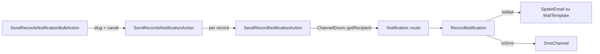

<<<<<<< HEAD
<<<<<<< HEAD
<<<<<<< HEAD
=======
>>>>>>> a988596b (first)
# 📬 Notify
=======
# Notify: template versionati, canali intercambiabili, un solo punto di invio
>>>>>>> d822d97f (.)

<!-- laraxot:badges:start -->
<!-- laraxot:badges:end -->

> **Un `MailTemplate` identificato da uno slug, tre canali in `ChannelEnum` (mail, sms, whatsapp) e una bulk action Filament: scegli il template, spunta i canali, invia a tutti i record selezionati. Il testo vive nel database, il codice non lo conosce.**

## In trenta secondi

Notify è il modulo Laraxot per le comunicazioni in uscita. Tiene i template email in `mail_templates` (modello `MailTemplate`, che estende `Spatie\MailTemplates\Models\MailTemplate` con `HasSlug` e `HasTranslations` su `subject`, `html_template`, `text_template`, `sms_template`), le loro versioni in `mail_template_versions` (`MailTemplateVersion::template()` è un `BelongsTo` con `restoreTemplate()`), i template multicanale in `notification_templates` (`NotificationTemplate` con `compile()`, `shouldSend()` e `preview()`), i temi grafici in `notify_themes` (`NotifyTheme`) e i contatti in `notify_contacts` (`Contact` con `ContactTypeEnum`: phone, mobile, email, pec, whatsapp, fax).

Le Actions in `app/Actions` sono tutte `QueueableAction`: costruiscono il messaggio (`BuildMailMessageAction`), scelgono layout e contenuti stagionali (`Mail/GetMailLayoutAction`, `DetermineSeasonalContentViewPathAction`), normalizzano i numeri (`SMS/NormalizePhoneNumberAction`) e parlano con i provider di SMS, WhatsApp, Telegram e push FCM.

<<<<<<< HEAD
<<<<<<< .merge_file_lkaMEP
## Scopo e confini

Notify è il livello di **trasporto** delle comunicazioni verso l'esterno: 46 Action, tutte
`QueueableAction`, organizzate per corriere (11 provider SMS, 8 push FCM, 4 WhatsApp,
4 mail, 3 Telegram) e non per contenuto. Sa come si consegna un messaggio; non sa perché
esista. Sei moduli lo consumano — IndennitaResponsabilita (9 file), Progressioni (6),
Xot (4), Ptv (3), Pdnd (2), User (1).

Il confine da non superare: **la decisione di notificare non è di Notify.** Nasce dove
sta lo stato (`Xot\States\Transitions\XotBaseTransition`, `Ptv\Actions\Scheda\SendMailByRecord`).
Oggi il confine interno più rotto è un altro: 3 modelli su 14 estendono
`Illuminate\...\Model` invece di `BaseModel` e finiscono fuori dalla connection `notify`,
e `docs/` pesa 804.192 righe contro 17.341 di `app/` — 46 a 1, con 83 gruppi di file
`.md` byte-identici.

Scopo esteso, misure e mosse: [docs/scopo.md](docs/scopo.md).
=======
# 📬 Notify — il modulo che decide se il cittadino lo sa

[](../../composer.json)
[](../../composer.json)
[](composer.json)
[](../../phpstan.neon)
[](#)
[](LICENSE)

> Un cambio di stato che nessuno notifica non è successo, dal punto di vista di
> chi aspetta. Notify è il modulo che chiude quel loop: email, SMS, WhatsApp,
> Telegram, push FCM — cinque canali diversi, un solo posto dove si decide chi
> viene avvisato di cosa.

Badge verificati l'1 settembre 2026 con `phpstan analyse Modules/Notify` (0
errori, `level: max` come da `phpstan.neon` di progetto — sacro, mai bypassato
con `-c` o `--level`). Rilanciabile: `cd laravel && ./vendor/bin/phpstan analyse Modules/Notify`.
>>>>>>> 3096f6ae (chore(gitattributes): sync dal prototipo canonico, no git-lfs [graft: broken parent 2c641c73 missing upstream, treated as root - local-only replace, not pushed])

---

## Scopo e confini

Notify è il livello di **trasporto** delle comunicazioni verso l'esterno: 46 Action, tutte
`QueueableAction`, organizzate per corriere (11 provider SMS, 8 push FCM, 4 WhatsApp,
4 mail, 3 Telegram) e non per contenuto. Sa come si consegna un messaggio; non sa perché
esista. Sei moduli lo consumano — IndennitaResponsabilita (9 file), Progressioni (6),
Xot (4), Ptv (3), Pdnd (2), User (1).

Il confine da non superare: **la decisione di notificare non è di Notify.** Nasce dove
sta lo stato (`Xot\States\Transitions\XotBaseTransition`, `Ptv\Actions\Scheda\SendMailByRecord`).
Oggi il confine interno più rotto è un altro: 3 modelli su 14 estendono
`Illuminate\...\Model` invece di `BaseModel` e finiscono fuori dalla connection `notify`,
e `docs/` pesa 804.192 righe contro 17.341 di `app/` — 46 a 1, con 83 gruppi di file
`.md` byte-identici.

Scopo esteso, misure e mosse: [docs/scopo.md](docs/scopo.md).

---

## Perché

Un sistema che cambia stato in silenzio genera ticket duplicati, telefonate
all'ufficio e sfiducia — non perché il lavoro non sia stato fatto, ma perché
nessuno lo sapeva. Notify esiste per rendere quel gap strutturalmente
impossibile: ogni evento di dominio che dichiara "questo va comunicato" passa
di qui, non attraverso un `Mail::send()` scritto ad hoc dentro un controller.

## Logica
<<<<<<< HEAD
=======
## Perché esiste
>>>>>>> .merge_file_Bt5am7
=======
## Perché esiste
>>>>>>> a988596b (first)

Senza un modulo dedicato ogni progetto finisce per avere il testo delle email hardcodato in un `Mailable`, il prefisso telefonico ricalcolato in tre punti diversi e nessun posto dove un operatore possa cambiare un oggetto senza un deploy. Notify sposta il testo in `MailTemplate` (modificabile dalla risorsa Filament "Template Email"), il canale in `ChannelEnum` e il provider in una Action sostituibile: `SendRecordNotificationAction` non sa se lo SMS parte con SmsFactor o Netfun, e non deve saperlo.

## Come funziona

Il percorso più usato è la notifica massiva da una tabella Filament:



1. `SendRecordsNotificationBulkAction` (estende `XotBaseBulkAction`) mostra `MailTemplateSelect` e `ChannelCheckboxList`, poi chiama `SendRecordsNotificationAction::execute(Collection $records, string $templateSlug, array $channels)` che ritorna un `SendNotificationBulkResultData` con `successCount`, `errorCount`, `totalProcessed`.
2. Per ogni record `SendRecordNotificationAction::execute(Model $record, string $mailTemplateSlug, array $channels)` ricava il destinatario con `ChannelEnum::getRecipient()` (email validata con `FILTER_VALIDATE_EMAIL`, telefono normalizzato) e chiama `Notification::route($canale, $to)->notify(new RecordNotification($record, $slug))`.
3. `RecordNotification::toMail()` restituisce `SpatieEmail`, un `TemplateMailable` che fa `MailTemplate::firstOrCreate` sullo slug: il primo invio crea il template, i successivi lo riusano. `toSms()` produce uno `SmsData` (`from`, `recipient`, `body`) e rispetta `config('sms.fallback_to')`.
4. Il layout HTML arriva da `GetMailLayoutAction::execute(string $baseName = 'base')`, che cerca in `Themes/<pub_theme>/resources/mail-layouts/` nell'ordine `{base}_{contesto}.html`, `{base}.html`, `christmas-professional.html`, `{contesto}.html`, `base.html`, con fallback `{{{ body }}}`.
5. Il contenuto stagionale lo decide `DetermineSeasonalContentViewPathAction`: Natale dal 1 dicembre al 10 gennaio, Pasqua dal venerdì santo al lunedì dell'angelo (calcolo del computus), estate dal 15 luglio al 31 agosto, Halloween dal 25 ottobre al 1 novembre.

Il secondo percorso, per i template multicanale, è `SendNotificationAction::handle(Model $recipient, string $templateCode, array $data, array $channels, array $options): ?Notification`: cerca il `NotificationTemplate` attivo per `code`, verifica `shouldSend($data)` sulle `conditions`, compila `subject`, `body_html`, `body_text` e smista su `mail`, `database` (salva un record in `notifications`) o `sms`. `SendNotificationJob` lo accoda.

## Il modello dati

| Modello | Tabella | Relazioni e tratti chiave | Base class |
|---|---|---|---|
| `MailTemplate` | `mail_templates` | `HasSlug` da `subject`, `HasTranslations`, `scopeForMailable()`; colonne `mailable`, `slug`, `html_layout_path`, `params`, `counter` | `Spatie\MailTemplates\Models\MailTemplate` |
| `MailTemplateVersion` | `mail_template_versions` | `template(): BelongsTo`, `restoreTemplate()`, unique su (`mail_template_id`, `version`), `SoftDeletes` | `BaseModel` (`XotBaseModel`) |
| `MailTemplateLog` | `mail_template_logs` | `template(): BelongsTo`, `mailable(): MorphTo`, timestamp `sent_at`, `opened_at`, `clicked_at` | `BaseModel` |
| `NotificationTemplate` | `notification_templates` | `type` cast a `NotificationTypeEnum` (email, sms, push), json `channels`, `variables`, `conditions`, `grapesjs_data`; `scopeActive()`, `scopeForChannel()` | `BaseModel` |
| `NotificationTemplateVersion` | `notification_template_versions` | `template(): BelongsTo`, `restoreTemplate()`, trait `Updater` | `BaseModel` |
| `NotificationLog` | `notification_logs` | `notifiable(): MorphTo`, `template(): BelongsTo`, `NotificationLogStatusEnum` (pending, sent, delivered, failed, opened, clicked), `markAsOpened()`, `markAsClicked()` | `BaseModel` |
| `Notification` | `notifications` | `channels` e `data` json, `read_at`, `sent_at`, `tenant_id` | `Modules\Xot\Models\BaseModel` |
| `NotificationType` | `notification_types` | `channels` e `settings` json, `HasFactory` | `Illuminate\Database\Eloquent\Model` |
| `NotificationChannel` | `notification_channels` | `driver`, `config` json, `is_enabled`, `priority` | `BaseModel` |
| `NotifyTheme` | `notify_themes` | `linkable(): MorphTo` su `post`, accessor `logo` da Media Library, `view_params` json | `BaseModel` |
| `NotifyThemeable` | `notify_themeables` | pivot morfico `model` + `notify_theme_id` | `BaseMorphPivot` |
| `Contact` | `notify_contacts` | `contact_type`, `value`, `verified_at`, contatori `sms_count`, `mail_count`, `sms_status_code` | `BaseModel` |

`BaseModel` del modulo estende `XotBaseModel` e implementa `HasMedia`. Le migrazioni estendono `XotBaseMigration` e usano `tableCreate()` per lo schema iniziale e `tableUpdate()` per le colonne aggiunte nel tempo.

## Superpoteri

| Cosa | Dove | Firma o contenuto |
|---|---|---|
| Invio massivo da tabella | `app/Filament/Actions/SendRecordsNotificationBulkAction.php` | `execute(Collection $records, string $templateSlug, array $channels): SendNotificationBulkResultData` |
| Invio singolo per record | `app/Actions/SendRecordNotificationAction.php` | `execute(Model $record, string $mailTemplateSlug, array $channels): void` |
| Invio da template multicanale | `app/Actions/SendNotificationAction.php` | `handle(Model $recipient, string $templateCode, array $data = [], array $channels = [], array $options = []): ?Notification` |
| Messaggio da tema | `app/Actions/BuildMailMessageAction.php` | `execute(string $name, Model $model, array $view_params = [], ?array $attachments = null): MailMessage` |
| Tema per lingua e tipo | `app/Actions/NotifyTheme/Get.php` | `execute(string $name, string $type, array $view_params): NotifyThemeData`, `firstOrCreate` su `lang`, `type`, `post_type`, `post_id` |
| Layout stagionale | `app/Actions/Mail/GetMailLayoutAction.php` | `execute(string $baseName = 'base'): string` |
| Vista stagionale | `app/Actions/DetermineSeasonalContentViewPathAction.php` | `execute(string $defaultViewName = 'base-content'): string` |
| Numeri italiani | `app/Actions/SMS/NormalizePhoneNumberAction.php` | `execute(string $phoneNumber): string`, toglie parentesi e zeri iniziali, antepone `+39` |
| Numeri E.164 | `app/Actions/NormalizePhoneNumberAction.php` | `execute(?string $phoneNumber): string`, converte `00` in `+` |
| SMS | `app/Actions/SMS/`, `app/Actions/EsendexSendAction.php`, `app/Actions/NetfunSendAction.php` | `execute(SmsData $smsData): array`; `SmsActionFactory::create(?string $driver): SmsActionContract` |
| WhatsApp | `app/Actions/WhatsApp/` | `Send360dialogWhatsAppAction`, `SendFacebookWhatsAppAction`, `SendTwilioWhatsAppAction`, `SendVonageWhatsAppAction`, tutte `execute(WhatsAppData): array` |
| Telegram | `app/Actions/Telegram/` | `SendOfficialTelegramAction`, `SendBotmanTelegramAction`, `SendNutgramTelegramAction`, `execute(TelegramData): array` |
| Push FCM | `app/Actions/Push/` | `SendPushToDeviceAction::execute(string $token, PushNotificationData $notification, array $data = []): array`, più topic, piattaforma, targeting e template |
| Allegato PDF da tema | `app/Actions/NotifyTheme/Attachment/Pdf.php` | `execute(string $post_type, array $view_params): AttachmentData` |

Risorse Filament in `app/Filament/Resources`: `ContactResource`, `NotificationResource`, `NotificationTemplateResource` (con pagina `PreviewNotificationTemplate`) e `NotifyThemeResource` (con `LinkableRelationManager`) estendono `XotBaseResource`; `MailTemplateResource` estende `LangBaseResource` e aggiunge `PreviewMailTemplate`. Le pagine Create, Edit, List e View estendono `XotBaseCreateRecord`, `XotBaseEditRecord`, `XotBaseListRecords`, `XotBaseViewRecord`.

Il cluster `app/Filament/Clusters/Test.php` (`XotBaseCluster`) raccoglie le pagine di prova `SendEmailPage`, `SendSpatieEmailPage`, `SendAwsEmailPage`, `TestSmtpPage`, `SendSmsPage`, `SendNetfunSmsPage`, `SendWhatsAppPage`, `SendTelegramPage`, `SendPushNotificationPage`, `SendFirebasePushNotificationPage`, `SlackNotificationPage`: ognuna estende `XotBasePage` e chiama la Action del canale con dati inseriti a mano.

`AdminPanelProvider` estende `XotBasePanelProvider` e, se `XotData::disable_database_notifications` è falso, registra il trigger `notify::livewire.database-notifications-trigger` con polling a 60 secondi nel menu utente.

Comandi artisan in `app/Console/Commands`:

| Comando | Cosa fa |
|---|---|
| `php artisan notify:send-mail` | chiede destinatario, oggetto, mittente e corpo HTML e costruisce un `EmailData` |
| `php artisan notify:cleanup-logs --days=30 --batch=1000` | cancella i `NotificationLog` più vecchi di N giorni a blocchi con `chunkById`, conservando i `FAILED` |
| `php artisan notify:analyze-translations` | segnala incoerenze tra i file di `lang/` del modulo |
| `php artisan telegram:set-webhook` | scheletro per registrare il webhook Telegram (corpo ancora commentato) |

## Esempio reale

Da `tests/Unit/Actions/SendRecordsNotificationActionTest.php`: due record, un template, due canali, quattro invii contati.

```php
$result = app(SendRecordsNotificationAction::class)->execute(
    records: $records,
    templateSlug: 'welcome-template',
    channels: ['mail', 'sms'],
);

Assert::assertSame(4, $result->successCount);
Assert::assertSame(0, $result->errorCount);
Assert::assertSame(4, $result->totalProcessed);
```

## Numeri veri

<!-- laraxot:metrics:start -->
<!-- laraxot:metrics:end -->

La misura di copertura documentata in [docs/coverage.md](./docs/coverage.md) è del 6,3% con 300 test saltati per database di test irraggiungibile: è la copertura della sola parte Unit senza DB, non quella del modulo.

## La visione

Chi scrive il testo non tocca il codice: modifica un `MailTemplate` o un `NotificationTemplate` dal pannello, lo vede in anteprima con `PreviewMailTemplate` e, se sbaglia, torna alla versione precedente con `MailTemplateVersion::restoreTemplate()`. Chi scrive il codice non tocca il testo: passa uno slug e un elenco di `ChannelEnum`, e cambia provider sostituendo una Action senza toccare chi la chiama.

## Lo scopo

- Tenere i template email in `mail_templates` con slug, traduzioni e versioni, e i template multicanale in `notification_templates` con condizioni di invio.
- Spedire lo stesso messaggio su mail, sms e whatsapp attraverso `ChannelEnum` e i canali `SmsChannel`, `WhatsAppChannel`, `TelegramChannel`, `NetfunChannel`.
- Isolare ogni provider esterno (SmsFactor, Netfun, Esendex, Twilio, Vonage, 360dialog, Facebook, Telegram, FCM) dietro una Action con `execute()` tipizzato su un DTO Spatie Data.
- Dare ai temi grafici (`NotifyTheme`, layout `ark`, `minty`, `sunny`, `widgets`, `empty` in `resources/views/emails/templates`) un posto nel database, non nel codice.

## Politica

- Nessuna classe Filament estesa direttamente: risorse su `XotBaseResource` o `LangBaseResource`, pagine su `XotBasePage`, cluster su `XotBaseCluster`, bulk action su `XotBaseBulkAction`.
- Nessun `env()` nei file di `config/` né nei provider: `MergesNotifyConfigFromEnv` legge `config('notify-env')` del progetto host e lo riversa in `notify.notify.*`, `notify.config.*`, `notify.sms.*`, `notify.whatsapp.*`, `notify.telegram.*`.
- In ambienti non di produzione `NotifyServiceProvider::boot()` legge `mail.fallback_to` tramite `ResolveTenantConfigValueAction` e, se presente, forza `Mail::alwaysTo()`: nessuna email finisce a un cliente vero per sbaglio.
- I driver SMS attivi sono quelli in `SmsDriverEnum` (`smsfactor`) e in `SmsActionFactory`; le altre Actions in `app/Actions/SMS/` restano raggiungibili solo per chiamata diretta, come registrato in [docs/wiki/decisions/sms-actions-consolidation-2026-06-30.md](./docs/wiki/decisions/sms-actions-consolidation-2026-06-30.md).
- Nessun controller HTTP senza route: lo verifica `tests/Unit/Architecture/NoOrphanHttpControllersTest.php`.
- Le label dei form vengono da `lang/it/*.php` (per esempio `mail_template.php`, `notify_theme.php`, `contact.php`), mai da `->label()` nel codice.

## Religione

- `BaseModel extends XotBaseModel implements HasMedia`; pivot su `BasePivot` e `BaseMorphPivot` con trait `Updater` di Xot.
- Migrazioni su `XotBaseMigration` con `tableCreate()` e `tableUpdate()`.
- Ogni Action usa `Spatie\QueueableAction\QueueableAction` ed espone `execute()` (o `handle()` in `SendNotificationAction`).
- Input e output tipizzati con `Spatie\LaravelData\Data`: `EmailData`, `SmsData`, `WhatsAppData`, `TelegramData`, `PushNotificationData`, `NotifyThemeData`, `SendNotificationBulkResultData`.
- Email su template database con `Spatie\MailTemplates\TemplateMailable` (`SpatieEmail`) e traduzioni con `Spatie\Translatable\HasTranslations`.
- Provider su `XotBaseServiceProvider`, `XotBaseRouteServiceProvider`, `XotBasePanelProvider`.

## Filosofia

Avvisare bene è rispettare il tempo di chi legge. [docs/philosophy.md](./docs/philosophy.md) la chiama "comunicazione responsabile": ogni messaggio ha un intento dichiarato (lo slug), un destinatario che può riceverlo su quel canale (`ChannelEnum::getRecipient()` ritorna `null` e il canale viene saltato) e un contenuto che si può leggere in anteprima prima di partire.

## Zen

Un solo slug, molti canali: il messaggio non sa da dove parte, e non deve saperlo.

## Configurazione

| File | Chiavi reali |
|---|---|
| `config/config.php` | `name`, `icon` (`heroicon-o-bell`), `navigation.sort` (70), `default_layout`, `layouts.default`, `templates.welcome`, `logo_url`, `unsubscribe_url`, `social_links` |
| `config/notify.php` | `company.*`, `email.default_from_address`, `email.default_from_name`, `paths.*`, `template_variables.*`, `webhooks.notification_delivered`, `webhooks.notification_bounced`, `webhooks.notification_clicked` |
| `config/sms.php` | `default` (`smsfactor`), `drivers.smsfactor.token`, `drivers.smsfactor.base_url`, `retry.attempts`, `rate_limit.max_attempts`, `circuit_breaker.threshold`, `validation.pattern` (E.164) |
| `config/whatsapp.php` | `default` (`twilio`), `drivers.twilio`, `drivers.vonage`, `drivers.facebook`, `drivers.360dialog`, `from`, `retry`, `rate_limit` |
| `config/telegram.php` | `default` (`official`), `drivers.official`, `drivers.botman`, `drivers.nutgram`, `parse_mode` (`HTML`), `rate_limit.max_attempts` (30) |

Chiavi lette a runtime fuori da questi file: `notify-env` (sorgente unica delle credenziali nel progetto host), `mail.fallback_to` (via Tenant), `sms.fallback_to`, `notify.cleanup.older_than_days`, `notify.cleanup.batch_size`.

## Quickstart

```bash
php artisan module:enable Notify
./vendor/bin/phpstan analyse Modules/Notify --memory-limit=-1
./vendor/bin/pest Modules/Notify/tests
php artisan notify:send-mail
```

Poi, dal pannello: crea un "Template Email" (gruppo Notifiche), aprilo in anteprima con `PreviewMailTemplate`, e da qualsiasi tabella che monta `SendRecordsNotificationBulkAction` seleziona i record, scegli lo slug e i canali.

## Documentazione

<!-- laraxot:docs:start -->
<!-- laraxot:docs:end -->

Punti di ingresso: [docs/00-index.md](./docs/00-index.md), [docs/email-templates.md](./docs/email-templates.md) per i template Spatie e stagionali, [docs/provider-actions-architecture.md](./docs/provider-actions-architecture.md) per aggiungere un driver, [docs/send-notification-bulk-action.md](./docs/send-notification-bulk-action.md) per l'invio massivo, [docs/stories](./docs/stories) per le story BMAD del modulo.

## Ecosistema

Dipendenze da `composer.json`: `spatie/laravel-database-mail-templates`, `laravel-notification-channels/fcm`, `laravel-notification-channels/telegram`, `irazasyed/telegram-bot-sdk`, `kreait/laravel-firebase`, `aws/aws-sdk-php`, `symfony/postmark-mailer`, `symfony/http-client`. Repository path locali: `Xot`, `Tenant`, `UI`.

Moduli usati nel codice: `Xot` (classi base, `XotData`, `SafeEloquentCastAction`), `Tenant` (`ResolveTenantConfigValueAction`), `Media` (`Modules\Media\Models\Media` nei modelli con `HasMedia`), `Lang` (`LangBaseResource`).

Moduli che consumano Notify: `Xot` (`SendMailByRecordAction` usa `EmailData` e `SmtpData`; `XotBaseTransition` invia `RecordNotification` con `RecordNotificationData`) e `User` (`UserServiceProvider` registra `SpatieEmail`).

---

<<<<<<< HEAD
<<<<<<< HEAD
<<<<<<< .merge_file_lkaMEP
**Modulo** `notify` · **Laraxot / FixCity Platform** · licenza MIT

---

## Scopo del modulo

Perche' esiste, come raggiungere meglio il suo scopo e cosa **non** gli appartiene:
[`docs/purpose.md`](./docs/purpose.md).
=======
**Modulo** `notify` · **Laraxot** · **FixCity Platform** · PHPStan 10 · Filament 5
**Modulo** `notify` · **Laraxot** · **Notify Platform** · PHPStan 10 · Filament 5
>>>>>>> .merge_file_Bt5am7
=======

Cinque canali (email, SMS, WhatsApp, Telegram, push FCM), un'unica interfaccia
verso il resto dei moduli. Chi genera la notifica non sa — e non deve sapere —
quale corriere la consegna: quella scelta è un dettaglio di configurazione
Filament, non una `if` sparsa nel codice applicativo.

## Filosofia

**Un canale che fallisce non deve far fallire gli altri quattro.** Rate
limiting per canale (`HasNotificationRateLimiting`, verificato: zero consumer
diretti nel repo perché è un trait pubblico di piattaforma, non debito morto —
vedi `docs/phpstan-ignore-audit.md`), retry isolati, nessun canale che blocca
la coda per colpa di un provider esterno lento.

## Religione

**Un numero senza il comando che l'ha prodotto non è un numero, è una
promessa.** Questo file dichiarava "PHPStan Level 10" — non è mai stato vero
in questo formato (il progetto usa `level: max`, non un intero) e "Laravel 12"
quando la dipendenza reale (ereditata dalla root) è `^13.0`. Non succede più:
ogni cifra qui sotto viene da un comando datato, eseguibile di nuovo.

## Politica

`laravel/phpstan.neon` è sacro — nessun agente lo tocca. Ogni verifica gira
nuda, senza override di livello, perché un numero ottenuto aggirando la
config del progetto non certifica niente del progetto.

## Zen

Cinque corrieri, un solo messaggio da consegnare per davvero: al cittadino,
non al log.

---

## Stato misurato — 1 settembre 2026

| Metrica | Valore | Comando |
|---|---:|---|
| File PHP / righe di codice | 720 / 54.927 | `find app -name '*.php' \| xargs wc -l` |
| File di test / casi | 126 / 823 | `./vendor/bin/pest Modules/Notify` |
| Copertura (Unit, misurata 27 ago) | **6.3 %** — bassa, dichiarata non nascosta | `docs/coverage.md` |
| PHPStan | **0 errori**, `level: max` | `./vendor/bin/phpstan analyse Modules/Notify` |
| `@phpstan-ignore` residui | 1, auditato e motivato | `docs/phpstan-ignore-audit.md` |
| PHPInsights — Code | 91.8 % | `./tools/phpinsights.sh Modules/Notify` |
| PHPInsights — Complexity | 100.0 % | idem |
| PHPInsights — Architecture | 85.7 % | idem |
| PHPInsights — Style | 87.7 % | idem |
| PHPMD su `app/` | 191 rilievi reali | `./tools/phpmd.sh Modules/Notify/app` |

La copertura al 6.3% è il numero più debole di questo modulo e non è
nascosto: 823 casi di test esistono, ma coprono a campione, non a fondo.
Dettaglio in [`docs/quality-audit.md`](docs/quality-audit.md) e
[`docs/coverage.md`](docs/coverage.md).

## Cosa contiene

- **Canali** — email (template DB via `spatie/laravel-database-mail-templates`),
  SMS, WhatsApp, Telegram (`irazasyed/telegram-bot-sdk`), push FCM
  (`kreait/laravel-firebase`, `laravel-notification-channels/fcm`).
- **Rate limiting** — `HasNotificationRateLimiting`, per evitare che un canale
  in errore spammi retry.
- **Filament** — configurazione notifiche via admin panel.

## Come si verifica (non fidarti di questo file)

```bash
cd laravel
./vendor/bin/phpstan analyse Modules/Notify          # 0 errori atteso
./tools/phpmd.sh Modules/Notify/app                  # NON la root del modulo
./tools/phpinsights.sh Modules/Notify
./vendor/bin/pest Modules/Notify
```

## Documentazione

| | |
|---|---|
| Audit di qualità (fonte dei numeri sopra) | [`docs/quality-audit.md`](docs/quality-audit.md) |
| Copertura test | [`docs/coverage.md`](docs/coverage.md) |
| Audit `@phpstan-ignore` | [`docs/phpstan-ignore-audit.md`](docs/phpstan-ignore-audit.md) |
| Wiki tecnica | [`docs/`](docs/) |

---

**Modulo** `notify` · **Laraxot / FixCity Platform** · licenza MIT
<<<<<<< HEAD
>>>>>>> 3096f6ae (chore(gitattributes): sync dal prototipo canonico, no git-lfs [graft: broken parent 2c641c73 missing upstream, treated as root - local-only replace, not pushed])
=======

---

## Scopo del modulo

Perche' esiste, come raggiungere meglio il suo scopo e cosa **non** gli appartiene:
[`docs/purpose.md`](./docs/purpose.md).
>>>>>>> bdc49995 (.)
=======
**Modulo** `notify` · **Laraxot** · **FixCity Platform** · PHPStan 10 · Filament 5
**Modulo** `notify` · **Laraxot** · **Notify Platform** · PHPStan 10 · Filament 5
>>>>>>> a988596b (first)
=======
Modulo `Notify` della famiglia **Laraxot**. Badge e numeri si rigenerano con `bash bashscripts/tools/readme/module-readme-badges.sh Notify`; il testo si cura a mano.
>>>>>>> d822d97f (.)
