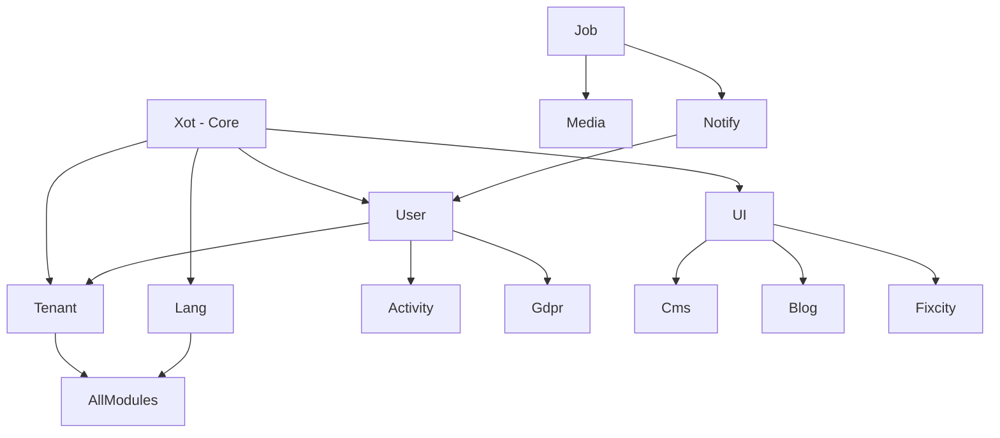

<<<<<<< HEAD
# FixCity Documentation

**Project**: FixCity Platform  
**Theme**: Sixteen (Active)  
**Document Root**: public_html/  
**Last Updated**: 2026-03-30

## 🚀 Quick Start

| I want to... | Go to... |
|--------------|----------|
| Understand project structure | [Project Configuration](project/configuration.md) |
| Learn AI workflow (BMAD+GSD+Ralph) | [AI Workflow](project/ai-workflow/) |
| Find module documentation | [Module Index](modules/index.md) |
| Find theme documentation | [Theme Index](themes/index.md) |
| Check coding standards | [Conventions](project/conventions/) |

## 📚 Documentation Sections

### Project Documentation

Documentation that applies to the entire project:

- **[Configuration](project/configuration.md)** - Theme detection, paths, environment
- **[AI Workflow](project/ai-workflow/)** - BMAD, GSD, Ralph Loop, OpenViking integration
- **[Conventions](project/conventions/)** - Coding standards, naming, structure

### Module Documentation

Module-specific documentation:

- **[Module Index](modules/index.md)** - List of all modules with docs
- AI Module - [Docs](../../laravel/Modules/AI/docs/)
- Activity Module - [Docs](../../laravel/Modules/Activity/docs/)
- Blog Module - [Docs](../../laravel/Modules/Blog/docs/)
- [View all modules...](modules/index.md)

### Theme Documentation

Theme-specific documentation:

- **Sixteen (Active)** - [Docs](../../laravel/Themes/Sixteen/docs/)
- TwentyOne (Inactive) - [Docs](../../laravel/Themes/TwentyOne/docs/)
- **[Theme Index](themes/index.md)** - Theme comparison and guides

### Script Documentation

Utility script documentation:

- **[Bash Scripts](../../bashscripts/docs/)** - Automation scripts
- AI Scripts - [Docs](../../bashscripts/docs/ai/)
- System Scripts - [Docs](../../bashscripts/docs/system/)

## 📖 Key Documents

### Essential Reading

1. **[AGENTS.md](../AGENTS.md)** - AI agent guidelines and commands
2. **[Project Configuration](project/configuration.md)** - Theme, paths, setup
3. **[AI Workflow](project/ai-workflow/)** - How to use BMAD+GSD+Ralph
4. **[Coding Conventions](project/conventions/)** - Standards and best practices

### For New Developers

1. Start with [Project Configuration](project/configuration.md)
2. Read [AI Workflow](project/ai-workflow/) to understand methodology
3. Check [Module Index](modules/index.md) for your module
4. Review [Coding Conventions](project/conventions/)

### For AI Agents

1. Read [.windsurfrules](../.windsurfrules) for project rules
2. Check [Project Configuration](project/configuration.md) for theme/paths
3. Use [Module Index](modules/index.md) to find relevant docs
4. Follow [DRY + KISS](#dry--kiss-principles) principles

## 🔍 Finding Documentation

### By Topic

| Topic | Location |
|-------|----------|
| Theme configuration | [Project Config](project/configuration.md) |
| Module development | [Module Docs](modules/index.md) |
| Frontend development | [Theme Docs](themes/index.md) |
| AI workflow | [AI Workflow](project/ai-workflow/) |
| Quality standards | [Conventions](project/conventions/) |
| Scripts | [Bash Scripts Docs](../../bashscripts/docs/) |

### By File Type

- **`.md` files**: Documentation (this index)
- **`.windsurfrules`**: AI agent rules
- **`AGENTS.md`**: Project guidelines
- **`README.md`**: Section index

## 📐 Documentation Structure

```
docs/
├── README.md                      # This file (master index)
├── project/                       # Project-wide docs
│   ├── configuration.md           # Theme, paths, environment
│   ├── ai-workflow/               # BMAD, GSD, Ralph, OpenViking
│   └── conventions/               # Coding standards
├── modules/                       # Module index + links
│   └── index.md                   # List of all module docs
├── themes/                        # Theme index + links
│   └── index.md                   # List of all theme docs
└── conventions/                   # Coding conventions
    └── README.md                  # Conventions index
```

## 🎯 DRY + KISS Principles

### DRY (Don't Repeat Yourself)

**Rule**: Every piece of knowledge has ONE authoritative source.

**Implementation**:
- ✅ Project docs in `docs/`
- ✅ Module docs in `laravel/Modules/*/docs/`
- ✅ Theme docs in `laravel/Themes/*/docs/`
- ❌ NO duplicates - use cross-reference links

**Example**:
```markdown
<!-- WRONG: Duplicating content -->
# PHPStan Guide
[full content...]

<!-- CORRECT: Cross-reference -->
# PHPStan Guide
See [Xot Module PHPStan Guide](../../laravel/Modules/Xot/docs/phpstan.md)
```

### KISS (Keep It Simple, Stupid)

**Rule**: Documentation should be essential and simple.

**Implementation**:
- ✅ Essential topics only
- ✅ Max 3 levels of nesting
- ✅ Clear, descriptive filenames
- ✅ One topic per file

**Example**:
```markdown
<!-- WRONG: Too complex -->
guide/advanced/topic/subtopic/details.md (5 levels)

<!-- CORRECT: Simple -->
topic-guide.md (1 level)
```

## 🔗 Cross-Reference Guidelines

### Linking Between Sections

```markdown
# From module docs to project docs
See [Project Configuration](../../../docs/project/configuration.md)

# From theme docs to module docs
See [Predict Module](../../../laravel/Modules/Predict/docs/)

# From project docs to theme docs
See [Sixteen Theme](../../laravel/Themes/Sixteen/docs/)
```

### Link Format

- Use relative paths: `../file.md`
- Use descriptive text: `[Theme Configuration](...)`
- Avoid absolute URLs in internal links

## 📊 Documentation Health

| Metric | Target | Status |
|--------|--------|--------|
| Duplicate files | 0 | ⏳ Checking |
| Broken links | 0 | ⏳ Checking |
| Indexed docs | 100% | ✅ Complete |
| Theme accuracy | 100% Sixteen | ✅ Complete |

## 🛠️ Maintenance

### Adding New Documentation

1. **Choose location**:
   - Project-wide → `docs/project/`
   - Module-specific → `laravel/Modules/*/docs/`
   - Theme-specific → `laravel/Themes/*/docs/`

2. **Follow naming**:
   - Lowercase: `configuration.md`
   - Kebab-case: `ai-workflow.md`
   - No dates: `update.md` NOT `2026-03-30-update.md`

3. **Update index**:
   - Add link to this README
   - Add to relevant section index

4. **Cross-reference**:
   - Link to related docs
   - Add "See Also" section

### Removing Duplicates

1. **Find duplicates**:
   ```bash
   bash bashscripts/docs/find-doc-duplicates.sh
   ```

2. **Review report**:
   - Check `docs-duplicates-report.md`

3. **Consolidate**:
   - Keep one copy
   - Update references
   - Use `git mv` to preserve history

4. **Commit**:
   ```bash
   git commit -m "docs: Remove duplicates (DRY compliance)"
   ```

## 📝 Related Files

| File | Purpose |
|------|---------|
| [.windsurfrules](../.windsurfrules) | AI agent rules and project config |
| [AGENTS.md](../AGENTS.md) | Project guidelines |
| [COMMIT_MESSAGE.md](../COMMIT_MESSAGE.md) | Commit message standards |

## 🆘 Help

### Finding Documentation

**Q**: Where do I find docs for [X]?  
**A**: Check the [Module Index](modules/index.md) or [Theme Index](themes/index.md)

**Q**: How do I know which theme is active?  
**A**: See [Project Configuration](project/configuration.md) - Theme Detection Algorithm

**Q**: Where are script docs?  
**A**: [Bash Scripts Documentation](../../bashscripts/docs/)

### Contributing

1. Follow [DRY + KISS](#dry--kiss-principles)
2. Use proper [naming conventions](#adding-new-documentation)
3. Add to appropriate [index](#documentation-structure)
4. Cross-reference related docs

---

**Next Steps**:
1. [Read Project Configuration](project/configuration.md)
2. [Explore AI Workflow](project/ai-workflow/)
3. [Check Module Index](modules/index.md)

**Last Sync**: 2026-03-30  
**Maintained By**: AI Agents + Development Team
=======
# Laravel Modules - Master Index

## Overview

This directory contains documentation for all Laravel modules in the FixCity PTVX ecosystem. Each module is a self-contained unit of functionality that follows the Laraxot architectural patterns.

## Project Structure

```
base_fixcity_fila5/
├── public_html/              # DOCUMENT ROOT (web accessible)
│   ├── index.php            # Entry point
│   ├── assets/              # Public assets
│   └── themes/              # Theme assets
├── laravel/Modules/         # All modules (this directory)
├── laravel/Themes/          # All themes
├── docs/                     # Project-wide documentation
└── bashscripts/             # Shell scripts
```

## Module List

### Core Modules

| Module | Description | Documentation |
|--------|-------------|---------------|
| **Xot** | Base framework module providing base classes, traits, and shared services | [docs/](Xot/docs/) |
| **User** | User authentication, authorization, and management | [docs/](User/docs/) |
| **Tenant** | Multi-tenancy architecture and isolation | [docs/](Tenant/docs/) |
| **UI** | Shared Blade components and Filament widgets | [docs/](UI/docs/) |
| **Lang** | Multi-language translations and localization | [docs/](Lang/docs/) |
| **Job** | Background job processing and queue management | [docs/](Job/docs/) |
| **Media** | File uploads, transformations, and media management | [docs/](Media/docs/) |
| **Notify** | Multi-channel notification system | [docs/](Notify/docs/) |
| **Activity** | Activity logging and audit trail | [docs/](Activity/docs/) |
| **Gdpr** | GDPR compliance and data protection | [docs/](Gdpr/docs/) |

### Domain Modules

| Module | Description | Documentation |
|--------|-------------|---------------|
| **Fixcity** | Ticket management and support system | [docs/](Fixcity/docs/) |
| **Cms** | Content management with Filament blocks | [docs/](Cms/docs/) |
| **Blog** | Blog, articles, and editorial content | [docs/](Blog/docs/) |
| **Comment** | Comment system with moderation | [docs/](Comment/docs/) |
| **Rating** | Rating and review system | [docs/](Rating/docs/) |
| **Seo** | SEO optimization toolkit | [docs/](Seo/docs/) |
| **Geo** | Geographic data and maps integration | [docs/](Geo/docs/) |
| **AI** | MCP integration and AI agents | [docs/](AI/docs/) |

## Architectural Principles

### No Services - Use Spatie Queueable Actions

- **NEVER** create Service classes
- **ALWAYS** use `Spatie\QueueableAction` pattern
- Create Actions using `create-action` skill

### No Routes/Controllers - Use Volt + Folio + Filament

- **NEVER** create route files for module functionality
- **NEVER** create Controllers
- **ALWAYS** use: Volt, Folio, Filament, Laraxot

### View Pattern

```php
// Use view-string + viewParams
/** @var view-string $view */
$view = 'module::view.name';
$viewParams = ['data' => $data];

return view($view, $viewParams);
```

### Base Class Extensions

- **ALWAYS** extend `XotBase*` classes
- **NEVER** extend Laravel/Filament base classes directly
- **USE** `getFormSchema()` instead of `form()`

## Module Structure

Standard module structure:

```
Modules/ModuleName/
├── app/
│   ├── Actions/           # Business logic (Spatie QueueableAction)
│   ├── Models/            # Eloquent models
│   ├── Filament/          # Filament resources, widgets
│   ├── Providers/         # Service providers
│   └── ...
├── config/                # Module configuration
├── database/
│   ├── factories/         # Model factories
│   ├── migrations/        # Database migrations
│   └── seeders/           # Database seeders
├── docs/                  # Module documentation
├── lang/                  # Translations
├── resources/
│   ├── views/             # Blade templates
│   └── assets/            # CSS/JS assets
├── tests/                 # Pest PHP tests
├── composer.json          # Module dependencies
└── module.json            # Module metadata
```

## Development Guidelines

### PHP Standards

- **Strict Types**: `declare(strict_types=1);` in every PHP file
- **Type Hints**: All methods must have return types
- **PHPDoc**: Complete documentation for classes, methods, properties
- **PHPStan**: Level 10 compliance required

### Testing

- **Framework**: Pest PHP
- **Coverage**: 90%+ target
- **Pattern**: Arrange-Act-Assert (AAA)

### Documentation

- **Location**: `Modules/ModuleName/docs/`
- **Format**: Markdown
- **Language**: Italian (primary), English (secondary)
- **Structure**: README.md + topic-specific files

## Quality Gates

### Before Commit

```bash
# PHPStan analysis
./vendor/bin/phpstan analyse --level=10 --memory-limit=2G

# Code formatting
composer pint

# Run tests
php artisan test
```

### CI/CD

- **GitHub Actions**: Automated testing on push
- **Semantic Versioning**: Tag-based releases
- **Changelog**: Auto-generated from conventional commits

## Active Theme

**Current Theme**: **Sixteen** (AGID/Bootstrap Italia compliant)  
**Domain**: `fixcity.local`  
**Config**: `laravel/config/localhost/xra.php` → `pub_theme`

**Theme Documentation**: [Themes Index](../../Themes/docs/README.md)  
**Theme Context**: [.planning/THEME_CONTEXT.md](../../../../.planning/THEME_CONTEXT.md)

## Related Documentation

- **Themes**: [laravel/Themes/docs/](../Themes/docs/)
- **Project Docs**: [docs/](../../../../docs/)
  - [VHost Configuration](../../../../docs/project/vhost-configuration.md) - Apache setup for fixcity.local
- **Bash Scripts**: [bashscripts/docs/](../../../../bashscripts/docs/)
- **AGENTS.md**: [AGENTS.md](../../../../AGENTS.md)

## Module Dependencies



## Support

- **Issues**: [GitHub Issues](https://github.com/laraxot/base_fixcity_fila5/issues)
- **Documentation**: [Project Docs](../../../../docs/)
- **Team**: Laraxot Development Team

---

**Last Updated**: March 30, 2026
**Version**: 1.0.0
**Total Modules**: 18
>>>>>>> origin/dev
