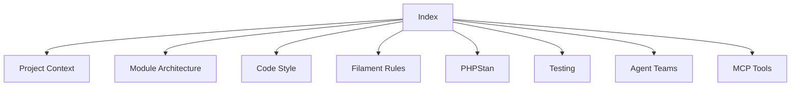

# Agent Documentation Index

> Documentazione centrale per gli agenti AI che lavorano su PTVX Fila5 Mono.

## 📚 Indice Principale

### 🏗️ Struttura Progetto
- [Project Context](project-context.md) - Contesto del progetto e struttura
- [Module Architecture](module-architecture.md) - Architettura modulare Laravel

### 💻 Coding Standards
- [Pattern SACRO Accessor](accessor-auto-persistence.md) - Accessor con Auto-Persistenza
- [Code Style](code-style.md) - Standard di codifica PHP e convenzioni
- [Filament Rules](filament-rules.md) - Regole Filament e XotBase
- [PHPStan Guide](phpstan.md) - Guida PHPStan Level 10

### 🧪 Testing & Quality
- [Testing Guide](testing.md) - Pattern di testing Pest
- [Code Quality](code-quality.md) - Qualità del codice e formattazione

### 🤖 Agent Teams & MCP
- [Agent Teams](agent-teams.md) - Configurazione Agent Teams
- [MCP Tools](mcp-tools.md) - Strumenti MCP Laravel Boost

### 🔧 Quick Commands
- [Commands](commands.md) - Comandi rapidi per sviluppo

---

**Link di ritorno:**
- → [CLAUDE.md](../CLAUDE.md)
- → [AGENTS.md](../AGENTS.md)
- → [AGENT_MEMORY.md](../AGENT_MEMORY.md)

## 🔗 Navigazione Rapida

---

*Ultimo aggiornamento: 2026-03-10*
