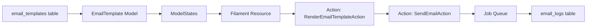

# Versione Migliorata: Filament Email Templates In-House

In questo documento proponiamo un’implementazione open source per la gestione di template email nel DB con UI Filament, ispirata e migliorata rispetto ai plugin:

- hugomyb-error-mailer
- filament-mails (vormkracht10)
- visual-builder-email-templates
- superduper-filament-starter-kit
- martin-petricko-database-mail (commerciale)
- spatie/laravel-database-mail-templates
- spatie/laravel-mailcoach-mailer
- esempi di Blade render, logo customization

---

## 1. Gap dei Plugin Esistenti

1. Plugin commerciali a pagamento o non mantenuti
2. Mancanza di versioning avanzato e rollback
3. UI non integrata con ModelStates per `draft`, `pending`, `sent`, `failed`
4. Personalizzazione limitata di layout (logo, stili)
5. Integrazione parziale con queue e logging

---

## 2. Obiettivi della Nostra Soluzione

- **Storage DB**: tutte le proprietà del template (soggetto, body markdown, variabili, versioni)
- **UI Filament**: Resource per CRUD, MarkdownEditor, preview live, versioni
- **ModelStates**: spatie/laravel-model-states per gestire stati del template e invio
- **Queueable Actions**: spatie/laravel-queueable-action per rendering e invio con retry
- **Invio Email**: Spatie MailcoachMailer o Mailable dinamico con `Blade::render()`
- **Logging**: tabella `email_logs` per destinatario, stato, errori, timestamp
- **Personalizzazione**: gestione logo, stili inline, template HTML e plain-text

---

## 3. Architettura Proposta



### 3.1 Migrazione e Modello
```php
Schema::create('email_templates', function (Blueprint $table) {
    $table->id();
    $table->string('name');
    $table->string('subject');
    $table->text('body'); // markdown o HTML
    $table->json('variables')->nullable();
    $table->timestamps();
});

class EmailTemplate extends Model {
    use HasStates;
    protected $casts = ['status' => EmailTemplateStatus::class];
}
```

### 3.2 Filament Resource
```php
public static function form(Form $form): Form {
    return $form->schema([
        Grid::make(2)->schema([
            TextInput::make('name')->required(),
            TextInput::make('subject')->required(),
            MarkdownEditor::make('body')->required(),
            KeyValue::make('variables'),
        ]),
    ]);
}
```

### 3.3 Stati (spatie-model-states)
```php
abstract class EmailTemplateStatus extends State {
  public static function config(): StateConfig {
    return parent::config()
      ->default(Draft::class)
      ->allowTransition(Draft::class, Pending::class)
      ->allowTransition(Pending::class, Sent::class)
      ->allowTransition(Pending::class, Failed::class);
  }
}
class Draft extends EmailTemplateStatus {}
class Pending extends EmailTemplateStatus {}
class Sent extends EmailTemplateStatus {}
class Failed extends EmailTemplateStatus {}
```

### 3.4 Queueable Actions
```php
class RenderEmailTemplateAction {
    use QueueableAction;
    public function execute(EmailTemplate $template, string $to, array $data): Mailable {
        $html = Blade::render($template->body, $data);
        return new GenericHtmlMail($template->subject, $html);
    }
}

class SendEmailAction {
    use QueueableAction;
    public function execute(Mailable $mail, string $to): void {
        Mail::to($to)->send($mail);
        // log e transizione stato
    }
}
```

---

## 4. Vantaggi

- Nessun costo di licenza
- UI integrata e moduli riutilizzabili
- Versioning e rollback dei template
- Infrastruttura scalabile (queue, retry, logging)
- Estendibile per webhook, SMS, notifiche push

---

**Collegamenti**:
- Filament Error Mailer: https://github.com/hugomayo7/filament-error-mailer
- Vormkracht10 Filament Mails: https://github.com/vormkracht10/filament-mails
- Visual Builder Email Templates: https://github.com/visualbuilder/email-templates
- Spatie DB Mail Templates: https://github.com/spatie/laravel-database-mail-templates
- Spatie Mailcoach: https://github.com/spatie/laravel-mailcoach-mailer
