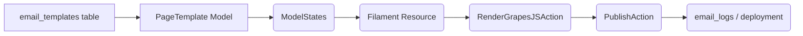

# Integrazione GrapesJS Editor (Dotswan)

Questo documento analizza il plugin [Dotswan GrapesJS](https://filamentphp.com/plugins/dotswan-grapesjs) per Filament e propone una versione in-house open source migliorata.

---

## 1. Plugin di riferimento

- **Dotswan GrapesJS**: editor drag’n’drop per contenuti HTML via GrapesJS
- **GitHub**: https://github.com/dotswan/filament-grapesjs

## 2. Funzionalità chiave del plugin

- Editor visuale con componenti drag’n’drop
- Asset manager per upload di immagini e risorse
- Anteprima live del design nel form Filament
- Salvataggio del JSON di GrapesJS nel DB e rendering HTML

## 3. Gap e Limitazioni

1. **Nessun versioning**: impossibile rollback a precedenti revisioni
2. **Stati non gestiti**: nessuna distinzione tra bozza, pubblicato, errore
3. **Media library disaccoppiata**: upload file base senza spatie/medialibrary
4. **Configurazione rigida**: toolbar e asset manager non estendibili via code
5. **Mantenimento incerto**: dipendenza da plugin esterno a volte non aggiornato

## 4. Obiettivi Soluzione In-House

- Archiviare sia **JSON** che **HTML** generato
- Introduzione di **versioning** e **ModelStates** (draft/published/failed)
- **Gestione media** centralizzata con `spatie/laravel-medialibrary`
- **Custom Field** per GrapesJS in Filament Forms
- **Preview live** e rendering frontend
- **Action** queueable per rendering, publishing e rollback
- **Audit log** delle modifiche ai template

## 5. Architettura Proposta



### 5.1 Migrazione e Modello
```php
Schema::create('page_templates', fn(Blueprint $table) =>
    $table->id()
          ->string('name')
          ->json('content_json')
          ->text('content_html')->nullable()
          ->timestamps()
);

class PageTemplate extends Model {
    use HasStates, InteractsWithMedia;
    protected $casts = ['status' => PageTemplateStatus::class];
    public function registerMediaCollections(): void {
        $this->addMediaCollection('assets')->useDisk('public');
    }
}
```

### 5.2 Filament Resource
```php
public static function form(Form $form): Form {
    return $form->schema([
        TextInput::make('name')->required(),
        GrapesJsEditor::make('content_json')
            ->toolbar(['bold','italic','image','video','link'])
            ->mediaCollection('assets'),
        Hidden::make('content_html'),
    ]);
}
```

### 5.3 Stati Template
```php
abstract class PageTemplateStatus extends State {
  public static function config(): StateConfig {
    return parent::config()
      ->default(Draft::class)
      ->allowTransition(Draft::class, Pending::class)
      ->allowTransition(Pending::class, Published::class)
      ->allowTransition(Pending::class, Failed::class);
  }
}
class Draft extends PageTemplateStatus {}
class Pending extends PageTemplateStatus {}
class Published extends PageTemplateStatus {}
class Failed extends PageTemplateStatus {}
```

### 5.4 Queueable Actions
```php
class RenderGrapesJSAction {
    use QueueableAction;
    public function execute(PageTemplate $template): void {
        $html = GrapesJsRenderer::render($template->content_json);
        $template->content_html = $html;
        $template->status->transitionTo(Pending::class);
        $template->save();
    }
}

class PublishPageTemplateAction {
    use QueueableAction;
    public function execute(PageTemplate $template): void {
        // logica di deploy o pubblicazione front-end
        $template->status->transitionTo(Published::class);
        $template->save();
    }
}
```

## 6. Vantaggi

- **Versioning & rollback**: gestione revisioni via ModelStates
- **Media library**: upload e conversione asset con spatie/medialibrary
- **Scalabilità**: rendering e publishing asincroni
- **Customizzabile**: toolbar e asset manager configurabili via code
- **Manutenibile**: pieno controllo sul codice, nessuna dipendenza esterna non manutenuta

---

**Link Utili**:

- Plugin ufficiale: https://filamentphp.com/plugins/dotswan-grapesjs
- Repository: https://github.com/dotswan/filament-grapesjs
- GrapesJS Docs: https://grapesjs.com/project_docs/
- GrapesJS Docs: https://grapesjs.com/docs/
