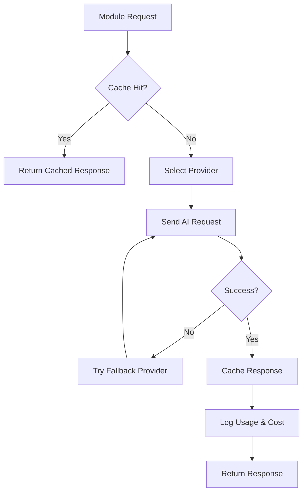

# Product Requirements Document (PRD) - AI Module

**Module**: AI
**Version**: 1.0
**Status**: Draft
**Author**: Product Team

---

## Document Control

| Version | Date | Author | Changes |
|---------|------|--------|---------|
| 1.0 | 2026-03-12 | Product Team | Initial draft |

---

## 1. Executive Summary

### 1.1 Problem Statement
> Modern applications increasingly require AI capabilities for content generation, data analysis, automation, and intelligent assistance. However, integrating AI services directly into application code creates tight coupling, makes model switching difficult, and duplicates effort across modules. Without a centralized AI integration layer, each module would need to implement its own AI connections, leading to inconsistent patterns, duplicated costs, and missed opportunities for shared learning and optimization.

### 1.2 Proposed Solution
> The AI module provides a unified abstraction layer for AI/ML services including LLM integration (Ollama, OpenAI, Anthropic), MCP (Model Context Protocol) services, prompt management, response caching, and cost tracking. It offers a clean API for other modules to leverage AI capabilities without managing connections, credentials, or implementation details. The module supports multiple providers, implements intelligent fallbacks, and provides comprehensive observability for AI operations.

### 1.3 Business Value Proposition
- **Primary Value**: Democratize AI capabilities across all modules with consistent, cost-effective integration
- **Secondary Value**: Reduce AI operational costs through caching, batching, and provider optimization
- **Strategic Alignment**: Enable AI-powered features platform-wide while maintaining control over costs, quality, and vendor dependencies

### 1.4 Success Metrics (High-Level)
| Metric | Current | Target | Timeline |
|--------|---------|--------|----------|
| AI Integration Coverage | ~3 modules | 10+ modules | Q3 2026 |
| Response Cache Hit Rate | N/A | 60%+ | Q2 2026 |
| Cost per AI Request | N/A | Reduce 40% | Q3 2026 |
| Provider Failover Success | N/A | 99.9% | Q2 2026 |

---

## 2. Goals & Objectives

### 2.1 Primary Goals (SMART)
1. **Specific**: Build unified AI abstraction supporting 3+ LLM providers with automatic failover
2. **Measurable**: Achieve 60%+ cache hit rate for AI responses, reduce per-request cost by 40%
3. **Achievable**: Leverage existing MCP protocols and Laravel caching infrastructure
4. **Relevant**: Critical for AI-powered features in Predict, Blog, Cms, and other modules
5. **Time-bound**: Core implementation by Q2 2026, full platform integration by Q4 2026

### 2.2 Secondary Goals
- Implement prompt versioning and A/B testing
- Build AI response quality monitoring
- Create cost allocation and billing per module
- Develop fine-tuning data collection pipeline

### 2.3 Non-Goals
> What this module will NOT do (scope boundaries)
- Train custom ML models (separate ML infrastructure)
- Replace domain-specific business logic
- Make autonomous business decisions
- Handle real-time streaming AI responses (future consideration)

### 2.4 Key Results (OKRs)
| Objective | Key Result | Target | Status |
|-----------|------------|--------|--------|
| Unified AI Integration | Providers integrated | 3+ providers | Pending |
| Cost Optimization | Average cost reduction | 40% | Pending |
| Quality & Reliability | Cache hit rate | 60%+ | Pending |
| Developer Experience | Module integrations | 10+ modules | Pending |

---

## 3. Target Users

### 3.1 User Personas

#### Persona 1: Module Developer
| Attribute | Details |
|-----------|---------|
| Role | Backend/Frontend Developer |
| Goals | Add AI features to module without managing AI complexity |
| Pain Points | AI provider integration, credential management, error handling |
| Technical Level | Advanced |
| Usage Frequency | Daily during development |

**User Story**:
> As a Module Developer, I want to call a simple AI API with my prompt, so that I can generate content without managing provider connections or credentials.

#### Persona 2: Product Manager
| Attribute | Details |
|-----------|---------|
| Role | Product Owner |
| Goals | Understand AI usage, costs, and ROI across features |
| Pain Points | Lack of visibility into AI costs and effectiveness |
| Technical Level | Intermediate |
| Usage Frequency | Weekly |

**User Story**:
> As a Product Manager, I want to see AI usage and cost reports by feature, so that I can make informed decisions about AI feature investments.

#### Persona 3: System Administrator
| Attribute | Details |
|-----------|---------|
| Role | DevOps Engineer |
| Goals | Ensure AI service reliability and manage costs |
| Pain Points | Provider outages, cost overruns, rate limiting |
| Technical Level | Advanced |
| Usage Frequency | Daily |

**User Story**:
> As a System Administrator, I want to configure AI provider failover and rate limits, so that I can ensure service reliability while controlling costs.

#### Persona 4: Content Creator
| Attribute | Details |
|-----------|---------|
| Role | Editor/Writer |
| Goals | Use AI to assist with content creation and editing |
| Pain Points | Time-consuming drafting, research, and editing |
| Technical Level | Basic |
| Usage Frequency | Daily |

**User Story**:
> As a Content Creator, I want AI-assisted drafting and editing tools, so that I can produce high-quality content more efficiently.

### 3.2 Use Cases
| ID | Use Case | Actor | Trigger | Outcome |
|----|----------|-------|---------|---------|
| UC-001 | Generate content draft | Developer | Content creation request | AI-generated draft |
| UC-002 | Analyze prediction data | Predict Module | Market analysis request | Statistical insights |
| UC-003 | Translate content | Lang Module | Translation request | Translated content |
| UC-004 | Moderate user content | Comment Module | Content submission | Moderation decision |
| UC-005 | Summarize long content | Blog Module | Article request | Summary generated |
| UC-006 | Answer user queries | Support | User question | AI-generated answer |

### 3.3 Pain Points Addressed
| Pain Point | Severity | How Solved |
|------------|----------|------------|
| Complex AI integration | High | Simple, unified API abstraction |
| Provider lock-in | High | Multi-provider support with failover |
| Unpredictable costs | High | Caching, cost tracking, optimization |
| Inconsistent quality | Medium | Quality monitoring, provider comparison |
| No usage visibility | Medium | Comprehensive analytics dashboard |

---

## 4. Functional Requirements

### 4.1 Requirements Matrix

| ID | Requirement | Description | Priority | Acceptance Criteria |
|----|-------------|-------------|----------|---------------------|
| FR-001 | Multi-Provider Support | Support OpenAI, Anthropic, Ollama, local LLMs | P0 | 3+ providers working |
| FR-002 | Unified API | Single interface for all AI operations | P0 | Consistent API across providers |
| FR-003 | Response Caching | Cache AI responses to reduce costs | P0 | 60%+ cache hit rate |
| FR-004 | Automatic Failover | Switch providers on failure | P0 | 99.9% availability |
| FR-005 | Prompt Management | Versioned prompt library | P1 | Prompt CRUD + versioning |
| FR-006 | Cost Tracking | Track costs per module/request | P1 | Accurate cost allocation |
| FR-007 | Rate Limiting | Configurable rate limits per provider | P1 | Prevent API limits |
| FR-008 | Quality Monitoring | Track AI response quality metrics | P2 | Quality scores tracked |
| FR-009 | MCP Integration | Model Context Protocol support | P1 | MCP services operational |
| FR-010 | Admin Dashboard | AI usage and cost monitoring | P1 | Real-time dashboard |

### 4.2 Priority Definitions
- **P0 (Critical)**: Must have for launch - core AI abstraction, multi-provider, caching
- **P1 (High)**: Should have - prompt management, cost tracking, admin tools
- **P2 (Medium)**: Nice to have - quality monitoring, advanced analytics
- **P3 (Low)**: Future consideration - fine-tuning, custom models

### 4.3 Feature Details

#### Feature 1: Multi-Provider AI Gateway
**Description**: Unified gateway that abstracts multiple AI providers (OpenAI GPT, Anthropic Claude, Ollama local models) behind a consistent API. Supports automatic provider selection, failover, and load balancing.

**User Flow**:
```
1. Module calls AI::complete(prompt, options)
2. Gateway checks cache for existing response
3. If cache miss, select optimal provider based on config
4. Send request to provider with proper authentication
5. On failure, automatically retry with fallback provider
6. Cache successful response
7. Return result to caller
8. Log usage and cost for analytics
```

**Acceptance Criteria**:
- [ ] Support for OpenAI API (GPT-4, GPT-3.5-turbo)
- [ ] Support for Anthropic API (Claude)
- [ ] Support for Ollama (local models)
- [ ] Automatic failover on provider error
- [ ] Configurable provider priorities
- [ ] Consistent response format across providers

**Dependencies**: External AI provider APIs, Redis for caching

#### Feature 2: Intelligent Response Caching
**Description**: Smart caching system that stores AI responses based on prompt hash, with support for TTL, invalidation, and cache warming.

**Acceptance Criteria**:
- [ ] Cache key based on prompt + model + parameters hash
- [ ] Configurable TTL per use case
- [ ] Manual cache invalidation API
- [ ] Cache warming for common prompts
- [ ] Cache hit/miss analytics

**Dependencies**: Redis, Provider Gateway

#### Feature 3: Prompt Management System
**Description**: Versioned prompt library with templates, variables, A/B testing, and performance tracking.

**Acceptance Criteria**:
- [ ] Create, read, update, delete prompts
- [ ] Prompt versioning with rollback
- [ ] Variable substitution in templates
- [ ] A/B test multiple prompt variants
- [ ] Track performance per prompt version

**Dependencies**: Database, Analytics System

#### Feature 4: Cost Tracking & Optimization
**Description**: Comprehensive cost tracking per request, module, and provider with optimization recommendations.

**Acceptance Criteria**:
- [ ] Track token usage per request
- [ ] Calculate cost based on provider pricing
- [ ] Allocate costs to requesting module
- [ ] Generate cost reports and alerts
- [ ] Provide optimization recommendations

**Dependencies**: Provider usage APIs, Analytics System

---

## 5. Non-Functional Requirements

### 5.1 Performance Requirements
| Metric | Requirement | Measurement |
|--------|-------------|-------------|
| Cache Lookup | <5ms | Redis response time |
| AI Request Latency | Provider dependent | End-to-end time |
| Throughput | 100 requests/sec | Sustained request rate |
| Cache Hit Rate | 60%+ | Hits / Total requests |
| Availability | 99.9% | Monthly uptime |

### 5.2 Security Requirements
- [x] API key encryption at rest
- [x] API key rotation support
- [x] Request/response logging (without sensitive data)
- [x] Rate limiting per API key
- [x] Access control for admin functions
- [x] Audit logging for all AI operations

### 5.3 Scalability Requirements
- Support for 1000+ concurrent AI requests
- Horizontal scaling for cache layer
- Provider load balancing
- Queue-based request processing for burst handling

### 5.4 Compliance Requirements
- [x] Data privacy (no PII sent to external providers without consent)
- [x] GDPR compliance (data processing agreements)
- [ ] Industry-specific AI regulations (as applicable)

---

## 6. User Experience

### 6.1 User Flows


### 6.2 Wireframes
> [Links to Figma/Sketch wireframes - to be created]

### 6.3 Design Principles
- Simple API: one method call for AI operations
- Sensible defaults with advanced configuration options
- Graceful degradation on provider failures
- Transparent cost and usage visibility

### 6.4 Interaction Specifications
| Interaction | Behavior | Feedback |
|-------------|----------|----------|
| AI Request | Async processing | Loading state with estimated time |
| Cache Hit | Instant response | Indicator showing cached result |
| Provider Failover | Automatic retry | Transparent to user |
| Cost Alert | Threshold exceeded | Admin notification |

---

## 7. Technical Considerations

### 7.1 Architecture Overview
```
┌─────────────────────────────────────────────────────────┐
│                    Client Modules                       │
│  (Predict, Blog, Cms, Comment, etc.)                    │
└─────────────────────────────────────────────────────────┘
                          │
                          │ AI::complete()
                          ▼
┌─────────────────────────────────────────────────────────┐
│                    AI Module                            │
│  ┌──────────────┐  ┌──────────────┐  ┌──────────────┐  │
│  │ Unified      │  │ Provider     │  │ Cache        │  │
│  │ API          │  │ Gateway      │  │ Layer        │  │
│  └──────────────┘  └──────────────┘  └──────────────┘  │
│  ┌──────────────┐  ┌──────────────┐  ┌──────────────┐  │
│  │ Prompt       │  │ Cost         │  │ MCP          │  │
│  │ Manager      │  │ Tracker      │  │ Services     │  │
│  └──────────────┘  └──────────────┘  └──────────────┘  │
└─────────────────────────────────────────────────────────┘
              │              │              │
              ▼              ▼              ▼
    ┌─────────────┐ ┌─────────────┐ ┌─────────────┐
    │   OpenAI    │ │  Anthropic  │ │   Ollama    │
    │   API       │ │   API       │ │   Local     │
    └─────────────┘ └─────────────┘ └─────────────┘
```

### 7.2 Dependencies
| Dependency | Type | Version | Criticality |
|------------|------|---------|-------------|
| Laravel | Framework | 12.x | Critical |
| Redis | Cache | 7.x | Critical |
| openai-php/client | SDK | 1.x | High |
| guzzlehttp/guzzle | HTTP Client | 7.x | High |
| spatie/laravel-queueable-action | Package | 2.x | Medium |

### 7.3 Integration Points
| System | Integration Type | Data Flow | Frequency |
|--------|------------------|-----------|-----------|
| OpenAI API | REST API | Bidirectional | Per request |
| Anthropic API | REST API | Bidirectional | Per request |
| Ollama | Local HTTP | Bidirectional | Per request |
| Redis | Cache | Read/Write | Per request |
| All Modules | Method Calls | Inbound | Per AI feature |

### 7.4 Technical Constraints
- PHP 8.3+ required
- Laravel 12+ required
- Redis required for caching
- External API dependencies (OpenAI, Anthropic)
- Rate limits imposed by providers

### 7.5 Database Schema
```sql
CREATE TABLE ai_prompts (
    id BIGINT UNSIGNED AUTO_INCREMENT PRIMARY KEY,
    name VARCHAR(255) UNIQUE,
    template TEXT,
    version INT DEFAULT 1,
    provider VARCHAR(50),
    model VARCHAR(100),
    parameters JSON,
    is_active BOOLEAN DEFAULT TRUE,
    created_at TIMESTAMP DEFAULT CURRENT_TIMESTAMP,
    updated_at TIMESTAMP DEFAULT CURRENT_TIMESTAMP ON UPDATE CURRENT_TIMESTAMP
);

CREATE TABLE ai_requests (
    id BIGINT UNSIGNED AUTO_INCREMENT PRIMARY KEY,
    prompt_id BIGINT UNSIGNED,
    provider VARCHAR(50),
    model VARCHAR(100),
    request_hash VARCHAR(64),
    request_data JSON,
    response_data JSON,
    tokens_used INT,
    cost_cents INT,
    cache_hit BOOLEAN DEFAULT FALSE,
    module VARCHAR(100),
    status VARCHAR(20),
    created_at TIMESTAMP DEFAULT CURRENT_TIMESTAMP,
    
    INDEX idx_request_hash (request_hash),
    INDEX idx_module (module),
    INDEX idx_created_at (created_at)
);

CREATE TABLE ai_costs (
    id BIGINT UNSIGNED AUTO_INCREMENT PRIMARY KEY,
    module VARCHAR(100),
    provider VARCHAR(50),
    date DATE,
    total_requests INT,
    total_tokens INT,
    total_cost_cents INT,
    created_at TIMESTAMP DEFAULT CURRENT_TIMESTAMP,
    
    UNIQUE KEY unique_module_provider_date (module, provider, date)
);
```

### 7.6 API Specifications
```php
// Basic Completion
AI::complete(string $prompt, array $options = []): string
AI::completeAsync(string $prompt, array $options = []): Promise

// With Prompt Template
AI::prompt(string $promptName, array $variables = []): string

// Provider Selection
AI::provider('openai')->complete($prompt);
AI::provider('anthropic')->complete($prompt);
AI::provider('ollama')->complete($prompt);

// Cache Control
AI::withCache(ttl: 3600)->complete($prompt);
AI::withoutCache()->complete($prompt);
AI::clearCache($promptHash);

// Cost Tracking
AI::getCosts(date_from, date_to, module);
AI::getUsage(date_from, date_to, module);
```

---

## 8. Analytics & Metrics

### 8.1 Success Metrics (KPIs)
| KPI | Definition | Target | Measurement Method |
|-----|------------|--------|-------------------|
| Cache Hit Rate | % requests served from cache | 60%+ | Cache hits / Total requests |
| Cost per Request | Average cost per AI request | Reduce 40% | Total cost / Total requests |
| Provider Availability | % successful requests | 99.9% | Success / Total requests |
| Module Adoption | Modules using AI | 10+ modules | Integration count |
| Response Quality | User satisfaction score | 4.5/5 | Feedback ratings |

### 8.2 Tracking Requirements
- Request volume per provider, model, module
- Cache hit/miss rates
- Cost breakdown by provider, module, use case
- Response latency percentiles
- Error rates by provider
- User feedback on AI-generated content

### 8.3 Reporting Dashboards
- Real-time request volume and costs
- Provider performance comparison
- Module-wise cost allocation
- Cache effectiveness metrics
- Quality scores and trends

### 8.4 A/B Testing Plans
| Test | Hypothesis | Variant A | Variant B | Success Metric |
|------|------------|-----------|-----------|----------------|
| Provider Comparison | Claude produces better content | GPT-4 | Claude 3 | User ratings |
| Prompt Optimization | Detailed prompts improve quality | Short prompt | Detailed prompt | Quality score |
| Cache TTL | Longer TTL reduces costs | 1 hour | 24 hours | Cost savings |

---

## 9. Go-to-Market

### 9.1 Launch Criteria
- [x] All P0 features complete
- [ ] 3+ providers integrated and tested
- [ ] Cache hit rate >50% in testing
- [ ] Documentation complete
- [ ] 2+ module integrations completed

### 9.2 Marketing Requirements
- [ ] Internal tech talk/demo
- [ ] Developer documentation
- [ ] Integration guide with examples
- [ ] Cost optimization best practices

### 9.3 Sales Enablement
- N/A (Internal infrastructure module)

### 9.4 Customer Support Needs
- [ ] Developer FAQ
- [ ] Troubleshooting guide
- [ ] Provider configuration guide
- [ ] Cost optimization guide

---

## 10. Timeline & Milestones

### 10.1 Key Dates
| Milestone | Date | Status |
|-----------|------|--------|
| Requirements Complete | 2026-03-12 | Complete |
| Design Complete | 2026-03-26 | Pending |
| Development Start | 2026-03-27 | Pending |
| Core Features (P0) | 2026-04-17 | Pending |
| Provider Integrations | 2026-04-24 | Pending |
| Beta Launch | 2026-05-01 | Pending |
| GA Launch | 2026-05-15 | Pending |

### 10.2 Phase Breakdown
**Phase 1: Discovery** (Weeks 1-2)
- Provider API evaluation
- Cost modeling analysis
- Use case gathering from modules

**Phase 2: Design** (Weeks 3-4)
- API contract definition
- Caching strategy design
- Provider failover design

**Phase 3: Development** (Weeks 5-10)
- Sprint 1-2: Core gateway, caching
- Sprint 3-4: Provider integrations, prompt management
- Sprint 5: Cost tracking, admin dashboard

**Phase 4: Testing** (Weeks 11-12)
- Integration testing with modules
- Load testing
- Failover testing

**Phase 5: Launch** (Week 13)
- Beta with Predict and Blog modules
- GA launch

### 10.3 Dependencies
| Dependency | On Whom | Due Date | Status |
|------------|---------|----------|--------|
| Redis Infrastructure | DevOps | 2026-03-20 | Pending |
| Provider API Keys | Finance | 2026-03-25 | Pending |
| Module Integrations | Module Teams | 2026-04-15 | Pending |

### 10.4 Risk Mitigation
| Risk | Probability | Impact | Mitigation |
|------|-------------|--------|------------|
| Provider API changes | Medium | High | Abstraction layer, version pinning |
| Cost overruns | Medium | High | Budget alerts, rate limits |
| Provider outages | Low | High | Multi-provider failover |
| Poor response quality | Medium | Medium | Quality monitoring, provider switching |

---

## 11. Open Questions

| ID | Question | Owner | Due Date | Status |
|----|----------|-------|----------|--------|
| Q-001 | Should we support streaming responses? | Tech Lead | 2026-03-20 | Open |
| Q-002 | What is the default cache TTL? | Product | 2026-03-20 | Open |
| Q-003 | Should we implement fine-tuning pipeline? | Tech Lead | 2026-04-01 | Open |

---

## 12. Appendix

### 12.1 Glossary
| Term | Definition |
|------|------------|
| LLM | Large Language Model |
| MCP | Model Context Protocol |
| Token | Unit of text for AI processing |
| Prompt | Input text/instructions for AI |
| Completion | AI-generated response |
| Failover | Automatic switch to backup provider |

### 12.2 References
- [OpenAI API Documentation](https://platform.openai.com/docs)
- [Anthropic API Documentation](https://docs.anthropic.com/)
- [Ollama Documentation](https://ollama.ai/)
- [Model Context Protocol](https://modelcontextprotocol.io/)

### 12.3 Related PRDs
- [Predict Module PRD](../Predict/docs/PRD.md)
- [Blog Module PRD](../Blog/docs/PRD.md)
- [Cms Module PRD](../Cms/docs/PRD.md)
- [Lang Module PRD](../Lang/docs/PRD.md)

---

## Approval

| Role | Name | Signature | Date |
|------|------|-----------|------|
| Product Manager | | | |
| Engineering Lead | | | |
| Design Lead | | | |
| Stakeholder | | | |
