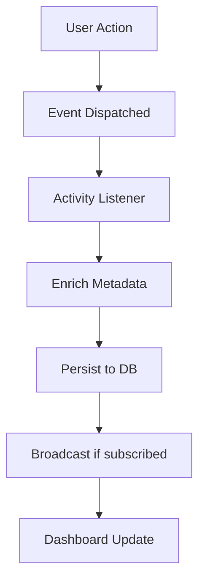

# Product Requirements Document (PRD) - Activity Module

**Module**: Activity
**Version**: 1.0
**Status**: Draft
**Last Updated**: 2026-03-12
**Author**: Product Team

---

## Document Control

| Version | Date | Author | Changes |
|---------|------|--------|---------|
| 1.0 | 2026-03-12 | Product Team | Initial draft |

---

## 1. Executive Summary

### 1.1 Problem Statement
> Modern web applications require comprehensive activity tracking for audit trails, user behavior analysis, compliance, and debugging. Without a centralized activity tracking system, it becomes impossible to answer critical questions like "who did what, when, and why?" The current lack of unified event sourcing creates blind spots in system observability and compliance capabilities.

### 1.2 Proposed Solution
> The Activity module provides a comprehensive event sourcing and activity tracking system that captures, stores, and analyzes all user and system actions across the entire platform. It implements a unified event model with rich metadata, supports real-time activity streams, enables historical audit queries, and integrates seamlessly with all other modules through a clean event-driven architecture.

### 1.3 Business Value Proposition
- **Primary Value**: Complete audit trail for compliance, security investigations, and user behavior analysis
- **Secondary Value**: Real-time activity feeds for social features, debugging capabilities, and operational insights
- **Strategic Alignment**: Foundation for GDPR compliance, security monitoring, and data-driven product improvements

### 1.4 Success Metrics (High-Level)
| Metric | Current | Target | Timeline |
|--------|---------|--------|----------|
| Event Capture Coverage | ~60% | 95%+ | Q2 2026 |
| Query Response Time | N/A | <100ms | Q2 2026 |
| Storage Efficiency | N/A | 90% compression | Q3 2026 |
| Integration Coverage | 5 modules | 18 modules | Q3 2026 |

---

## 2. Goals & Objectives

### 2.1 Primary Goals (SMART)
1. **Specific**: Implement comprehensive event capture for all user and system actions across 18 modules
2. **Measurable**: Achieve 95%+ event capture rate with <100ms query response time for activity lookups
3. **Achievable**: Leverage Laravel's event system and existing module architecture for seamless integration
4. **Relevant**: Critical for GDPR compliance, security audits, and product analytics
5. **Time-bound**: Complete core implementation by Q2 2026, full integration by Q3 2026

### 2.2 Secondary Goals
- Implement real-time activity streaming for live dashboards
- Create advanced analytics and reporting capabilities
- Build activity pattern detection for anomaly identification
- Develop retention policies and data lifecycle management

### 2.3 Non-Goals
> What this module will NOT do (scope boundaries)
- Real-time notification delivery (handled by Notify module)
- User session management (handled by User module)
- Business logic execution (remains in domain modules)
- Long-term data warehousing (separate analytics infrastructure)

### 2.4 Key Results (OKRs)
| Objective | Key Result | Target | Status |
|-----------|------------|--------|--------|
| Comprehensive Event Capture | Events captured across all modules | 18/18 modules | Pending |
| Performance Excellence | P95 query latency <100ms | <100ms | Pending |
| Compliance Ready | Full audit trail for GDPR | 100% coverage | Pending |
| Developer Adoption | Module integration rate | 95%+ | Pending |

---

## 3. Target Users

### 3.1 User Personas

#### Persona 1: Security Administrator
| Attribute | Details |
|-----------|---------|
| Role | Security/Compliance Officer |
| Goals | Track all system access and changes for compliance |
| Pain Points | Incomplete audit trails, slow investigation response |
| Technical Level | Advanced |
| Usage Frequency | Daily |

**User Story**:
> As a Security Administrator, I want to query all actions performed by a specific user within a time range, so that I can investigate potential security incidents and ensure compliance.

#### Persona 2: Product Analyst
| Attribute | Details |
|-----------|---------|
| Role | Data/Product Analyst |
| Goals | Understand user behavior patterns and feature adoption |
| Pain Points | Fragmented data sources, incomplete user journeys |
| Technical Level | Intermediate |
| Usage Frequency | Daily |

**User Story**:
> As a Product Analyst, I want to analyze activity patterns across user segments, so that I can identify feature adoption trends and optimize user experience.

#### Persona 3: System Administrator
| Attribute | Details |
|-----------|---------|
| Role | DevOps/System Admin |
| Goals | Monitor system health and debug issues |
| Pain Points | Limited visibility into system operations |
| Technical Level | Advanced |
| Usage Frequency | Daily |

**User Story**:
> As a System Administrator, I want to view real-time activity streams, so that I can monitor system health and quickly identify operational issues.

#### Persona 4: End User
| Attribute | Details |
|-----------|---------|
| Role | Platform User |
| Goals | View personal activity history and social feeds |
| Pain Points | Cannot track own actions or see relevant updates |
| Technical Level | Basic |
| Usage Frequency | Weekly |

**User Story**:
> As an End User, I want to see my recent activity history, so that I can track my actions and contributions on the platform.

### 3.2 Use Cases
| ID | Use Case | Actor | Trigger | Outcome |
|----|----------|-------|---------|---------|
| UC-001 | Capture user login/logout | System | Authentication event | Activity record created |
| UC-002 | Track content modifications | System | CRUD operations | Audit trail maintained |
| UC-003 | Query user activity history | Admin | Investigation request | Activity report generated |
| UC-004 | Real-time activity monitoring | Admin | Dashboard access | Live activity stream |
| UC-005 | Export audit data | Admin | Compliance request | Data export completed |
| UC-006 | Detect anomalous patterns | System | Automated monitoring | Alert triggered |

### 3.3 Pain Points Addressed
| Pain Point | Severity | How Solved |
|------------|----------|------------|
| Incomplete audit trails | High | Comprehensive event capture across all modules |
| Slow investigation response | High | Optimized queries with proper indexing |
| Fragmented activity data | High | Centralized activity repository |
| Limited real-time visibility | Medium | Real-time streaming capabilities |
| No pattern detection | Medium | Analytics and anomaly detection |

---

## 4. Functional Requirements

### 4.1 Requirements Matrix

| ID | Requirement | Description | Priority | Acceptance Criteria |
|----|-------------|-------------|----------|---------------------|
| FR-001 | Event Capture | Capture all user and system actions with rich metadata | P0 | 95%+ event capture rate |
| FR-002 | Activity Storage | Store activities with efficient retrieval | P0 | <100ms query response (P95) |
| FR-003 | Activity Query | Query activities by user, type, time, entity | P0 | Flexible query API |
| FR-004 | Real-time Streaming | Stream activities in real-time | P1 | WebSocket/Livewire integration |
| FR-005 | Activity Dashboard | Admin dashboard for activity monitoring | P1 | Real-time visualization |
| FR-006 | Export Capabilities | Export activity data in standard formats | P1 | CSV, JSON export |
| FR-007 | Retention Policies | Configurable data retention rules | P1 | Automated cleanup |
| FR-008 | Anomaly Detection | Detect unusual activity patterns | P2 | ML-based detection |
| FR-009 | User Activity Feed | Personal activity timeline for users | P2 | Social feed features |
| FR-010 | Integration SDK | Easy integration for other modules | P0 | Documentation + examples |

### 4.2 Priority Definitions
- **P0 (Critical)**: Must have for launch - core event capture and storage
- **P1 (High)**: Should have, high priority - dashboards, exports, retention
- **P2 (Medium)**: Nice to have, can wait - analytics, social features
- **P3 (Low)**: Future consideration - advanced ML features

### 4.3 Feature Details

#### Feature 1: Event Capture System
**Description**: Comprehensive event capture mechanism that intercepts and records all significant actions across the platform with rich contextual metadata including user, timestamp, IP address, user agent, entity references, and action details.

**User Flow**:
```
1. Action occurs in any module (e.g., user updates profile)
2. Module dispatches Laravel event with activity context
3. Activity listener captures event
4. Activity record enriched with metadata (IP, user agent, session)
5. Record persisted to activity_log table
6. Optional: real-time broadcast to subscribers
```

**Acceptance Criteria**:
- [ ] All CRUD operations captured automatically
- [ ] Authentication events (login, logout, password change) captured
- [ ] Administrative actions logged with full context
- [ ] Failed operations (errors, validation failures) optionally captured
- [ ] Metadata includes: user_id, ip_address, user_agent, entity_type, entity_id, action_type, timestamp, context

**Dependencies**: Laravel Event System, User Module

#### Feature 2: Activity Query Engine
**Description**: Powerful and flexible query API for retrieving activity records with support for filtering, sorting, pagination, and aggregation.

**Acceptance Criteria**:
- [ ] Filter by user, date range, action type, entity type
- [ ] Support for complex queries (AND/OR conditions)
- [ ] Pagination for large result sets
- [ ] Aggregation capabilities (counts, groupings)
- [ ] Query performance <100ms for typical queries

**Dependencies**: Activity Storage

#### Feature 3: Admin Dashboard
**Description**: Real-time dashboard for monitoring platform activity with visualizations, filters, and drill-down capabilities.

**Acceptance Criteria**:
- [ ] Live activity stream with auto-refresh
- [ ] Activity volume charts (hourly, daily, weekly)
- [ ] Top users by activity
- [ ] Activity type breakdown
- [ ] Search and filter capabilities
- [ ] Drill-down to activity details

**Dependencies**: Activity Query Engine, Filament UI

---

## 5. Non-Functional Requirements

### 5.1 Performance Requirements
| Metric | Requirement | Measurement |
|--------|-------------|-------------|
| Event Capture Latency | <10ms overhead | Added time per event |
| Query Response Time | <100ms (P95) | Query execution time |
| Throughput | 1000 events/sec | Sustained event rate |
| Storage Efficiency | 90% compression | Data size reduction |
| Availability | 99.9% | Monthly uptime |

### 5.2 Security Requirements
- [x] Authentication required for activity access
- [x] Authorization checks (role-based access control)
- [x] Data encryption at rest (sensitive fields)
- [x] Data encryption in transit (TLS)
- [x] Audit logging (activity module logs its own access)
- [x] GDPR compliance (right to erasure, data portability)

### 5.3 Scalability Requirements
- Support for 10M+ activity records
- Horizontal scaling capability (sharding by date/user)
- Partitioning strategy for large datasets
- Read replicas for query scaling

### 5.4 Compliance Requirements
- [x] GDPR (data retention, export, erasure)
- [ ] SOC 2 (audit trail requirements)
- [ ] Industry-specific regulations (as needed)

---

## 6. User Experience

### 6.1 User Flows


### 6.2 Wireframes
> [Links to Figma/Sketch wireframes - to be created]

### 6.3 Design Principles
- Consistency with Filament design system
- Mobile-first responsive design for activity feeds
- Accessibility first approach (WCAG 2.1 AA)
- Performance-optimized for large datasets

### 6.4 Interaction Specifications
| Interaction | Behavior | Feedback |
|-------------|----------|----------|
| Activity Click | Expand details | Modal/slide-over panel |
| Filter Change | Update results | Instant filter with loading state |
| Export Request | Generate file | Progress indicator + download |
| Real-time Update | Append new items | Smooth animation |

---

## 7. Technical Considerations

### 7.1 Architecture Overview
```
┌─────────────────────────────────────────────────────────┐
│                    Other Modules                        │
│  (Blog, Predict, User, Media, etc.)                     │
└─────────────────────────────────────────────────────────┘
                          │
                          │ Laravel Events
                          ▼
┌─────────────────────────────────────────────────────────┐
│                  Activity Module                        │
│  ┌──────────────┐  ┌──────────────┐  ┌──────────────┐  │
│  │ Event        │  │ Activity     │  │ Query        │  │
│  │ Listeners    │  │ Models       │  │ Engine       │  │
│  └──────────────┘  └──────────────┘  └──────────────┘  │
│  ┌──────────────┐  ┌──────────────┐  ┌──────────────┐  │
│  │ Broadcast    │  │ Admin        │  │ Export       │  │
│  │ System       │  │ Dashboard    │  │ Service      │  │
│  └──────────────┘  └──────────────┘  └──────────────┘  │
└─────────────────────────────────────────────────────────┘
                          │
                          ▼
┌─────────────────────────────────────────────────────────┐
│                  Data Layer                             │
│  - activity_log table (partitioned)                     │
│  - Redis cache for recent activities                    │
│  - Elasticsearch for advanced search (optional)         │
└─────────────────────────────────────────────────────────┘
```

### 7.2 Dependencies
| Dependency | Type | Version | Criticality |
|------------|------|---------|-------------|
| Laravel | Framework | 12.x | Critical |
| Filament | UI Framework | 5.x | Critical |
| Livewire | Full-stack | 4.x | Critical |
| spatie/laravel-activitylog | Package | 4.x | High |
| spatie/laravel-queueable-action | Package | 2.x | Medium |

### 7.3 Integration Points
| System | Integration Type | Data Flow | Frequency |
|--------|------------------|-----------|-----------|
| All Modules | Event Dispatch | Outbound | Per action |
| User Module | User Reference | Bidirectional | Per event |
| Notify Module | Activity Alerts | Outbound | On trigger |
| Admin Dashboard | Data Display | Inbound | Real-time |

### 7.4 Technical Constraints
- PHP 8.3+ required
- Laravel 12+ required
- Filament v5 compatibility
- Module architecture (Nwidart)
- Database: MySQL 8.0+ with partitioning support

### 7.5 Database Schema
```sql
CREATE TABLE activity_log (
    id BIGINT UNSIGNED AUTO_INCREMENT PRIMARY KEY,
    log_name VARCHAR(50) DEFAULT 'default',
    description VARCHAR(255),
    subject_type VARCHAR(255),
    subject_id BIGINT UNSIGNED,
    causer_type VARCHAR(255),
    causer_id BIGINT UNSIGNED,
    causer_ip VARCHAR(45),
    causer_user_agent VARCHAR(255),
    event VARCHAR(50),
    properties JSON,
    created_at TIMESTAMP DEFAULT CURRENT_TIMESTAMP,
    updated_at TIMESTAMP DEFAULT CURRENT_TIMESTAMP ON UPDATE CURRENT_TIMESTAMP,
    
    INDEX idx_subject (subject_type, subject_id),
    INDEX idx_causer (causer_type, causer_id),
    INDEX idx_log_name (log_name),
    INDEX idx_created_at (created_at)
) ENGINE=InnoDB DEFAULT CHARSET=utf8mb4;
```

### 7.6 API Specifications
```php
// Activity Query API
GET /api/activities?user_id={id}&date_from={date}&date_to={date}&type={type}
Response: {
    "data": [
        {
            "id": 123,
            "description": "User updated profile",
            "causer": {...},
            "subject": {...},
            "event": "updated",
            "properties": {...},
            "created_at": "2026-03-12T10:00:00Z"
        }
    ],
    "meta": {"total": 100, "per_page": 20, "current_page": 1}
}

// Activity Export API
POST /api/activities/export
Body: {
    "filters": {...},
    "format": "csv|json"
}
Response: {
    "download_url": "...",
    "expires_at": "..."
}
```

---

## 8. Analytics & Metrics

### 8.1 Success Metrics (KPIs)
| KPI | Definition | Target | Measurement Method |
|-----|------------|--------|-------------------|
| Event Capture Rate | % of actions captured | 95%+ | Event count / Action count |
| Query Performance | P95 response time | <100ms | Application monitoring |
| Storage Efficiency | Compression ratio | 90% | Raw vs stored size |
| Integration Coverage | Modules integrated | 18/18 | Module count |
| User Adoption | Dashboard MAU | 80% of admins | Analytics tracking |

### 8.2 Tracking Requirements
- Event capture success/failure rates
- Query performance metrics
- Storage growth trends
- Integration status per module
- User engagement with dashboards

### 8.3 Reporting Dashboards
- Activity volume over time (hourly, daily, weekly)
- Top users by activity count
- Activity type distribution
- Error rate in event capture
- Storage utilization

### 8.4 A/B Testing Plans
| Test | Hypothesis | Variant A | Variant B | Success Metric |
|------|------------|-----------|-----------|----------------|
| Dashboard Layout | Compact view improves efficiency | Standard view | Compact view | Task completion time |

---

## 9. Go-to-Market

### 9.1 Launch Criteria
- [x] All P0 features complete
- [ ] Performance benchmarks met
- [ ] Security audit passed
- [ ] Documentation complete
- [ ] Support team trained

### 9.2 Marketing Requirements
- [ ] Internal announcement
- [ ] Documentation published
- [ ] Demo video for admins
- [ ] Integration guide for developers

### 9.3 Sales Enablement
- N/A (Internal module)

### 9.4 Customer Support Needs
- [ ] Admin user guide
- [ ] FAQ for common queries
- [ ] Troubleshooting guide
- [ ] Support ticket templates

---

## 10. Timeline & Milestones

### 10.1 Key Dates
| Milestone | Date | Status |
|-----------|------|--------|
| Requirements Complete | 2026-03-12 | Complete |
| Design Complete | 2026-03-26 | Pending |
| Development Start | 2026-03-27 | Pending |
| Core Features (P0) | 2026-04-17 | Pending |
| Beta Launch | 2026-04-24 | Pending |
| GA Launch | 2026-05-08 | Pending |

### 10.2 Phase Breakdown
**Phase 1: Discovery** (Weeks 1-2)
- User research with admins and analysts
- Competitive analysis of audit tools
- Technical feasibility study

**Phase 2: Design** (Weeks 3-4)
- UX design for dashboards
- Technical architecture finalization
- API contract definition

**Phase 3: Development** (Weeks 5-10)
- Sprint 1-2: Core event capture and storage
- Sprint 3-4: Query engine and admin dashboard
- Sprint 5: Export, retention, polish

**Phase 4: Testing** (Weeks 11-12)
- QA testing
- Performance testing
- Security audit

**Phase 5: Launch** (Week 13)
- Beta launch with select admins
- GA launch

### 10.3 Dependencies
| Dependency | On Whom | Due Date | Status |
|------------|---------|----------|--------|
| Laravel 12 Upgrade | Infrastructure | 2026-03-15 | Pending |
| Filament v5 Migration | UI Team | 2026-04-01 | Pending |
| Module Integration | All Module Owners | 2026-04-15 | Pending |

### 10.4 Risk Mitigation
| Risk | Probability | Impact | Mitigation |
|------|-------------|--------|------------|
| Performance degradation | Medium | High | Implement async processing, batching |
| Storage bloat | Medium | Medium | Retention policies, compression |
| Integration complexity | High | Medium | Clear SDK, documentation, support |
| Privacy concerns | Low | High | GDPR compliance by design |

---

## 11. Open Questions

| ID | Question | Owner | Due Date | Status |
|----|----------|-------|----------|--------|
| Q-001 | Should we use Elasticsearch for advanced search? | Tech Lead | 2026-03-20 | Open |
| Q-002 | What is the default retention period? | Product | 2026-03-20 | Open |
| Q-003 | Should activity capture be synchronous or async? | Tech Lead | 2026-03-20 | Open |

---

## 12. Appendix

### 12.1 Glossary
| Term | Definition |
|------|------------|
| Event | A recorded action that occurred in the system |
| Activity | A stored record of an event with metadata |
| Causer | The user or system that performed the action |
| Subject | The entity that was acted upon |
| Event Sourcing | Pattern of storing state changes as events |

### 12.2 References
- [Laravel Events Documentation](https://laravel.com/docs/events)
- [Spatie Activity Log Package](https://github.com/spatie/laravel-activitylog)
- [GDPR Compliance Guidelines](https://gdpr.eu/)

### 12.3 Related PRDs
- [User Module PRD](../User/docs/PRD.md)
- [Notify Module PRD](../Notify/docs/PRD.md)
- [Gdpr Module PRD](../Gdpr/docs/PRD.md)

---

## Approval

| Role | Name | Signature | Date |
|------|------|-----------|------|
| Product Manager | | | |
| Engineering Lead | | | |
| Design Lead | | | |
| Stakeholder | | | |
