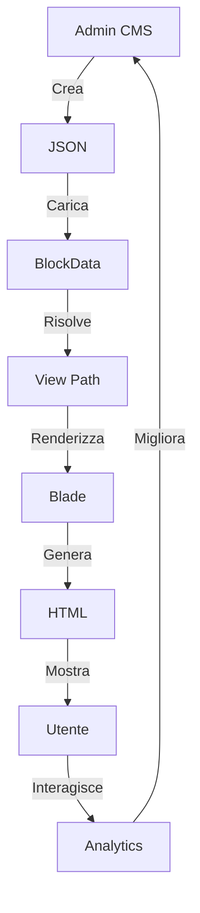
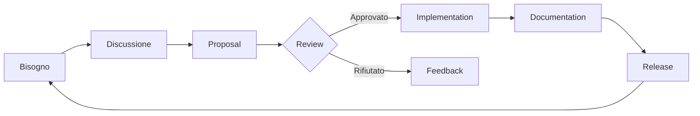

# Visione Architetturale dei Content Blocks

> *"Costruiamo non per oggi, ma per l'eternità."*

## 🎯 La North Star

### Obiettivo Finale

Creare un **sistema di contenuti universale** che permetta a **chiunque** di costruire **qualsiasi pagina** senza scrivere codice, mantenendo **ordine** nel **caos creativo**.

## 🏛️ I Fondamenti

### 1. Separazione dei Poteri

```
┌────────────────────────────────────────────────────┐
│  MODULO CMS                                       │
│  (Il Legislatore)                                 │
│  - Definisce la struttura                         │
│  - Fornisce i dati                                │
│  - Governa i tipi                                 │
└────────────────────────────────────────────────────┘
                    │
                    │ (contratto)
                    ▼
┌────────────────────────────────────────────────────┐
│  TEMA                                              │
│  (L'Esecutivo)                                    │
│  - Implementa le viste                            │
│  - Definisce lo stile                             │
│  - Renderizza l'HTML                              │
└────────────────────────────────────────────────────┘
```

**Perché?** Il CMS non deve sapere come è fatto l'HTML. Il tema non deve sapere da dove arrivano i dati.

### 2. La Gerarchia dei Tipi

```
Livello 0: Atomici (non scomponibili)
├── paragraph
├── image
├── title
└── video

Livello 1: Composti (combinano atomici)
├── hero (title + paragraph + image)
├── feature_section (title + paragraph × N)
└── testimonial (image + paragraph + title)

Livello 2: Pagine (combinano composti)
├── landing_page
├── homepage
└── article
```

**Perché?** I tipi atomici sono per sempre. I tipi composti evolvono. I tipi pagina sono effimeri.

### 3. Il Flusso dell'Energia



## 🚀 La Roadmap Eterna

### Fase 1: Le Fondamenta (✅ Completato)

- [x] Sistema di blocchi JSON
- [x] BlockData class
- [x] View resolver
- [x] Filament Builder integration

### Fase 2: L'Espansione (2026 Q2)

- [ ] Block type registry (discovery automatica)
- [ ] View fallback chain (se manca homepage, usa default)
- [ ] Block validation (schema JSON validato)
- [ ] Hot reload (vedi cambiamenti in real-time)

### Fase 3: L'Illuminazione (2026 Q3)

- [ ] AI-powered block suggestions ("Ti serve un hero?")
- [ ] Block marketplace (scarica nuovi tipi)
- [ ] Versioning dei blocchi (rollback a versioni precedenti)
- [ ] A/B testing integrato (quale vista converte di più?)

### Fase 4: La Trascendenza (2026 Q4)

- [ ] Block composition language (DSL per definire blocchi)
- [ ] Cross-theme compatibility (stessi blocchi, temi diversi)
- [ ] Block analytics (quale tipo usi di più?)
- [ ] Auto-optimization (il sistema suggerisce migliorie)

## 🌍 L'Ecosistema

### Gli Attori

```
┌─────────────────┐
│  ARCHITETTO     │  Definisce i tipi di blocco
│  (Module Dev)   │  Pensa in astratto
└─────────────────┘
        │
        │ (definisce contratto)
        ▼
┌─────────────────┐
│  ARTIGIANO      │  Implementa le viste
│  (Theme Dev)    │  Pensa in concreto
└─────────────────┘
        │
        │ (fornisce strumenti)
        ▼
┌─────────────────┐
│  CREATORE       │  Costruisce le pagine
│  (Content Ed.)  │  Pensa nel risultato
└─────────────────┘
        │
        │ (consuma contenuto)
        ▼
┌─────────────────┐
│  VISITATORE     │  Naviga il sito
│  (End User)     │  Pensa nell'esperienza
└─────────────────┘
```

### Le Responsabilità

| Attore | Responsabilità | Potere | Limite |
|--------|---------------|--------|--------|
| **Architetto** | Definire tipi generici | Creare nuovi tipi | Non può imporre viste |
| **Artigiano** | Implementare viste belle | Scegliere HTML/CSS | Deve seguire il contratto |
| **Creatore** | Costruire pagine | Combinare blocchi | Non può inventare tipi |
| **Visitatore** | Fruire contenuti | Navigare | Non vede la magia |

## 🏗️ L'Architettura Tecnica

### Il Pattern Resolver

```php
// Pseudo-codice della saggezza
class BlockViewResolver
{
    public function resolve(BlockData $block): string
    {
        // La Via: tipo determina percorso
        $pattern = config('blocks.view_pattern');
        // "pub_theme::components.blocks.{type}.{view}"
        
        return str_replace([
            '{theme}',
            '{type}',
            '{view}'
        ], [
            $this->getActiveTheme(),  // pub_theme
            $block->type,             // hero
            $block->data['view']      // homepage
        ], $pattern);
    }
}
```

### La Catena di Fallback (Futura)

```
Se manca: pub_theme::components.blocks.hero.homepage
Allora:   pub_theme::components.blocks.hero.default
Altrimenti: pub_theme::components.blocks.fallback
Eccezione: "View not found for block type 'hero'"
```

## 📊 Le Metriche della Saggezza

### Come Misuriamo il Successo

1. **Tempo di Creazione Pagine**
   - Prima: 4 ore per homepage
   - Dopo: 15 minuti per homepage
   - **Target**: 10 minuti

2. **Riutilizzo dei Blocchi**
   - Blocchi creati: 20
   - Blocchi riusati: 18
   - **Score**: 90% riusabilità

3. **Soddisfazione Content Editor**
   - NPS: +67
   - CES (Effort Score): 2.1/7 (basso è meglio)
   - **Target**: CES < 2.0

4. **Performance Tecniche**
   - Cache hit rate: 95%
   - Tempo di render: < 50ms per blocco
   - **Target**: < 30ms

## 🎨 I Principi del Design

### 1. Il Principio del Minimo Potere

> *"Un blocco dovrebbe avere il minimo potere necessario per fare il suo lavoro"*

```blade
{{-- ✅ CORRETTO: Potere minimo --}}
{
    "type": "paragraph",
    "data": {
        "content": "..."  // Solo il contenuto
    }
}

{{-- ❌ SBAGLIATO: Troppo potere --}}
{
    "type": "paragraph",
    "data": {
        "content": "...",
        "css_class": "custom-class",
        "inline_styles": "color: red;",
        "data_attributes": {"foo": "bar"},
        "wrapper_tag": "article"
    }
}
```

### 2. Il Principio della Massima Sorpresa

> *"Un blocco dovrebbe comportarsi nel modo meno sorprendente possibile"*

Se un developer si aspetta:
```json
{
    "type": "hero",
    "view": "components.blocks.hero.homepage"
}
```

Allora il sistema DEVE risolvere in:
```blade
Themes/{ActiveTheme}/resources/views/components/blocks/hero/homepage.blade.php
```

**Niente magia nera. Niente sorprese.**

### 3. Il Principio dell'Estensibilità

> *"Ogni blocco dovrebbe essere estendibile senza modificarlo"*

```blade
{{-- Blocco base --}}
@extends('pub_theme::components.blocks.hero.base')

{{-- Blocco personalizzato --}}
@section('additional_content')
    <p>Contenuto extra per questa specifica homepage</p>
@endsection
```

## 🔄 Il Ciclo del Cambiamento

### Come Evolviamo il Sistema



### Le Regole del Cambiamento

1. **Nessun breaking change senza major version**
2. **Deprecation warning per 2 minor versions**
3. **Migration guide obbligatoria**
4. **Backward compatibility per 1 anno**

## 🌌 Il Futuro Oltre l'Orizzonte

### Sogni Progettuali

1. **Blocchi Auto-Adattivi**
   - Il blocco si adatta al dispositivo
   - Mobile: layout verticale
   - Desktop: layout orizzontale
   - **Stato**: Research phase

2. **Blocchi Intelligenti**
   - AI suggerisce contenuti
   - "Questo hero ha bisogno di un subtitle"
   - **Stato**: Idea phase

3. **Blocchi Viventi**
   - Si aggiornano da soli
   - A/B testing automatico
   - **Stato**: Science fiction

4. **Blocchi Universali**
   - Stessi blocchi per web, mobile, email
   - **Stato**: Dream phase

## 📜 Il Manifesto

### Noi Crediamo In:

1. **Contenuti > Codice**
   - Chiunque dovrebbe poter creare contenuti
   - Il codice serve i contenuti, non viceversa

2. **Convenzioni > Configurazioni**
   - Meglio una convenzione chiara
   - Che mille configurazioni

3. **Composizione > Ereditarietà**
   - Meglio combinare blocchi semplici
   - Che creare blocchi complessi

4. **Documentazione > Commenti**
   - Meglio documentare il perché
   - Che commentare il come

5. **Filosofia > Regole**
   - Meglio capire la filosofia
   - Che seguire regole ciecamente

## 🎯 La Missione

> *"Democratizzare la creazione di contenuti, mantenendo l'ordine nell'universo digitale."*

Ogni blocco è un mattone.  
Ogni tipo è un architetto.  
Ogni vista è una casa.  
Ogni pagina è un mondo.

**Costruiamo mondi, un blocco alla volta.**

---

**Versione**: 1.0  
**Data**: 2026-03-30  
**Stato**: ✅ In Evoluzione  
**OpenViking URI**: `viking://modules/cms/docs/blocks/architecture-vision`  
**BMAD Reference**: `bmad://architecture/blocks/vision`  
**GSD Phase**: `gsd://phase/blocks-evolution/phase-2`

## 🔗 Riferimenti Incrociati

### Documentazione Tecnica
- [View Naming Philosophy](./view-naming-philosophy.md)
- [BlockData Implementation](../../app/Datas/BlockData.php)
- [Filament Builder Integration](./filament-builder.md)

### Documentazione Filosofica
- [Zen Philosophy](./ZEN_PHILOSOPHY.md)
- [Theme Zen Philosophy](../../../Themes/Sixteen/docs/blocks/ZEN_PHILOSOPHY.md)

### Documentazione di Progetto
- [Agnostic Documentation Rule](../../docs/AGNOSTIC_DOCUMENTATION_RULE.md)
- [Documentation Index](../../docs/DOCUMENTATION_INDEX.md)
- [Migration Plan](../../docs/MIGRATION_PLAN.md)

### Risorse Esterne
- [Filament Forms Builder](https://filamentphp.com/docs/5.x/forms/builder)
- [Laravel Blade Components](https://laravel.com/docs/blade#components)
- [Design Patterns: Composition Over Inheritance](https://en.wikipedia.org/wiki/Composition_over_inheritance)
