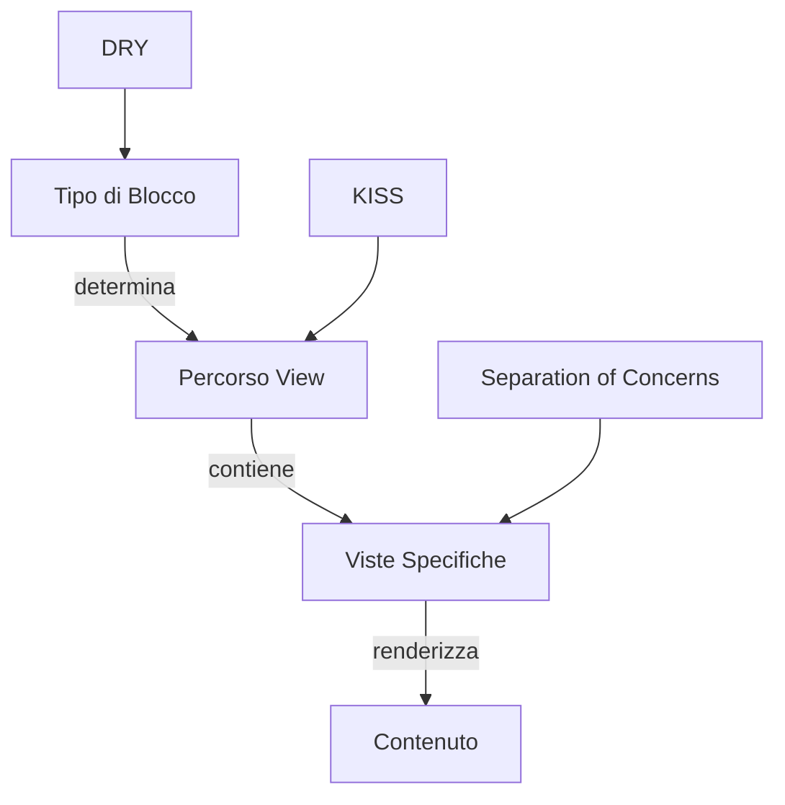
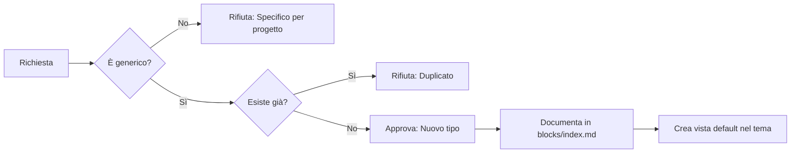
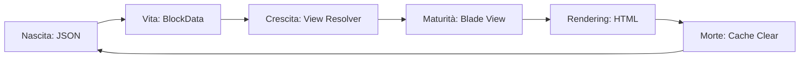

# Zen & Filosofia dei Content Blocks

> *"La vista segue il tipo, come l'ombra segue la forma."*  
> — Antico proverbio degli sviluppatori Laravel

## 🧘 La Via del Blocco

### Il Primo Principio: Tipo → Vista

```
pub_theme::components.blocks.<tipo>.<vista>
```

Questa non è una convenzione. È **la Via**.

#### Perché questa è la Via?

1. **Predicibilità**: Se conosco il tipo `hero`, so che la vista è in `components.blocks.hero.*`
2. **Modularità**: Ogni tipo è un universo autosufficiente
3. **Riutilizzo**: Lo stesso tipo può avere infinite viste diverse
4. **Manutenzione**: Se devo fixare `hero`, guardo solo in `components.blocks.hero/`

### I Tre Pilastri



## 📿 I Cinque Comandamenti

### 1. Non avrai altro tipo all'infuori del tuo tipo

```blade
{{-- ✅ CORRETTO --}}
"type": "hero"
"view": "pub_theme::components.blocks.hero.homepage"

{{-- ❌ SBAGLIATO --}}
"type": "hero"
"view": "pub_theme::components.blocks.tests.reference-page"
```

**Spiegazione**: Il tipo `hero` DEVE avere viste in `components.blocks.hero.*`, non in `components.blocks.tests.*`

### 2. Non nominare il percorso della vista invano

```blade
{{-- ✅ CORRETTO: Il percorso riflette la struttura --}}
pub_theme::components.blocks.hero.homepage
pub_theme::components.blocks.hero.landing
pub_theme::components.blocks.hero.minimal

{{-- ❌ SBAGLIATO: Percorsi che non seguono la convenzione --}}
pub_theme::components.blocks.misc.hero-stuff
pub_theme::components.blocks.custom.homepage-hero
```

### 3. Ricordati di separare il modulo dal tema

```blade
{{-- ✅ CORRETTO: Il modulo definisce i dati, il tema definisce le viste --}}
// Modulo Cms: definisce la struttura
{
    "type": "hero",
    "data": { "title": "...", "subtitle": "..." }
}

// Tema Sixteen: definisce la vista
Themes/Sixteen/resources/views/components/blocks/hero/homepage.blade.php

{{-- ❌ SBAGLIATO: Il modulo conosce le viste del tema --}}
// Modulo Cms: NON fare questo
return view('sixteen::components.blocks.hero.homepage');
```

### 4. Onora il tuo padre (il modulo) e la tua madre (il tema)

```blade
{{-- ✅ CORRETTO: Rispetta i confini --}}
// Il modulo fornisce i dati
class BlockData {
    public string $type;
    public array $data;
}

// Il tema fornisce le viste
Themes/Sixteen/resources/views/components/blocks/hero/homepage.blade.php

{{-- ❌ SBAGLIATO: Incesto architetturale --}}
// Il modulo crea HTML
return '<div class="hero">' . $data['title'] . '</div>';
```

### 5. Non creare blocchi specifici per progetto

```blade
{{-- ✅ CORRETTO: Generico e riutilizzabile --}}
{
    "type": "hero",
    "data": {
        "view": "pub_theme::components.blocks.hero.homepage",
        "title": "Benvenuto",
        "subtitle": "La tua piattaforma"
    }
}

{{-- ❌ SBAGLIATO: Specifico per FixCity --}}
{
    "type": "fixcity_hero",
    "data": {
        "view": "pub_theme::components.blocks.fixcity.city-hero",
        "title": "Segnala problemi urbani"
    }
}
```

## 🎯 La Visione

### Il Sogno di un Mondo Modulare

Immagina un mondo dove:

1. **Ogni blocco è LEGO**: Puoi combinare `hero` + `paragraph` + `image` + `contact` in qualsiasi ordine
2. **I tipi sono universali**: `hero` funziona per FixCity, per Blog, per E-commerce
3. **Le viste sono intercambiabili**: Stesso tipo `hero`, viste diverse per temi diversi
4. **I non-tecnici creano**: Il CMS permette a chiunque di costruire pagine complesse

### La Democrazia dei Contenuti

```
┌─────────────────────────────────────────┐
│  UTENTE CMS (Non-tecnico)               │
│  "Voglio una homepage con:"             │
│   - Un hero grande                      │
│   - Una sezione servizi                 │
│   - Le ultime notizie                   │
│   - Un form contatti                    │
└─────────────────────────────────────────┘
              │
              ▼
┌─────────────────────────────────────────┐
│  CMS (Traduce desideri in blocchi)      │
│  [hero, services, news_list, contact]   │
└─────────────────────────────────────────┘
              │
              ▼
┌─────────────────────────────────────────┐
│  SISTEMA (Renderizza seguendo la Via)   │
│  pub_theme::components.blocks.hero.*    │
│  pub_theme::components.blocks.services.*│
│  pub_theme::components.blocks.news.*    │
│  pub_theme::components.blocks.contact.* │
└─────────────────────────────────────────┘
```

## ☯️ Lo Zen della Progettazione

### Il Wu Wei (Non-Azione) nei Blocchi

> *"Il miglior blocco è quello che non serve creare"*

Prima di creare un nuovo tipo di blocco:

1. **Esiste già?** Cerca in `Modules/Cms/docs/blocks/`
2. **Puoi estendere un tipo esistente?** `hero` può fare molto
3. **È davvero necessario?** O è solo capriccio?
4. **Sarà riutilizzabile?** O è specifico per un caso?

### Il Vuoto che Contiene Tutto

Un blocco ben progettato è come una ciotola vuota:

```blade
{{-- ✅ Vuoto ma potente --}}
{
    "type": "paragraph",
    "data": {
        "view": "pub_theme::components.blocks.paragraph.simple",
        "content": "..."  // Il contenuto riempie il vuoto
    }
}

{{-- ❌ Troppo pieno, rigido --}}
{
    "type": "very_specific_about_us_paragraph_with_blue_background",
    "data": {
        "view": "pub_theme::components.blocks.paragraph.about-us-blue",
        "content": "...",
        "background_color": "#0066cc",
        "font_size": "16px",
        "line_height": "1.6"
    }
}
```

### Il Ritorno all'Origine

Tutto torna al tipo:

```
JSON (tipo: "hero")
  ↓
BlockData (type = "hero")
  ↓
View Resolver (cerca in components.blocks.hero.*)
  ↓
Blade View (hero/homepage.blade.php)
  ↓
HTML (<section class="hero">...</section>)
```

## 🧭 La Politica (Governance)

### Chi Decide i Nuovi Tipi?



### Il Processo di Canonizzazione

Per un nuovo tipo di blocco:

1. **Proposal**: Apri issue con giustificazione
2. **Review**: La comunità valuta se è generico
3. **Implementation**: Crea il tipo + vista default
4. **Documentation**: Scrivi docs filosofiche + tecniche
5. **Canonization**: Il tipo entra nei "sacri testi"

### Tipi Canonizzati (2026-03-30)

| Tipo | Scopo | Vista Default | Stato |
|------|-------|---------------|-------|
| `hero` | Hero section principale | `hero.homepage` | ✅ Canonico |
| `paragraph` | Testo formattato | `paragraph.simple` | ✅ Canonico |
| `image` | Immagine singola | `image.default` | ✅ Canonico |
| `images_gallery` | Galleria immagini | `gallery.grid` | ✅ Canonico |
| `widget` | Widget Filament | `widget.container` | ✅ Canonico |
| `chart` | Grafici | `chart.default` | ✅ Canonico |
| `rating` | Sistema valutazioni | `rating.stars` | ✅ Canonico |
| `feature_sections` | Sezioni con features | `features.grid` | ✅ Canonico |
| `landing_page` | Landing page | `landing.full` | ✅ Canonico |
| `page_block` | Blocco generico | `page.reference` | ⚠️ Legacy |

## 📚 I Testi Sacri (Riferimenti)

### Documentazione Tecnica
- [View Naming Philosophy](./view-naming-philosophy.md) - La regola tecnica
- [BlockData Implementation](../../app/Datas/BlockData.php) - Il codice
- [Filament Builder](./filament-builder.md) - L'interfaccia admin

### Documentazione Filosofica
- [Architecture Vision](./ARCHITECTURE_VISION.md) - La visione a lungo termine
- [Zen of Components](../../../Themes/Sixteen/docs/blocks/ZEN_PHILOSOPHY.md) - La prospettiva del tema

### Documentazione del Progetto
- [Agnostic Documentation Rule](../../docs/AGNOSTIC_DOCUMENTATION_RULE.md) - La legge
- [Documentation Index](../../docs/DOCUMENTATION_INDEX.md) - La mappa

## 🪷 Meditazioni per Sviluppatori

### Koan 1: Il Tipo e la Vista

> Un developer chiese: "Posso usare il tipo `hero` con una vista `components.blocks.about.us-hero`?"  
> Il maestro rispose: "Puoi, ma non dovresti. Perché quando il tuo successore cercherà `hero`, troverà `about.us-hero`? E quando cercherà `about.us-hero`, troverà `hero`?"

**Morale**: La vista DEVE stare nella directory del tipo.

### Koan 2: Il Blocco Specifico

> Un developer chiese: "Ma ho bisogno di un blocco `fixcity_ticket_form`!"  
> Il maestro rispose: "Hai bisogno di un blocco `form` con tipo `ticket`. Il tipo è `form`, la vista è `form.ticket`."

**Morale**: Generalizza il tipo, specifica la vista.

### Koan 3: La Vista Mancante

> Un developer pianse: "La vista `components.blocks.hero.homepage` non esiste!"  
> Il maestro sorrise: "Esiste nel tuo cuore. Creala."

**Morale**: Il tipo definisce il percorso, non l'esistenza. Se la vista manca, creala.

## 🎨 L'Arte del Blocco

### La Bellezza della Convenzione

```blade
{{-- La poesia di un blocco ben nominato --}}
{
    "type": "hero",
    "data": {
        "view": "pub_theme::components.blocks.hero.homepage"
    }
}

{{-- Si legge come haiku --}}
pub_theme     :: il tema parla
components    :: i mattoni UI
blocks        :: i blocchi
hero          :: il tipo
homepage      :: la vista specifica
```

### La Bruttezza dell'Eccezione

```blade
{{-- La prosa di un blocco mal nominato --}}
{
    "type": "hero",
    "data": {
        "view": "pub_theme::components.blocks.tests.reference-page"
    }
}

{{-- Dissonanza cognitiva --}}
"Sei un hero... ma vivi nel quartiere tests"
"Sei una reference-page... ma ti chiami hero"
"Chi sei veramente?"
```

## 🔄 Il Ciclo della Vita del Blocco



Ogni blocco nasce JSON, vive come PHP, cresce come Blade, muore come HTML... e rinasce al prossimo request.

## 🌟 L'Illuminazione

Quando avrai interiorizzato la Via:

- Non guarderai più le convenzioni
- Il tuo codice seguirà la Via naturalmente
- I nuovi developer impareranno da te
- I blocchi si scriveranno da soli

**Questo è il Nirvana del Developer.**

---

**Versione**: 1.0  
**Data**: 2026-03-30  
**Stato**: ✅ Illuminato  
**OpenViking URI**: `viking://modules/cms/docs/blocks/zen-philosophy`

> *"Prima di studiare la Via, le montagne sono montagne e le acque sono acque. Quando studi la Via, le montagne non sono più montagne e le acque non sono più acque. Dopo aver studiato la Via, le montagne sono di nuovo montagne e le acque sono di nuovo acque."*  
> — Qingyuan Weixin (adattato per sviluppatori di blocchi)
