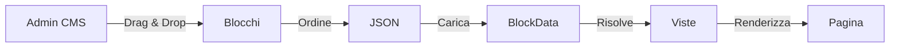

# Indice della Documentazione - Blocchi CMS

> *"La vista segue il tipo, come l'ombra segue la forma."*

## Collegamenti Correlati

### Documentazione Filosofica (LEGGI PRIMA)
- [🧘 Zen & Filosofia dei Blocchi](./ZEN_PHILOSOPHY.md) - **LA VIA**: Perché la convenzione tipo→vista è sacra
- [🎯 Visione Architetturale](./ARCHITECTURE_VISION.md) - **IL SOGNO**: Dove stiamo andando

### Documentazione Tecnica (CORE)
- [View Naming Philosophy](./view-naming-philosophy.md) - **LA REGOLA**: `pub_theme::components.blocks.<tipo>.<vista>`
- [BlockData Implementation](../../app/Datas/BlockData.php) - **IL CODICE**: Come funziona
- [Filament Builder Integration](./filament-builder.md) - **L'INTERFACCIA**: Come si usa in admin

### Documentazione del Progetto
- [Indice CMS](../index.md)
- [README CMS](../readme.md)
- [Agnostic Documentation Rule](../../docs/AGNOSTIC_DOCUMENTATION_RULE.md)
- [Documentation Index](../../docs/DOCUMENTATION_INDEX.md)

### Temi (Bidirezionale)
- [Sixteen Theme Blocks](../../../Themes/Sixteen/docs/blocks/ZEN_PHILOSOPHY.md) - La prospettiva del tema
- [TwentyOne Theme Blocks](../../../Themes/TwentyOne/docs/blocks/) - Tema admin

### Risorse Esterne
- [Filament Forms Builder](https://filamentphp.com/docs/5.x/forms/builder)
- [Laravel Blade Components](https://laravel.com/docs/blade#components)

---

## Panoramica

I blocchi sono componenti riutilizzabili che compongono le sezioni del sito. Ogni blocco ha uno scopo specifico e può essere inserito in diverse sezioni tramite i file JSON di configurazione.

### Il Principio Fondamentale

```
SE tipo = "hero"
ALLORA vista = "pub_theme::components.blocks.hero.*"
```

**Perché?** Modularità, predicibilità, riutilizzo. Leggi [Zen Philosophy](./ZEN_PHILOSOPHY.md) per approfondire.

---

## Tipi di Blocchi Canonizzati

### Blocchi Atomici (Livello 0)

| Tipo | Scopo | Vista Default | Documentazione |
|------|-------|---------------|----------------|
| `hero` | Hero section principale | `hero.homepage` | [Hero](./hero.md) |
| `paragraph` | Testo formattato | `paragraph.simple` | [Text](./text.md) |
| `title` | Titolo sezione | `title.default` | [Title](./title.md) |
| `image` | Immagine singola | `image.default` | [Image](./image.md) |
| `video` | Contenuto video | `video.default` | [Video](./video.md) |

### Blocchi Composti (Livello 1)

| Tipo | Scopo | Vista Default | Documentazione |
|------|-------|---------------|----------------|
| `feature_sections` | Sezioni con features | `features.grid` | [Features](./features.md) |
| `testimonials` | Testimonianze | `testimonials.grid` | [Testimonials](./testimonials.md) |
| `pricing` | Piani tariffari | `pricing.cards` | [Pricing](./pricing.md) |
| `team` | Presentazione team | `team.grid` | [Team](./team.md) |
| `faq` | Domande frequenti | `faq.accordion` | [FAQ](./faq.md) |

### Blocchi Pagina (Livello 2)

| Tipo | Scopo | Vista Default | Documentazione |
|------|-------|---------------|----------------|
| `landing_page` | Landing page completa | `landing.full` | [Landing](./landing.md) |
| `homepage` | Homepage | `homepage.full` | [Homepage](./homepage.md) |
| `page_block` | Blocco generico | `page.reference` | [Page](./page.md) |

### Blocchi Speciali

| Tipo | Scopo | Vista Default | Documentazione |
|------|-------|---------------|----------------|
| `widget` | Widget Filament | `widget.container` | [Widget](./widget.md) |
| `chart` | Grafici | `chart.default` | [Chart](./chart.md) |
| `rating` | Sistema valutazioni | `rating.stars` | [Rating](./rating.md) |
| `images_gallery` | Galleria immagini | `gallery.grid` | [Gallery](./gallery.md) |
| `topics` | Griglia argomenti | `topics.default` | [Topics](./research/topics-block-research.md) 🆕 |

---

## La Regola d'Oro: View Naming Convention

### La Formula

```
{theme}::components.blocks.{type}.{view}
```

### Esempi

```blade
{{-- ✅ CORRETTO: Il tipo determina il percorso --}}
{
    "type": "hero",
    "data": {
        "view": "pub_theme::components.blocks.hero.homepage"
    }
}

{{-- ✅ CORRETTO: Altro esempio --}}
{
    "type": "paragraph",
    "data": {
        "view": "pub_theme::components.blocks.paragraph.simple"
    }
}

{{-- ❌ SBAGLIATO: La vista non segue il tipo --}}
{
    "type": "hero",
    "data": {
        "view": "pub_theme::components.blocks.tests.reference-page"
    }
}
```

**Spiegazione**: Se il tipo è `hero`, la vista DEVE stare in `components.blocks.hero.*`, non in `components.blocks.tests.*`

Leggi [View Naming Philosophy](./view-naming-philosophy.md) per la spiegazione completa.

---

## Struttura di un Blocco

Ogni blocco segue una struttura standardizzata:

```
Modules/Cms/
├── app/Datas/
│   └── BlockData.php              # La classe che definisce i blocchi
├── docs/blocks/
│   ├── index.md                   # Questo indice
│   ├── ZEN_PHILOSOPHY.md          # La filosofia
│   ├── ARCHITECTURE_VISION.md     # La visione
│   ├── view-naming-philosophy.md  # La regola tecnica
│   └── [tipo].md                  # Documentazione per tipo
└── resources/views/
    └── blocks/
        └── [tipo]/
            ├── [vista1].blade.php
            └── [vista2].blade.php

Themes/Sixteen/
└── resources/views/
    └── components/
        └── blocks/
            └── [tipo]/
                ├── [vista1].blade.php
                └── [vista2].blade.php
```

---

## Implementazione: La Via

### 1. Definisci il Tipo (JSON)

```json
{
    "id": "homepage",
    "content_blocks": {
        "it": [
            {
                "type": "hero",
                "data": {
                    "view": "pub_theme::components.blocks.hero.homepage",
                    "title": "Benvenuto",
                    "subtitle": "La tua piattaforma"
                }
            }
        ]
    }
}
```

### 2. Crea la Vista (Blade)

```blade
{{-- Themes/Sixteen/resources/views/components/blocks/hero/homepage.blade.php --}}
@layout('pub_theme::layouts.default')

@section('content')
<section class="hero hero--homepage">
    <div class="container">
        <h1>{{ $title }}</h1>
        <p>{{ $subtitle }}</p>
    </div>
</section>
@endsection
```

### 3. Documenta (Markdown)

```markdown
# Hero Block

## Scopo
Hero section principale per homepage.

## Vista Default
`pub_theme::components.blocks.hero.homepage`

## Esempio JSON
[vedi sopra]

## Riferimenti
- [Zen Philosophy](./ZEN_PHILOSOPHY.md)
- [View Naming](./view-naming-philosophy.md)
```

---

## Best Practices (I Comandamenti)

### 1. Onora il Tipo

```blade
{{-- ✅ CORRETTO --}}
"type": "hero" → view in "components.blocks.hero.*"

{{-- ❌ SBAGLIATO --}}
"type": "hero" → view in "components.blocks.misc.*"
```

### 2. Non Creare Idoli Specifici

```blade
{{-- ✅ CORRETTO: Generico --}}
"type": "form"

{{-- ❌ SBAGLIATO: Specifico --}}
"type": "fixcity_contact_form_with_map"
```

### 3. Ricorda il Sabato (Documenta)

Ogni blocco DEVE avere:
- [ ] Documentazione tecnica
- [ ] Esempio JSON
- [ ] Vista default
- [ ] Riferimenti incrociati

### 4. Onora Padre (Modulo) e Madre (Tema)

```blade
{{-- ✅ CORRETTO: Confini rispettati --}}
Modulo: Fornisce i dati
Tema: Fornisce le viste

{{-- ❌ SBAGLIATO: Incesto architetturale --}}
Modulo: Crea HTML
```

### 5. Non Uccidere (la Riutilizzabilità)

Prima di creare un nuovo tipo:
1. Esiste già?
2. Puoi estenderne uno esistente?
3. È davvero necessario?
4. Sarà riutilizzabile?

---

## Flusso di Creazione Pagine



---

## Metriche di Qualità

| Metrica | Target | Attuale | Stato |
|---------|--------|---------|-------|
| Riutilizzo blocchi | >90% | TBD | 🟡 |
| Tempo creazione pagina | <10 min | TBD | 🟡 |
| Documentazione completa | 100% | TBD | 🟡 |
| Viste per tipo | 3-5 | TBD | 🟡 |

---

## Note Importanti

- Ogni blocco deve essere **autocontenuto** e non dipendere da altri blocchi
- I blocchi devono supportare la **localizzazione** tramite le chiavi del file JSON
- L'implementazione deve seguire le convenzioni di **naming del progetto**
- **Leggi la filosofia PRIMA** di implementare: [ZEN_PHILOSOPHY.md](./ZEN_PHILOSOPHY.md)

---

## OpenViking URIs

- `viking://modules/cms/docs/blocks/index` - Questo indice
- `viking://modules/cms/docs/blocks/zen-philosophy` - Filosofia
- `viking://modules/cms/docs/blocks/architecture-vision` - Visione
- `viking://modules/cms/docs/blocks/view-naming` - Regola view naming

---

**Versione**: 2.0 (Aggiornato con Filosofia)  
**Data**: 2026-03-30  
**Stato**: ✅ Vivo e In Evoluzione  
**Prossima Review**: 2026-04-30

