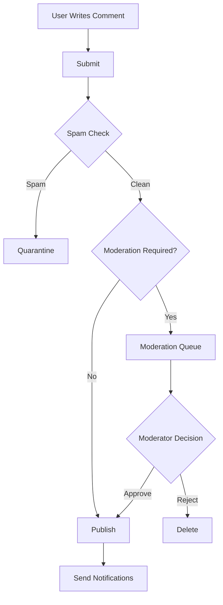

# Product Requirements Document (PRD) - Comment Module

**Module**: Comment
**Version**: 1.0
**Status**: Draft
**Last Updated**: 2026-03-12
**Author**: Product Team

---

## Document Control

| Version | Date | Author | Changes |
|---------|------|--------|---------|
| 1.0 | 2026-03-12 | Product Team | Initial draft |

---

## 1. Executive Summary

### 1.1 Problem Statement
> User engagement through comments is essential for building community and fostering discussion. However, managing comments at scale requires robust moderation tools, spam prevention, threading capabilities, and notification systems. Without a dedicated comment management system, platforms struggle with spam, toxic content, and poor user experience, leading to decreased engagement and potential brand damage.

### 1.2 Proposed Solution
> The Comment module provides a comprehensive comment management system with threaded discussions, rich text support, moderation workflows, spam detection, voting/rating, and notifications. It integrates seamlessly with Blog, Predict, Media, and other content modules to enable user engagement across the platform. The module includes admin tools for moderation, user controls for managing their comments, and automated systems for spam and abuse prevention.

### 1.3 Business Value Proposition
- **Primary Value**: Enable safe, engaging user discussions that build community
- **Secondary Value**: User-generated content for SEO, community insights
- **Strategic Alignment**: Increase user engagement, time on site, and community building

### 1.4 Success Metrics (High-Level)
| Metric | Current | Target | Timeline |
|--------|---------|--------|----------|
| Comment Engagement Rate | N/A | 15% of readers | Q3 2026 |
| Spam Detection Accuracy | N/A | 95%+ | Q2 2026 |
| Moderation Response Time | N/A | <4 hours | Q2 2026 |
| User Satisfaction | N/A | 4.0/5 | Q3 2026 |

---

## 2. Goals & Objectives

### 2.1 Primary Goals (SMART)
1. **Specific**: Build threaded comment system with moderation and spam prevention
2. **Measurable**: Achieve 95%+ spam detection accuracy, <4 hour moderation response
3. **Achievable**: Leverage existing User, Notify, and AI modules for integration
4. **Relevant**: Critical for community engagement and user-generated content
5. **Time-bound**: Core commenting by Q2 2026, advanced features by Q3 2026

### 2.2 Secondary Goals
- Implement comment analytics and insights
- Build comment reputation system
- Create comment export and data portability
- Develop advanced moderation AI

### 2.3 Non-Goals
> What this module will NOT do (scope boundaries)
- Real-time chat/messaging (separate chat system)
- Forum-style discussions (handled by forum module if needed)
- Comment-based customer support (handled by support system)

### 2.4 Key Results (OKRs)
| Objective | Key Result | Target | Status |
|-----------|------------|--------|--------|
| Engagement Excellence | Comments per article | 10+ average | Pending |
| Community Safety | Spam detection rate | 95%+ | Pending |
| Moderation Efficiency | Response time | <4 hours | Pending |
| User Satisfaction | Comment satisfaction | 4.0/5 | Pending |

---

## 3. Target Users

### 3.1 User Personas

#### Persona 1: Community Member
| Attribute | Details |
|-----------|---------|
| Role | Registered User |
| Goals | Share opinions, engage in discussions, connect with others |
| Pain Points | Complex comment forms, lack of formatting, no notifications |
| Technical Level | Basic |
| Usage Frequency | Weekly |

**User Story**:
> As a Community Member, I want to easily post comments and receive notifications of replies, so that I can engage in meaningful discussions.

#### Persona 2: Content Moderator
| Attribute | Details |
|-----------|---------|
| Role | Moderator/Admin |
| Goals | Maintain community standards, remove spam and abuse |
| Pain Points | High volume of comments, difficult moderation tools |
| Technical Level | Intermediate |
| Usage Frequency | Daily |

**User Story**:
> As a Content Moderator, I want efficient moderation tools with bulk actions, so that I can maintain community quality efficiently.

#### Persona 3: Content Creator
| Attribute | Details |
|-----------|---------|
| Role | Author/Editor |
| Goals | Engage with readers, monitor comments on content |
| Pain Points | No visibility into comments, can't respond easily |
| Technical Level | Intermediate |
| Usage Frequency | Weekly |

**User Story**:
> As a Content Creator, I want to monitor and respond to comments on my articles, so that I can build relationships with my audience.

### 3.2 Use Cases
| ID | Use Case | Actor | Trigger | Outcome |
|----|----------|-------|---------|---------|
| UC-001 | Post comment | User | Read content | Comment submitted |
| UC-002 | Reply to comment | User | Read comment | Threaded reply |
| UC-003 | Report comment | User | See inappropriate content | Report submitted |
| UC-004 | Moderate comment | Moderator | Report or flag | Comment action taken |
| UC-005 | Vote on comment | User | Read comment | Upvote/downvote |
| UC-006 | Receive notification | User | Reply to comment | Notification sent |

### 3.3 Pain Points Addressed
| Pain Point | Severity | How Solved |
|------------|----------|------------|
| Spam comments | High | AI-powered spam detection |
| Toxic content | High | Moderation workflow, reporting |
| Poor organization | Medium | Threaded comments, sorting |
| No engagement tracking | Medium | Notifications, activity feed |
| Limited formatting | Low | Rich text, markdown support |

---

## 4. Functional Requirements

### 4.1 Requirements Matrix

| ID | Requirement | Description | Priority | Acceptance Criteria |
|----|-------------|-------------|----------|---------------------|
| FR-001 | Comment Creation | Post comments on content | P0 | Rich text support |
| FR-002 | Threaded Replies | Nested comment replies | P0 | Multi-level threading |
| FR-003 | Comment Moderation | Approve, edit, delete comments | P0 | Moderation dashboard |
| FR-004 | Spam Detection | Automatic spam identification | P0 | 95%+ accuracy |
| FR-005 | Comment Voting | Upvote/downvote comments | P1 | Vote tally display |
| FR-006 | Comment Reporting | Users can report comments | P1 | Report workflow |
| FR-007 | Notifications | Notify on replies, mentions | P1 | Email + in-app |
| FR-008 | User Profiles | Show commenter info | P1 | Profile links |
| FR-009 | Comment Editing | Edit own comments | P2 | Edit history |
| FR-010 | Comment Search | Search and filter comments | P2 | Admin search |
| FR-011 | Bulk Moderation | Moderate multiple comments | P2 | Bulk actions |
| FR-012 | Comment Analytics | Engagement metrics | P3 | Analytics dashboard |

### 4.2 Priority Definitions
- **P0 (Critical)**: Must have for launch - core commenting, moderation, spam
- **P1 (High)**: Should have - voting, reporting, notifications
- **P2 (Medium)**: Nice to have - editing, search, bulk tools
- **P3 (Low)**: Future consideration - advanced analytics

### 4.3 Feature Details

#### Feature 1: Comment System
**Description**: Core commenting functionality with rich text support, threading, and real-time updates.

**User Flow**:
```
1. User scrolls to comment section
2. Clicks comment box
3. Types comment (with formatting)
4. Submits comment
5. System validates and checks spam
6. Comment posted (or queued for moderation)
7. Notifications sent to content author
```

**Acceptance Criteria**:
- [ ] Rich text editor with markdown support
- [ ] Comment preview before posting
- [ ] Auto-save drafts
- [ ] Image/media embedding
- [ ] @mention support
- [ ] Edit/delete own comments

**Dependencies**: User Module, Media Module

#### Feature 2: Moderation System
**Description**: Comprehensive moderation tools for managing comments, handling reports, and maintaining community standards.

**Acceptance Criteria**:
- [ ] Moderation dashboard with queue
- [ ] Approve, reject, edit, delete actions
- [ ] Bulk moderation actions
- [ ] User ban/suspend capabilities
- [ ] Moderation audit log
- [ ] Automated flagging rules

**Dependencies**: User Module, Activity Module

#### Feature 3: Spam & Abuse Prevention
**Description**: AI-powered spam detection and community-driven reporting system.

**Acceptance Criteria**:
- [ ] Automatic spam detection (95%+ accuracy)
- [ ] Rate limiting for comment posting
- [ ] Link/URL filtering
- [ ] Profanity filter
- [ ] User reporting system
- [ ] Auto-hide reported comments

**Dependencies**: AI Module

---

## 5. Non-Functional Requirements

### 5.1 Performance Requirements
| Metric | Requirement | Measurement |
|--------|-------------|-------------|
| Comment Load Time | <1s | Comment section |
| Post Comment | <500ms | Submission to display |
| Concurrent Users | 1000+ | Simultaneous commenters |
| Spam Detection | <100ms | Detection latency |
| Availability | 99.9% | Monthly uptime |

### 5.2 Security Requirements
- [x] Authentication for posting (configurable)
- [x] XSS protection (content sanitization)
- [x] CSRF protection
- [x] Rate limiting
- [x] User authorization checks
- [x] Audit logging

### 5.3 Scalability Requirements
- Support for 1M+ comments
- Efficient pagination and lazy loading
- Comment caching strategy
- Database indexing for performance

### 5.4 Compliance Requirements
- [x] GDPR (comment deletion, data export)
- [x] Content moderation policies
- [x] Age restrictions (if applicable)

---

## 6. User Experience

### 6.1 User Flows


### 6.2 Wireframes
> [Links to Figma/Sketch wireframes - to be created]

### 6.3 Design Principles
- Clean, readable comment layout
- Clear visual hierarchy for threads
- Accessible to all users
- Mobile-responsive design

### 6.4 Interaction Specifications
| Interaction | Behavior | Feedback |
|-------------|----------|----------|
| Post Comment | Submit form | Loading state → success |
| Reply | Inline reply form | Thread expands |
| Vote | Click vote button | Vote count updates |
| Report | Click report | Confirmation dialog |

---

## 7. Technical Considerations

### 7.1 Architecture Overview
```
┌─────────────────────────────────────────────────────────┐
│                  Comment Module                         │
│  ┌──────────────┐  ┌──────────────┐  ┌──────────────┐  │
│  │ Comment      │  │ Moderation   │  │ Spam         │  │
│  │ Engine       │  │ System       │  │ Detection    │  │
│  └──────────────┘  └──────────────┘  └──────────────┘  │
│  ┌──────────────┐  ┌──────────────┐  ┌──────────────┐  │
│  │ Threading    │  │ Notification │  │ Voting       │  │
│  │ System       │  │ Integration  │  │ System       │  │
│  └──────────────┘  └──────────────┘  └──────────────┘  │
└─────────────────────────────────────────────────────────┘
              │              │              │
              ▼              ▼              ▼
    ┌─────────────┐ ┌─────────────┐ ┌─────────────┐
    │   Blog/     │ │   Notify    │ │     AI      │
    │   Predict   │ │   Module    │ │   Module    │
    └─────────────┘ └─────────────┘ └─────────────┘
```

### 7.2 Dependencies
| Dependency | Type | Version | Criticality |
|------------|------|---------|-------------|
| Laravel | Framework | 12.x | Critical |
| Filament | UI Framework | 5.x | Critical |
| spatie/laravel-activitylog | Package | 4.x | Medium |
| spatie/laravel-query-builder | Package | 5.x | Medium |

### 7.3 Integration Points
| System | Integration Type | Data Flow | Frequency |
|--------|------------------|-----------|-----------|
| Blog Module | Content Comments | Inbound | Per article |
| Predict Module | Market Comments | Inbound | Per market |
| User Module | User Data | Bidirectional | Per comment |
| Notify Module | Notifications | Outbound | Per event |
| AI Module | Spam Detection | Outbound | Per comment |

### 7.4 Technical Constraints
- PHP 8.3+ required
- Laravel 12+ required
- Filament v5 compatibility
- Database: MySQL 8.0+

### 7.5 Database Schema
```sql
CREATE TABLE comments (
    id BIGINT UNSIGNED AUTO_INCREMENT PRIMARY KEY,
    user_id BIGINT UNSIGNED,
    commentable_type VARCHAR(255),
    commentable_id BIGINT UNSIGNED,
    parent_id BIGINT UNSIGNED NULL,
    content TEXT,
    status ENUM('pending', 'approved', 'rejected', 'spam'),
    is_edited BOOLEAN DEFAULT FALSE,
    votes_up INT DEFAULT 0,
    votes_down INT DEFAULT 0,
    reports_count INT DEFAULT 0,
    created_at TIMESTAMP DEFAULT CURRENT_TIMESTAMP,
    updated_at TIMESTAMP DEFAULT CURRENT_TIMESTAMP ON UPDATE CURRENT_TIMESTAMP,
    
    INDEX idx_commentable (commentable_type, commentable_id),
    INDEX idx_parent (parent_id),
    INDEX idx_status (status)
);

CREATE TABLE comment_reports (
    id BIGINT UNSIGNED AUTO_INCREMENT PRIMARY KEY,
    comment_id BIGINT UNSIGNED,
    user_id BIGINT UNSIGNED,
    reason VARCHAR(255),
    status ENUM('pending', 'resolved', 'dismissed'),
    created_at TIMESTAMP DEFAULT CURRENT_TIMESTAMP,
    
    INDEX idx_comment (comment_id),
    INDEX idx_status (status)
);

CREATE TABLE comment_votes (
    id BIGINT UNSIGNED AUTO_INCREMENT PRIMARY KEY,
    comment_id BIGINT UNSIGNED,
    user_id BIGINT UNSIGNED,
    vote_type TINYINT,
    created_at TIMESTAMP DEFAULT CURRENT_TIMESTAMP,
    
    UNIQUE KEY unique_comment_user (comment_id, user_id)
);
```

---

## 8. Analytics & Metrics

### 8.1 Success Metrics (KPIs)
| KPI | Definition | Target | Measurement Method |
|-----|------------|--------|-------------------|
| Comment Rate | % readers who comment | 15% | Analytics |
| Spam Detection | % spam correctly identified | 95%+ | AI accuracy |
| Moderation Time | Avg response time | <4 hours | Timestamps |
| User Satisfaction | Comment satisfaction | 4.0/5 | Surveys |
| Engagement Depth | Avg replies per comment | 2+ | Database |

### 8.2 Tracking Requirements
- Comment volume over time
- Spam detection rates
- Moderation queue size
- User engagement metrics
- Report resolution time

### 8.3 Reporting Dashboards
- Comment activity overview
- Moderation queue status
- Spam detection metrics
- User engagement trends
- Top commented content

---

## 9. Go-to-Market

### 9.1 Launch Criteria
- [x] All P0 features complete
- [ ] Spam detection tested
- [ ] Moderation workflow verified
- [ ] Documentation complete
- [ ] Community guidelines published

### 9.2 Marketing Requirements
- [ ] Community guidelines
- [ ] User onboarding content
- [ ] Moderator training materials
- [ ] Launch announcement

### 9.3 Sales Enablement
- N/A (Internal engagement feature)

### 9.4 Customer Support Needs
- [ ] User guide for commenting
- [ ] Moderator handbook
- [ ] FAQ
- [ ] Reporting guide

---

## 10. Timeline & Milestones

### 10.1 Key Dates
| Milestone | Date | Status |
|-----------|------|--------|
| Requirements Complete | 2026-03-12 | Complete |
| Design Complete | 2026-03-26 | Pending |
| Development Start | 2026-03-27 | Pending |
| Core Features (P0) | 2026-04-17 | Pending |
| Beta Launch | 2026-04-24 | Pending |
| GA Launch | 2026-05-08 | Pending |

### 10.2 Phase Breakdown
**Phase 1: Discovery** (Weeks 1-2)
- Community moderation research
- Spam detection evaluation
- User interviews

**Phase 2: Design** (Weeks 3-4)
- Comment UI/UX design
- Moderation workflow design
- Admin dashboard design

**Phase 3: Development** (Weeks 5-10)
- Sprint 1-2: Core commenting, threading
- Sprint 3-4: Moderation, spam detection
- Sprint 5: Notifications, polish

**Phase 4: Testing** (Weeks 11-12)
- QA testing
- Load testing
- Security testing

**Phase 5: Launch** (Week 13)
- Beta launch
- GA launch

### 10.3 Dependencies
| Dependency | On Whom | Due Date | Status |
|------------|---------|----------|--------|
| AI Module | AI Team | 2026-04-01 | Pending |
| Notify Module | Notify Team | 2026-04-01 | Pending |
| Filament v5 | UI Team | 2026-04-01 | Pending |

### 10.4 Risk Mitigation
| Risk | Probability | Impact | Mitigation |
|------|-------------|--------|------------|
| Spam overload | Medium | High | Aggressive filtering, rate limits |
| Toxic community | Medium | High | Clear guidelines, active moderation |
| Performance issues | Low | Medium | Caching, pagination |

---

## 11. Open Questions

| ID | Question | Owner | Due Date | Status |
|----|----------|-------|----------|--------|
| Q-001 | Should comments require approval by default? | Product | 2026-03-20 | Open |
| Q-002 | What is the voting system (up/down or just up)? | Product | 2026-03-20 | Open |
| Q-003 | Should we allow anonymous comments? | Product | 2026-03-20 | Open |

---

## 12. Appendix

### 12.1 Glossary
| Term | Definition |
|------|------------|
| Thread | Nested comment conversation |
| Moderation | Review and approval process |
| Spam | Unwanted or malicious content |
| Report | User flag for inappropriate content |
| Vote | User rating of comment quality |

### 12.2 References
- [Filament Documentation](https://filamentphp.com/docs)
- [Laravel Documentation](https://laravel.com/docs)

### 12.3 Related PRDs
- [Blog Module PRD](../Blog/docs/PRD.md)
- [Notify Module PRD](../Notify/docs/PRD.md)
- [AI Module PRD](../AI/docs/PRD.md)
- [User Module PRD](../User/docs/PRD.md)

---

## Approval

| Role | Name | Signature | Date |
|------|------|-----------|------|
| Product Manager | | | |
| Engineering Lead | | | |
| Design Lead | | | |
| Stakeholder | | | |
