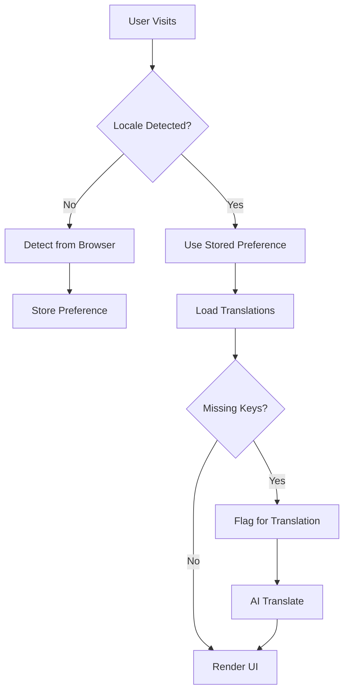

# Product Requirements Document (PRD) - Lang Module

**Module**: Lang
**Version**: 1.0
**Status**: Draft
**Author**: Product Team

---

## Document Control

| Version | Date | Author | Changes |
|---------|------|--------|---------|
| 1.0 | 2026-03-12 | Product Team | Initial draft |

---

## 1. Executive Summary

### 1.1 Problem Statement
> Global platforms require comprehensive multi-language support for content, UI, and user communications. Without a centralized localization module, translations become fragmented across files, inconsistent between modules, and difficult to maintain. Manual translation workflows are slow, error-prone, and don't scale. The platform needs a unified localization system to manage translations, automate workflows, and deliver localized experiences seamlessly.

### 1.2 Proposed Solution
> The Lang module provides comprehensive localization infrastructure including translation management, AI-assisted translation, locale detection, language switching, translation workflows, missing translation detection, and quality assurance. It integrates with the AI module for automated translations, provides admin tools for managing translations, and ensures consistent multi-language support across all modules.

### 1.3 Business Value Proposition
- **Primary Value**: Unified localization enabling global market access
- **Secondary Value**: Reduced translation costs through AI automation, consistent UX
- **Strategic Alignment**: International expansion, accessibility, user experience

### 1.4 Success Metrics (High-Level)
| Metric | Current | Target | Timeline |
|--------|---------|--------|----------|
| Translation Coverage | N/A | 95%+ UI strings | Q3 2026 |
| Translation Accuracy | N/A | 90%+ (AI-assisted) | Q3 2026 |
| Locale Support | N/A | 10+ languages | Q3 2026 |
| Missing Translations | N/A | <1% | Q3 2026 |

---

## 2. Goals & Objectives

### 2.1 Primary Goals (SMART)
1. **Specific**: Build comprehensive translation management with AI-assisted workflows
2. **Measurable**: Achieve 95%+ translation coverage, 90%+ AI translation accuracy
3. **Achievable**: Leverage AI module for translation, existing Laravel localization
4. **Relevant**: Critical for international expansion and accessibility
5. **Time-bound**: Core localization by Q2 2026, full language support by Q3 2026

### 2.2 Secondary Goals
- Implement translation memory for consistency
- Build translation quality scoring
- Create community translation contributions
- Develop locale-specific formatting

### 2.3 Non-Goals
> What this module will NOT do (scope boundaries)
- Professional translation services (external vendors)
- Real-time translation of user content (use AI module directly)
- Language learning features

### 2.4 Key Results (OKRs)
| Objective | Key Result | Target | Status |
|-----------|------------|--------|--------|
| Localization Excellence | Translation coverage | 95%+ | Pending |
| AI Efficiency | AI translation accuracy | 90%+ | Pending |
| Global Reach | Supported locales | 10+ | Pending |
| Quality Assurance | Missing translations | <1% | Pending |

---

## 3. Target Users

### 3.1 User Personas

#### Persona 1: International User
| Attribute | Details |
|-----------|---------|
| Role | Non-English Speaking User |
| Goals | Use platform in native language |
| Pain Points | English-only interfaces, poor translations |
| Technical Level | Basic |
| Usage Frequency | Daily |

**User Story**:
> As an International User, I want to use the platform in my native language, so that I can understand features and content without language barriers.

#### Persona 2: Content Manager
| Attribute | Details |
|-----------|---------|
| Role | Localization Manager |
| Goals | Manage translations, ensure quality |
| Pain Points | Fragmented translations, inconsistent quality |
| Technical Level | Intermediate |
| Usage Frequency | Daily |

**User Story**:
> As a Content Manager, I want a centralized translation management system, so that I can efficiently manage translations and maintain quality across languages.

#### Persona 3: Developer
| Attribute | Details |
|-----------|---------|
| Role | Application Developer |
| Goals | Implement i18n without complexity |
| Pain Points | Manual translation files, missing keys |
| Technical Level | Advanced |
| Usage Frequency | Daily during development |

**User Story**:
> As a Developer, I want simple localization APIs with auto-detection, so that I can build internationalized features without managing translation files.

### 3.2 Use Cases
| ID | Use Case | Actor | Trigger | Outcome |
|----|----------|-------|---------|---------|
| UC-001 | Switch language | User | Language selector | UI language changed |
| UC-002 | Auto-detect locale | System | User session | Locale detected |
| UC-003 | Translate content | AI Module | Translation request | Content translated |
| UC-004 | Manage translations | Content Manager | Admin panel | Translations updated |
| UC-005 | Detect missing translations | System | Runtime check | Missing keys flagged |
| UC-006 | Export translations | Content Manager | Localization workflow | Translation files |

### 3.3 Pain Points Addressed
| Pain Point | Severity | How Solved |
|------------|----------|------------|
| Fragmented translations | High | Centralized translation management |
| Manual translation workflows | High | AI-assisted automation |
| Inconsistent quality | Medium | Translation QA, memory |
| Missing translations | Medium | Auto-detection, alerts |

---

## 4. Functional Requirements

### 4.1 Requirements Matrix

| ID | Requirement | Description | Priority | Acceptance Criteria |
|----|-------------|-------------|----------|---------------------|
| FR-001 | Translation Management | CRUD for translations | P0 | Admin interface |
| FR-002 | AI Translation | Auto-translate content | P0 | AI module integration |
| FR-003 | Locale Detection | Auto-detect user language | P0 | Browser, user preference |
| FR-004 | Language Switching | User language selection | P0 | Persistent preference |
| FR-005 | Translation Files | Manage lang files | P0 | Laravel format |
| FR-006 | Missing Translation Detection | Detect missing keys | P1 | Runtime detection |
| FR-007 | Translation Workflow | Review, approve workflow | P1 | Workflow enforcement |
| FR-008 | Translation Memory | Reuse translations | P2 | Consistency |
| FR-009 | Quality Assurance | Translation QA tools | P2 | Review tools |
| FR-010 | Export/Import | Translation file exchange | P1 | Standard formats |
| FR-011 | Locale Formatting | Date, number, currency | P2 | Locale-specific |
| FR-012 | Pluralization | Multi-language plurals | P1 | Laravel pluralization |

### 4.2 Priority Definitions
- **P0 (Critical)**: Must have for launch - core localization, AI translation
- **P1 (High)**: Should have - workflow, detection, export
- **P2 (Medium)**: Nice to have - memory, QA, formatting
- **P3 (Low)**: Future consideration - community translations

### 4.3 Feature Details

#### Feature 1: Translation Management
**Description**: Centralized admin interface for managing translations across all locales with edit, review, and approval workflows.

**User Flow**:
```
1. Content manager opens translation admin
2. Selects locale and namespace
3. Views all translation keys
4. Edits translations inline
5. Saves changes
6. Changes propagated to application
```

**Acceptance Criteria**:
- [ ] Browse translations by locale, namespace
- [ ] Inline editing with save
- [ ] Bulk edit capabilities
- [ ] Translation history
- [ ] Compare versions
- [ ] Rollback capability

**Dependencies**: Filament Admin, User Module

#### Feature 2: AI-Assisted Translation
**Description**: Automatic translation using AI module with quality scoring and human review workflow.

**Acceptance Criteria**:
- [ ] AI translation on demand
- [ ] Batch translation for missing keys
- [ ] Quality confidence score
- [ ] Human review for low-confidence
- [ ] Translation memory integration
- [ ] Cost tracking per translation

**Dependencies**: AI Module

#### Feature 3: Locale Detection & Switching
**Description**: Automatic locale detection from browser, user preference, with manual override capability.

**Acceptance Criteria**:
- [ ] Browser language detection
- [ ] User preference storage
- [ ] URL-based locale switching
- [ ] Session-based locale
- [ ] Fallback to default locale
- [ ] RTL language support

**Dependencies**: User Module, Session Management

---

## 5. Non-Functional Requirements

### 5.1 Performance Requirements
| Metric | Requirement | Measurement |
|--------|-------------|-------------|
| Translation Load | <50ms | Per request overhead |
| AI Translation | <5s | Per translation |
| Locale Detection | <10ms | Detection time |
| Cache Hit Rate | 95%+ | Translation cache |
| Availability | 99.9% | Monthly uptime |

### 5.2 Security Requirements
- [x] Authentication for admin functions
- [x] Authorization for translation changes
- [x] Input validation
- [x] XSS protection in translations
- [x] Audit logging

### 5.3 Scalability Requirements
- Support for 50+ locales
- Efficient translation caching
- CDN for static translations
- Lazy loading for large translation sets

### 5.4 Compliance Requirements
- [x] Accessibility (multi-language)
- [x] Regional compliance (content)
- [x] RTL language support

---

## 6. User Experience

### 6.1 User Flows


### 6.2 Wireframes
> [Links to Figma/Sketch wireframes - to be created]

### 6.3 Design Principles
- Seamless language switching
- Consistent translation quality
- RTL language support
- Accessible language selector

### 6.4 Interaction Specifications
| Interaction | Behavior | Feedback |
|-------------|----------|----------|
| Switch Language | Select from dropdown | Page reload with new locale |
| Edit Translation | Inline edit | Save confirmation |
| AI Translate | Click translate | Loading → translated |
| View Missing | Filter view | Highlighted keys |

---

## 7. Technical Considerations

### 7.1 Architecture Overview
```
┌─────────────────────────────────────────────────────────┐
│                    Lang Module                          │
│  ┌──────────────┐  ┌──────────────┐  ┌──────────────┐  │
│  │ Translation  │  │ AI           │  │ Locale       │  │
│  │ Management   │  │ Translation  │  │ Detection    │  │
│  └──────────────┘  └──────────────┘  └──────────────┘  │
│  ┌──────────────┐  ┌──────────────┐  ┌──────────────┐  │
│  │ Translation  │  │ Missing      │  │ Export/      │  │
│  │ Memory       │  │ Detection    │  │ Import       │  │
│  └──────────────┘  └──────────────┘  └──────────────┘  │
└─────────────────────────────────────────────────────────┘
              │              │              │
              ▼              ▼              ▼
    ┌─────────────┐ ┌─────────────┐ ┌─────────────┐
    │     AI      │ │   User      │ │   Cache     │
    │   Module    │ │   Module    │ │   (Redis)   │
    └─────────────┘ └─────────────┘ └─────────────┘
```

### 7.2 Dependencies
| Dependency | Type | Version | Criticality |
|------------|------|---------|-------------|
| Laravel | Framework | 12.x | Critical |
| Filament | UI Framework | 5.x | High |
| AI Module | Internal | 1.x | High |
| Redis | Cache | 7.x | High |

### 7.3 Integration Points
| System | Integration Type | Data Flow | Frequency |
|--------|------------------|-----------|-----------|
| AI Module | Translation | Outbound | Per translation |
| All Modules | Translation Keys | Inbound | Per request |
| User Module | User Preferences | Bidirectional | Per session |
| Cache | Translation Cache | Bidirectional | Per request |

### 7.4 Technical Constraints
- PHP 8.3+ required
- Laravel 12+ required
- Laravel localization format
- Filament v5 compatibility

### 7.5 Database Schema
```sql
CREATE TABLE translations (
    id BIGINT UNSIGNED AUTO_INCREMENT PRIMARY KEY,
    locale VARCHAR(10),
    namespace VARCHAR(100),
    translation_key VARCHAR(500),
    translation_value TEXT,
    is_ai_generated BOOLEAN DEFAULT FALSE,
    ai_confidence_score DECIMAL(3,2),
    reviewed_by BIGINT UNSIGNED NULL,
    reviewed_at TIMESTAMP NULL,
    created_at TIMESTAMP DEFAULT CURRENT_TIMESTAMP,
    updated_at TIMESTAMP DEFAULT CURRENT_TIMESTAMP ON UPDATE CURRENT_TIMESTAMP,
    
    UNIQUE KEY unique_locale_key (locale, namespace, translation_key(100)),
    INDEX idx_locale (locale),
    INDEX idx_namespace (namespace)
);

CREATE TABLE translation_memories (
    id BIGINT UNSIGNED AUTO_INCREMENT PRIMARY KEY,
    source_text TEXT,
    source_locale VARCHAR(10),
    target_text TEXT,
    target_locale VARCHAR(10),
    usage_count INT DEFAULT 0,
    created_at TIMESTAMP DEFAULT CURRENT_TIMESTAMP,
    
    INDEX idx_source (source_locale, source_text(100)),
    INDEX idx_target (target_locale, target_text(100))
);

CREATE TABLE missing_translations (
    id BIGINT UNSIGNED AUTO_INCREMENT PRIMARY KEY,
    locale VARCHAR(10),
    translation_key VARCHAR(500),
    detected_at TIMESTAMP DEFAULT CURRENT_TIMESTAMP,
    resolved_at TIMESTAMP NULL,
    
    UNIQUE KEY unique_locale_key (locale, translation_key(200))
);
```

---

## 8. Analytics & Metrics

### 8.1 Success Metrics (KPIs)
| KPI | Definition | Target | Measurement Method |
|-----|------------|--------|-------------------|
| Translation Coverage | % keys translated | 95%+ | Translation audit |
| AI Accuracy | % AI translations approved | 90%+ | Review tracking |
| Missing Keys | % missing translations | <1% | Detection system |
| Locale Adoption | Usage per locale | Varies | Analytics |

### 8.2 Tracking Requirements
- Translation coverage by locale
- AI translation usage and costs
- Missing translation trends
- User locale preferences

### 8.3 Reporting Dashboards
- Translation coverage overview
- AI translation metrics
- Missing translations queue
- Locale usage analytics

---

## 9. Timeline & Milestones

### 9.1 Key Dates
| Milestone | Date | Status |
|-----------|------|--------|
| Requirements Complete | 2026-03-12 | Complete |
| Design Complete | 2026-03-26 | Pending |
| Development Start | 2026-03-27 | Pending |
| Core Features (P0) | 2026-04-17 | Pending |
| Beta Launch | 2026-04-24 | Pending |
| GA Launch | 2026-05-08 | Pending |

---

## 10. Open Questions

| ID | Question | Owner | Due Date | Status |
|----|----------|-------|----------|--------|
| Q-001 | Which locales should be launch locales? | Product | 2026-03-20 | Open |
| Q-002 | Should AI translations be auto-published? | Product | 2026-03-20 | Open |
| Q-003 | Should we support community translations? | Product | 2026-04-01 | Open |

---

## 11. Appendix

### 11.1 Glossary
| Term | Definition |
|------|------------|
| i18n | Internationalization |
| l10n | Localization |
| Locale | Language + region combination |
| RTL | Right-to-left languages |
| Translation Memory | Database of approved translations |

### 11.2 References
- [Laravel Localization](https://laravel.com/docs/localization)
- [Unicode CLDR](https://cldr.unicode.org/)

### 11.3 Related PRDs
- [AI Module PRD](../AI/docs/PRD.md)
- [User Module PRD](../User/docs/PRD.md)
- [Blog Module PRD](../Blog/docs/PRD.md)

---

## Approval

| Role | Name | Signature | Date |
|------|------|-----------|------|
| Product Manager | | | |
| Engineering Lead | | | |
| Design Lead | | | |
| Stakeholder | | | |
