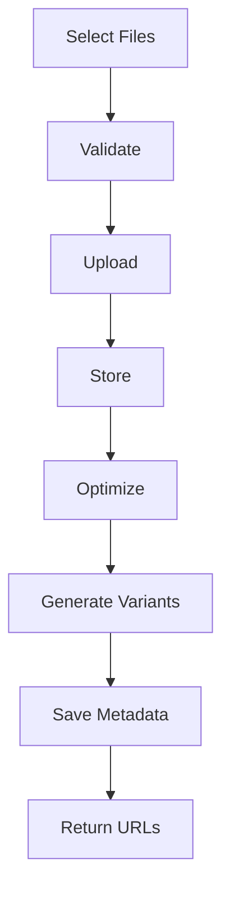

# Product Requirements Document (PRD) - Media Module

**Module**: Media
**Version**: 1.0
**Status**: Draft
**Last Updated**: 2026-03-12
**Author**: Product Team

---

## Document Control

| Version | Date | Author | Changes |
|---------|------|--------|---------|
| 1.0 | 2026-03-12 | Product Team | Initial draft |

---

## 1. Executive Summary

### 1.1 Problem Statement
> Modern applications require robust media management for images, videos, documents, and other digital assets. Without a centralized media system, file uploads become fragmented across modules, storage is inefficient, and media operations (resizing, optimization, CDN delivery) are duplicated. The platform needs a unified media management module to handle uploads, storage, transformations, and delivery consistently and efficiently.

### 1.2 Proposed Solution
> The Media module provides comprehensive media management including file uploads, storage abstraction (local, S3, CDN), image/video transformations, optimization, responsive image generation, media library, and integration with all content modules. It leverages Spatie Media Library for robust media handling and provides admin tools for managing media assets across the platform.

### 1.3 Business Value Proposition
- **Primary Value**: Unified media infrastructure enabling efficient asset management
- **Secondary Value**: Cost optimization through CDN, storage efficiency, improved performance
- **Strategic Alignment**: Content quality, performance optimization, user experience

### 1.4 Success Metrics (High-Level)
| Metric | Current | Target | Timeline |
|--------|---------|--------|----------|
| Upload Success Rate | N/A | 99.9% | Q2 2026 |
| Image Optimization | N/A | 70% size reduction | Q2 2026 |
| CDN Coverage | N/A | 100% public media | Q3 2026 |
| Storage Efficiency | N/A | 90% utilization | Q3 2026 |

---

## 2. Goals & Objectives

### 2.1 Primary Goals (SMART)
1. **Specific**: Build comprehensive media management with uploads, transformations, and CDN delivery
2. **Measurable**: Achieve 99.9% upload success, 70% image size reduction through optimization
3. **Achievable**: Leverage Spatie Media Library, Laravel storage, CDN providers
4. **Relevant**: Critical for content quality and platform performance
5. **Time-bound**: Core media system by Q2 2026, advanced features by Q3 2026

### 2.2 Secondary Goals
- Implement AI-powered image tagging
- Build video transcoding pipeline
- Create media analytics dashboard
- Develop advanced DAM features

### 2.3 Non-Goals
> What this module will NOT do (scope boundaries)
- Video streaming infrastructure (use specialized services)
- Complex digital asset management (enterprise DAM)
- Real-time media editing (client-side)

### 2.4 Key Results (OKRs)
| Objective | Key Result | Target | Status |
|-----------|------------|--------|--------|
| Media Excellence | Upload success rate | 99.9% | Pending |
| Performance | Image optimization | 70% reduction | Pending |
| Delivery | CDN coverage | 100% | Pending |
| Adoption | Module integrations | 10+ modules | Pending |

---

## 3. Target Users

### 3.1 User Personas

#### Persona 1: Content Creator
| Attribute | Details |
|-----------|---------|
| Role | Editor/Author |
| Goals | Upload and manage media for content |
| Pain Points | Complex upload, slow processing, poor quality |
| Technical Level | Intermediate |
| Usage Frequency | Daily |

**User Story**:
> As a Content Creator, I want to easily upload and manage images for my articles, so that I can create visually appealing content without technical barriers.

#### Persona 2: System Administrator
| Attribute | Details |
|-----------|---------|
| Role | DevOps/Admin |
| Goals | Manage storage, optimize delivery, control costs |
| Pain Points | Storage bloat, slow delivery, high costs |
| Technical Level | Advanced |
| Usage Frequency | Daily |

**User Story**:
> As a System Administrator, I want to configure storage backends and CDN delivery, so that I can optimize performance and control infrastructure costs.

#### Persona 3: End User
| Attribute | Details |
|-----------|---------|
| Role | Platform User |
| Goals | View high-quality images quickly |
| Pain Points | Slow loading, poor image quality |
| Technical Level | Basic |
| Usage Frequency | Daily |

**User Story**:
> As an End User, I want images to load quickly at optimal quality, so that I can enjoy content without waiting.

### 3.2 Use Cases
| ID | Use Case | Actor | Trigger | Outcome |
|----|----------|-------|---------|---------|
| UC-001 | Upload media | Content Creator | New content | Media uploaded |
| UC-002 | Transform image | System | Display request | Optimized image |
| UC-003 | Generate responsive | System | Upload complete | Multiple sizes |
| UC-004 | Serve from CDN | System | User request | Fast delivery |
| UC-005 | Manage library | Admin | Media management | Organized assets |
| UC-006 | Delete media | Admin | Content cleanup | Media removed |

### 3.3 Pain Points Addressed
| Pain Point | Severity | How Solved |
|------------|----------|------------|
| Fragmented uploads | High | Unified upload API |
| Poor image optimization | High | Automatic optimization |
| Slow delivery | High | CDN integration |
| Storage inefficiency | Medium | Smart storage, cleanup |

---

## 4. Functional Requirements

### 4.1 Requirements Matrix

| ID | Requirement | Description | Priority | Acceptance Criteria |
|----|-------------|-------------|----------|---------------------|
| FR-001 | File Upload | Upload images, videos, documents | P0 | Multi-file support |
| FR-002 | Storage Abstraction | Local, S3, CDN support | P0 | Multiple drivers |
| FR-003 | Image Transformation | Resize, crop, optimize | P0 | On-the-fly transforms |
| FR-004 | Responsive Images | Generate multiple sizes | P0 | Automatic generation |
| FR-005 | Media Library | Browse, search media | P1 | Admin interface |
| FR-006 | CDN Integration | CDN delivery | P1 | Configurable CDN |
| FR-007 | Image Optimization | Compress without quality loss | P0 | 70% size reduction |
| FR-008 | Video Thumbnails | Generate video thumbnails | P2 | Auto-generation |
| FR-009 | Media Tagging | Tag and categorize media | P2 | Tag management |
| FR-010 | Access Control | Media permissions | P1 | Authorization |
| FR-011 | Media Analytics | Usage tracking | P3 | Analytics dashboard |
| FR-012 | Bulk Operations | Batch upload, delete | P2 | Bulk actions |

### 4.2 Priority Definitions
- **P0 (Critical)**: Must have for launch - uploads, storage, transformations
- **P1 (High)**: Should have - library, CDN, access control
- **P2 (Medium)**: Nice to have - tagging, bulk ops, thumbnails
- **P3 (Low)**: Future consideration - analytics, AI features

### 4.3 Feature Details

#### Feature 1: File Upload System
**Description**: Robust file upload with support for multiple file types, chunked uploads, and progress tracking.

**User Flow**:
```
1. User selects files to upload
2. System validates file type, size
3. Files uploaded with progress indicator
4. Server validates and stores files
5. Image optimization applied
6. Responsive images generated
7. Media metadata saved
8. URLs returned for use
```

**Acceptance Criteria**:
- [ ] Drag-and-drop upload
- [ ] Multi-file upload
- [ ] Chunked upload for large files
- [ ] Upload progress indicator
- [ ] File type validation
- [ ] Size limit enforcement
- [ ] Virus scanning (optional)

**Dependencies**: Storage backend, Image processing

#### Feature 2: Image Transformation Engine
**Description**: On-the-fly image transformations including resize, crop, optimize, and format conversion.

**Acceptance Criteria**:
- [ ] Resize (fit, crop, stretch)
- [ ] Format conversion (WebP, AVIF)
- [ ] Quality optimization
- [ ] Watermarking
- [ ] EXIF data handling
- [ ] Caching of transformed images

**Dependencies**: Image processing library (GD, Imagick)

#### Feature 3: Responsive Image Generation
**Description**: Automatic generation of multiple image sizes for responsive delivery.

**Acceptance Criteria**:
- [ ] Configurable size presets
- [ ] Automatic srcset generation
- [ ] Lazy loading support
- [ ] CDN delivery
- [ ] Cache invalidation

**Dependencies**: Image Transformation, CDN

---

## 5. Non-Functional Requirements

### 5.1 Performance Requirements
| Metric | Requirement | Measurement |
|--------|-------------|-------------|
| Upload Time | <5s for 5MB | Upload completion |
| Image Transform | <500ms | Transformation time |
| CDN Delivery | <200ms | Time to first byte |
| Optimization Ratio | 70% size reduction | Original vs optimized |
| Availability | 99.9% | Monthly uptime |

### 5.2 Security Requirements
- [x] Authentication for uploads
- [x] Authorization for media access
- [x] File type validation
- [x] Virus scanning option
- [x] Access control for private media
- [x] Secure CDN integration

### 5.3 Scalability Requirements
- Support for 100,000+ media files
- Efficient storage scaling
- CDN for global delivery
- Queue-based processing

### 5.4 Compliance Requirements
- [x] GDPR (media containing personal data)
- [x] Copyright compliance
- [x] Accessibility (alt text)

---

## 6. User Experience

### 6.1 User Flows


### 6.2 Wireframes
> [Links to Figma/Sketch wireframes - to be created]

### 6.3 Design Principles
- Simple, intuitive upload interface
- Clear visual feedback
- Fast, responsive media delivery
- Accessible media management

### 6.4 Interaction Specifications
| Interaction | Behavior | Feedback |
|-------------|----------|----------|
| Upload Files | Drag-drop or select | Progress bar |
| Transform Image | Request size | Optimized image |
| Browse Library | Navigate folders | Grid/list view |
| Delete Media | Confirm delete | Removal confirmation |

---

## 7. Technical Considerations

### 7.1 Architecture Overview
```
┌─────────────────────────────────────────────────────────┐
│                   Media Module                          │
│  ┌──────────────┐  ┌──────────────┐  ┌──────────────┐  │
│  │ Upload       │  │ Image        │  │ Responsive   │  │
│  │ System       │  │ Transform    │  │ Images       │  │
│  └──────────────┘  └──────────────┘  └──────────────┘  │
│  ┌──────────────┐  ┌──────────────┐  ┌──────────────┐  │
│  │ Storage      │  │ CDN          │  │ Media        │  │
│  │ Abstraction  │  │ Integration  │  │ Library      │  │
│  └──────────────┘  └──────────────┘  └──────────────┘  │
└─────────────────────────────────────────────────────────┘
              │              │              │
              ▼              ▼              ▼
    ┌─────────────┐ ┌─────────────┐ ┌─────────────┐
    │   S3/Local  │ │    CDN      │ │   Spatie    │
    │   Storage   │ │   Provider  │ │   MediaLib  │
    └─────────────┘ └─────────────┘ └─────────────┘
```

### 7.2 Dependencies
| Dependency | Type | Version | Criticality |
|------------|------|---------|-------------|
| Laravel | Framework | 12.x | Critical |
| Filament | UI Framework | 5.x | High |
| spatie/laravel-medialibrary | Package | 11.x | Critical |
| intervention/image | Package | 3.x | High |
| league/flysystem-aws-s3-v3 | Package | 3.x | Medium |

### 7.3 Integration Points
| System | Integration Type | Data Flow | Frequency |
|--------|------------------|-----------|-----------|
| Blog Module | Article Images | Inbound | Per article |
| Predict Module | Market Images | Inbound | Per market |
| User Module | User Avatars | Inbound | Per user |
| Cms Module | Page Media | Inbound | Per page |

### 7.4 Technical Constraints
- PHP 8.3+ required
- Laravel 12+ required
- Spatie Media Library 11.x
- Image processing extension (GD/Imagick)

### 7.5 Database Schema
```sql
CREATE TABLE media (
    id BIGINT UNSIGNED AUTO_INCREMENT PRIMARY KEY,
    name VARCHAR(255),
    file_name VARCHAR(255),
    mime_type VARCHAR(100),
    disk VARCHAR(50),
    collection_name VARCHAR(255),
    size INT,
    manipulations JSON,
    custom_properties JSON,
    responsive_images JSON,
    model_type VARCHAR(255),
    model_id BIGINT UNSIGNED,
    created_at TIMESTAMP DEFAULT CURRENT_TIMESTAMP,
    updated_at TIMESTAMP DEFAULT CURRENT_TIMESTAMP ON UPDATE CURRENT_TIMESTAMP,
    
    INDEX idx_model (model_type, model_id),
    INDEX idx_collection (collection_name)
);

CREATE TABLE media_tags (
    id BIGINT UNSIGNED AUTO_INCREMENT PRIMARY KEY,
    media_id BIGINT UNSIGNED,
    tag VARCHAR(100),
    created_at TIMESTAMP DEFAULT CURRENT_TIMESTAMP,
    
    INDEX idx_media (media_id),
    INDEX idx_tag (tag)
);
```

---

## 8. Analytics & Metrics

### 8.1 Success Metrics (KPIs)
| KPI | Definition | Target | Measurement Method |
|-----|------------|--------|-------------------|
| Upload Success Rate | % successful uploads | 99.9% | Upload tracking |
| Optimization Ratio | Size reduction | 70% | Before/after |
| CDN Hit Rate | % CDN-served requests | 95%+ | CDN analytics |
| Storage Efficiency | Utilization rate | 90% | Storage audit |

### 8.2 Tracking Requirements
- Upload volume and success rates
- Storage usage by type
- CDN usage and costs
- Image transformation metrics

### 8.3 Reporting Dashboards
- Media library overview
- Storage utilization
- CDN performance
- Upload metrics

---

## 9. Timeline & Milestones

### 9.1 Key Dates
| Milestone | Date | Status |
|-----------|------|--------|
| Requirements Complete | 2026-03-12 | Complete |
| Design Complete | 2026-03-26 | Pending |
| Development Start | 2026-03-27 | Pending |
| Core Features (P0) | 2026-04-17 | Pending |
| Beta Launch | 2026-04-24 | Pending |
| GA Launch | 2026-05-08 | Pending |

---

## 10. Open Questions

| ID | Question | Owner | Due Date | Status |
|----|----------|-------|----------|--------|
| Q-001 | Which CDN provider should we use? | Tech Lead | 2026-03-20 | Open |
| Q-002 | Should we support video transcoding? | Product | 2026-04-01 | Open |
| Q-003 | What are the storage limits per user? | Product | 2026-03-20 | Open |

---

## 11. Appendix

### 11.1 Glossary
| Term | Definition |
|------|------------|
| CDN | Content Delivery Network |
| Responsive Images | Multiple sizes for different screens |
| WebP | Modern image format |
| EXIF | Image metadata |
| srcset | HTML attribute for responsive images |

### 11.2 References
- [Spatie Media Library](https://spatie.be/docs/laravel-medialibrary)
- [Laravel Storage](https://laravel.com/docs/filesystem)
- [Intervention Image](https://image.intervention.io/)

### 11.3 Related PRDs
- [Blog Module PRD](../Blog/docs/PRD.md)
- [Cms Module PRD](../Cms/docs/PRD.md)
- [User Module PRD](../User/docs/PRD.md)

---

## Approval

| Role | Name | Signature | Date |
|------|------|-----------|------|
| Product Manager | | | |
| Engineering Lead | | | |
| Design Lead | | | |
| Stakeholder | | | |
