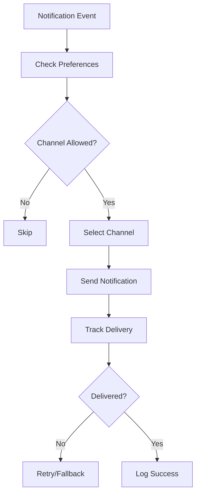

# Product Requirements Document (PRD) - Notify Module

**Module**: Notify
**Version**: 1.0
**Status**: Draft
**Author**: Product Team

---

## Document Control

| Version | Date | Author | Changes |
|---------|------|--------|---------|
| 1.0 | 2026-03-12 | Product Team | Initial draft |

---

## 1. Executive Summary

### 1.1 Problem Statement
> Modern applications require multi-channel notification delivery to keep users informed through email, SMS, push notifications, in-app alerts, and more. Without a centralized notification system, each module implements its own notification logic, leading to inconsistent UX, duplicate effort, notification fatigue, and poor user control. The platform needs a unified notification orchestration layer to manage delivery, preferences, and analytics across all channels.

### 1.2 Proposed Solution
> The Notify module provides comprehensive notification infrastructure including multi-channel delivery (email, SMS, push, in-app, Slack), notification templates, user preference management, notification scheduling, delivery tracking, analytics, and rate limiting. It integrates with all modules to provide consistent notification experiences while respecting user preferences and optimizing delivery timing.

### 1.3 Business Value Proposition
- **Primary Value**: Unified notification delivery improving user engagement and satisfaction
- **Secondary Value**: Reduced notification fatigue through preference management, cost optimization
- **Strategic Alignment**: User engagement, retention, communication excellence

### 1.4 Success Metrics (High-Level)
| Metric | Current | Target | Timeline |
|--------|---------|--------|----------|
| Notification Delivery Rate | N/A | 98%+ | Q2 2026 |
| Email Open Rate | N/A | 25%+ | Q3 2026 |
| User Preference Adoption | N/A | 60%+ | Q3 2026 |
| Notification Engagement | N/A | 15% CTR | Q3 2026 |

---

## 2. Goals & Objectives

### 2.1 Primary Goals (SMART)
1. **Specific**: Build multi-channel notification system with preference management
2. **Measurable**: Achieve 98%+ delivery rate, 60%+ preference adoption
3. **Achievable**: Leverage Laravel Notifications, existing channels
4. **Relevant**: Critical for user engagement and retention
5. **Time-bound**: Core notifications by Q2 2026, advanced features by Q3 2026

### 2.2 Secondary Goals
- Implement smart notification timing
- Build notification A/B testing
- Create notification digest system
- Develop AI-powered notification optimization

### 2.3 Non-Goals
> What this module will NOT do (scope boundaries)
- Real-time chat/messaging (separate system)
- Marketing automation (use marketing platforms)
- Customer support tickets (handled by support system)

### 2.4 Key Results (OKRs)
| Objective | Key Result | Target | Status |
|-----------|------------|--------|--------|
| Delivery Excellence | Delivery success rate | 98%+ | Pending |
| User Control | Preference adoption | 60%+ | Pending |
| Engagement | Notification CTR | 15%+ | Pending |
| Cost Efficiency | Cost per notification | Optimize | Pending |

---

## 3. Target Users

### 3.1 User Personas

#### Persona 1: End User
| Attribute | Details |
|-----------|---------|
| Role | Platform User |
| Goals | Receive important notifications, control notification volume |
| Pain Points | Too many notifications, can't control what they receive |
| Technical Level | Basic |
| Usage Frequency | Daily |

**User Story**:
> As an End User, I want to control which notifications I receive and through which channels, so that I stay informed without being overwhelmed.

#### Persona 2: Product Manager
| Attribute | Details |
|-----------|---------|
| Role | Product Owner |
| Goals | Drive user engagement through effective notifications |
| Pain Points | Low engagement, high unsubscribe rates |
| Technical Level | Intermediate |
| Usage Frequency | Weekly |

**User Story**:
> As a Product Manager, I want to understand notification performance and optimize engagement, so that I can drive user activation and retention.

#### Persona 3: Developer
| Attribute | Details |
|-----------|---------|
| Role | Application Developer |
| Goals | Send notifications easily without managing delivery |
| Pain Points | Complex notification logic, channel management |
| Technical Level | Advanced |
| Usage Frequency | Daily |

**User Story**:
> As a Developer, I want a simple notification API with automatic channel handling, so that I can notify users without managing delivery infrastructure.

### 3.2 Use Cases
| ID | Use Case | Actor | Trigger | Outcome |
|----|----------|-------|---------|---------|
| UC-001 | Send email notification | System | Event triggered | Email sent |
| UC-002 | Send push notification | System | Event triggered | Push delivered |
| UC-003 | Manage preferences | User | Settings access | Preferences updated |
| UC-004 | View notifications | User | Notification center | Notifications displayed |
| UC-005 | Mark as read | User | Notification viewed | Status updated |
| UC-006 | Unsubscribe | User | Email footer | Preferences updated |

### 3.3 Pain Points Addressed
| Pain Point | Severity | How Solved |
|------------|----------|------------|
| Notification overload | High | Preference management |
| Inconsistent delivery | High | Unified delivery system |
| Poor engagement | Medium | Analytics, optimization |
| Channel fragmentation | Medium | Multi-channel abstraction |

---

## 4. Functional Requirements

### 4.1 Requirements Matrix

| ID | Requirement | Description | Priority | Acceptance Criteria |
|----|-------------|-------------|----------|---------------------|
| FR-001 | Email Notifications | Send transactional emails | P0 | Email delivery |
| FR-002 | Push Notifications | Mobile/web push | P0 | Push delivery |
| FR-003 | SMS Notifications | SMS message delivery | P1 | SMS delivery |
| FR-004 | In-App Notifications | In-app notification center | P0 | Real-time updates |
| FR-005 | Notification Templates | Reusable templates | P0 | Template system |
| FR-006 | Preference Management | User notification settings | P0 | Granular controls |
| FR-007 | Delivery Tracking | Track delivery status | P1 | Delivery analytics |
| FR-008 | Rate Limiting | Prevent notification spam | P1 | Rate controls |
| FR-009 | Scheduling | Schedule notifications | P2 | Time-based delivery |
| FR-010 | Digest System | Notification digests | P2 | Batched notifications |
| FR-011 | A/B Testing | Test notification variants | P3 | Testing framework |
| FR-012 | Smart Timing | Optimal send time | P3 | AI-powered timing |

### 4.2 Priority Definitions
- **P0 (Critical)**: Must have for launch - email, push, in-app, preferences
- **P1 (High)**: Should have - SMS, tracking, rate limiting
- **P2 (Medium)**: Nice to have - scheduling, digest
- **P3 (Low)**: Future consideration - A/B testing, AI timing

### 4.3 Feature Details

#### Feature 1: Multi-Channel Delivery
**Description**: Unified notification delivery across email, SMS, push, in-app, and other channels with automatic channel selection and fallback.

**User Flow**:
```
1. Module dispatches notification event
2. Notify module receives event
3. Checks user preferences for channel
4. Selects optimal channel
5. Sends via channel provider
6. Tracks delivery status
7. Falls back to alternate channel if failed
```

**Acceptance Criteria**:
- [ ] Email delivery (SendGrid, SES, Mailgun)
- [ ] Push notifications (FCM, APNs)
- [ ] SMS delivery (Twilio, Vonage)
- [ ] In-app notifications
- [ ] Channel fallback
- [ ] Delivery confirmation

**Dependencies**: External providers, User Module

#### Feature 2: Notification Preference Center
**Description**: User-facing preference management for notification types and channels.

**Acceptance Criteria**:
- [ ] Granular notification type controls
- [ ] Channel selection per type
- [ ] Digest frequency options
- [ ] Quiet hours configuration
- [ ] Unsubscribe from all
- [ ] Preference persistence

**Dependencies**: User Module, Filament

#### Feature 3: In-App Notification Center
**Description**: Real-time in-app notification display with read/unread status and actions.

**Acceptance Criteria**:
- [ ] Notification list with pagination
- [ ] Read/unread status
- [ ] Mark all as read
- [ ] Notification actions (click-through)
- [ ] Real-time updates (Livewire)
- [ ] Notification count badge

**Dependencies**: Livewire, Broadcasting

---

## 5. Non-Functional Requirements

### 5.1 Performance Requirements
| Metric | Requirement | Measurement |
|--------|-------------|-------------|
| Email Delivery | <30s | Send time |
| Push Delivery | <5s | Delivery time |
| In-App Update | <1s | Real-time update |
| Preference Load | <100ms | Load time |
| Availability | 99.9% | Monthly uptime |

### 5.2 Security Requirements
- [x] Authentication for notification access
- [x] Preference authorization
- [x] Unsubscribe token validation
- [x] Data encryption (sensitive notifications)
- [x] Rate limiting

### 5.3 Scalability Requirements
- Support for 1M+ notifications/day
- Horizontal scaling for delivery
- Queue-based processing
- Provider rate limit handling

### 5.4 Compliance Requirements
- [x] CAN-SPAM compliance
- [x] GDPR (notification data)
- [x] Unsubscribe requirements
- [x] Privacy policy disclosure

---

## 6. User Experience

### 6.1 User Flows


### 6.2 Wireframes
> [Links to Figma/Sketch wireframes - to be created]

### 6.3 Design Principles
- Clear notification presentation
- Easy preference management
- Respectful notification frequency
- Accessible notification center

### 6.4 Interaction Specifications
| Interaction | Behavior | Feedback |
|-------------|----------|----------|
| View Notification | Click notification | Navigate to content |
| Mark Read | Click/view | Status update |
| Change Preference | Toggle setting | Save confirmation |
| Unsubscribe | Click link | Confirmation page |

---

## 7. Technical Considerations

### 7.1 Architecture Overview
```
┌─────────────────────────────────────────────────────────┐
│                  Notify Module                          │
│  ┌──────────────┐  ┌──────────────┐  ┌──────────────┐  │
│  │ Email        │  │ Push         │  │ SMS          │  │
│  │ Delivery     │  │ Delivery     │  │ Delivery     │  │
│  └──────────────┘  └──────────────┘  └──────────────┘  │
│  ┌──────────────┐  ┌──────────────┐  ┌──────────────┐  │
│  │ In-App       │  │ Preference   │  │ Template     │  │
│  │ Center       │  │ Manager      │  │ System       │  │
│  └──────────────┘  └──────────────┘  └──────────────┘  │
└─────────────────────────────────────────────────────────┘
              │              │              │
              ▼              ▼              ▼
    ┌─────────────┐ ┌─────────────┐ ┌─────────────┐
    │  SendGrid/  │ │    FCM/     │ │   Twilio/   │
    │   SES       │ │    APNs     │ │   Vonage    │
    └─────────────┘ └─────────────┘ └─────────────┘
```

### 7.2 Dependencies
| Dependency | Type | Version | Criticality |
|------------|------|---------|-------------|
| Laravel | Framework | 12.x | Critical |
| Filament | UI Framework | 5.x | High |
| Livewire | Full-stack | 4.x | High |
| spatie/laravel-notification-channels | Package | Various | Medium |

### 7.3 Integration Points
| System | Integration Type | Data Flow | Frequency |
|--------|------------------|-----------|-----------|
| All Modules | Notification Events | Inbound | Per event |
| User Module | User Data | Bidirectional | Per notification |
| Email Provider | Email Delivery | Outbound | Per email |
| Push Provider | Push Delivery | Outbound | Per push |

### 7.4 Technical Constraints
- PHP 8.3+ required
- Laravel 12+ required
- External provider API limits
- Filament v5 compatibility

### 7.5 Database Schema
```sql
CREATE TABLE notifications (
    id BIGINT UNSIGNED AUTO_INCREMENT PRIMARY KEY,
    notifiable_type VARCHAR(255),
    notifiable_id BIGINT UNSIGNED,
    type VARCHAR(255),
    data JSON,
    read_at TIMESTAMP NULL,
    created_at TIMESTAMP DEFAULT CURRENT_TIMESTAMP,
    
    INDEX idx_notifiable (notifiable_type, notifiable_id),
    INDEX idx_read (read_at)
);

CREATE TABLE notification_preferences (
    id BIGINT UNSIGNED AUTO_INCREMENT PRIMARY KEY,
    user_id BIGINT UNSIGNED,
    notification_type VARCHAR(100),
    channel_email BOOLEAN DEFAULT TRUE,
    channel_push BOOLEAN DEFAULT TRUE,
    channel_sms BOOLEAN DEFAULT FALSE,
    digest_frequency ENUM('realtime', 'daily', 'weekly', 'never'),
    quiet_hours_start TIME,
    quiet_hours_end TIME,
    created_at TIMESTAMP DEFAULT CURRENT_TIMESTAMP,
    updated_at TIMESTAMP DEFAULT CURRENT_TIMESTAMP ON UPDATE CURRENT_TIMESTAMP,
    
    UNIQUE KEY unique_user_type (user_id, notification_type)
);

CREATE TABLE notification_logs (
    id BIGINT UNSIGNED AUTO_INCREMENT PRIMARY KEY,
    notification_id BIGINT UNSIGNED,
    channel VARCHAR(50),
    status VARCHAR(20),
    provider_response JSON,
    sent_at TIMESTAMP DEFAULT CURRENT_TIMESTAMP,
    
    INDEX idx_notification (notification_id),
    INDEX idx_status (status)
);
```

---

## 8. Analytics & Metrics

### 8.1 Success Metrics (KPIs)
| KPI | Definition | Target | Measurement Method |
|-----|------------|--------|-------------------|
| Delivery Rate | % successfully delivered | 98%+ | Delivery tracking |
| Email Open Rate | % emails opened | 25%+ | Email tracking |
| Push CTR | % push notifications clicked | 10%+ | Push analytics |
| Preference Adoption | % users with preferences | 60%+ | User tracking |

### 8.2 Tracking Requirements
- Delivery rates by channel
- Open/click rates
- Unsubscribe rates
- Preference distribution

### 8.3 Reporting Dashboards
- Notification volume overview
- Delivery performance
- Engagement metrics
- Preference analytics

---

## 9. Timeline & Milestones

### 9.1 Key Dates
| Milestone | Date | Status |
|-----------|------|--------|
| Requirements Complete | 2026-03-12 | Complete |
| Design Complete | 2026-03-26 | Pending |
| Development Start | 2026-03-27 | Pending |
| Core Features (P0) | 2026-04-17 | Pending |
| Beta Launch | 2026-04-24 | Pending |
| GA Launch | 2026-05-08 | Pending |

---

## 10. Open Questions

| ID | Question | Owner | Due Date | Status |
|----|----------|-------|----------|--------|
| Q-001 | Which email provider should we use? | Tech Lead | 2026-03-20 | Open |
| Q-002 | Should push be opt-in or opt-out? | Product | 2026-03-20 | Open |
| Q-003 | What is the default digest frequency? | Product | 2026-03-20 | Open |

---

## 11. Appendix

### 11.1 Glossary
| Term | Definition |
|------|------------|
| Push Notification | Mobile/web browser notification |
| Digest | Batched notification summary |
| Quiet Hours | Time period without notifications |
| CTR | Click-through rate |

### 11.2 References
- [Laravel Notifications](https://laravel.com/docs/notifications)
- [Firebase Cloud Messaging](https://firebase.google.com/docs/cloud-messaging)

### 11.3 Related PRDs
- [User Module PRD](../User/docs/PRD.md)
- [Activity Module PRD](../Activity/docs/PRD.md)
- [Predict Module PRD](../Predict/docs/PRD.md)

---

## Approval

| Role | Name | Signature | Date |
|------|------|-----------|------|
| Product Manager | | | |
| Engineering Lead | | | |
| Design Lead | | | |
| Stakeholder | | | |
