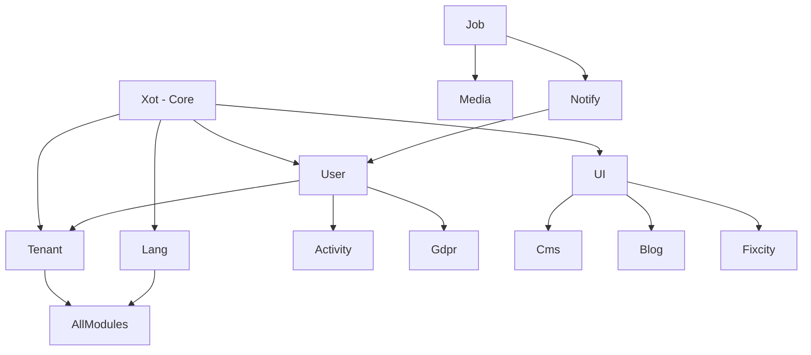

# Laravel Modules - Master Index

## Overview

This directory contains documentation for all Laravel modules in the FixCity PTVX ecosystem. Each module is a self-contained unit of functionality that follows the Laraxot architectural patterns.

## Project Structure

```
base_fixcity_fila5/
├── public_html/              # DOCUMENT ROOT (web accessible)
│   ├── index.php            # Entry point
│   ├── assets/              # Public assets
│   └── themes/              # Theme assets
├── laravel/Modules/         # All modules (this directory)
├── laravel/Themes/          # All themes
├── docs/                     # Project-wide documentation
└── bashscripts/             # Shell scripts
```

## Module List

### Core Modules

| Module | Description | Documentation |
|--------|-------------|---------------|
| **Xot** | Base framework module providing base classes, traits, and shared services | [docs/](Xot/docs/) |
| **User** | User authentication, authorization, and management | [docs/](User/docs/) |
| **Tenant** | Multi-tenancy architecture and isolation | [docs/](Tenant/docs/) |
| **UI** | Shared Blade components and Filament widgets | [docs/](UI/docs/) |
| **Lang** | Multi-language translations and localization | [docs/](Lang/docs/) |
| **Job** | Background job processing and queue management | [docs/](Job/docs/) |
| **Media** | File uploads, transformations, and media management | [docs/](Media/docs/) |
| **Notify** | Multi-channel notification system | [docs/](Notify/docs/) |
| **Activity** | Activity logging and audit trail | [docs/](Activity/docs/) |
| **Gdpr** | GDPR compliance and data protection | [docs/](Gdpr/docs/) |

### Domain Modules

| Module | Description | Documentation |
|--------|-------------|---------------|
| **Fixcity** | Ticket management and support system | [docs/](Fixcity/docs/) |
| **Cms** | Content management with Filament blocks | [docs/](Cms/docs/) |
| **Blog** | Blog, articles, and editorial content | [docs/](Blog/docs/) |
| **Comment** | Comment system with moderation | [docs/](Comment/docs/) |
| **Rating** | Rating and review system | [docs/](Rating/docs/) |
| **Seo** | SEO optimization toolkit | [docs/](Seo/docs/) |
| **Geo** | Geographic data and maps integration | [docs/](Geo/docs/) |
| **AI** | MCP integration and AI agents | [docs/](AI/docs/) |

## Architectural Principles

### No Services - Use Spatie Queueable Actions

- **NEVER** create Service classes
- **ALWAYS** use `Spatie\QueueableAction` pattern
- Create Actions using `create-action` skill

### No Routes/Controllers - Use Volt + Folio + Filament

- **NEVER** create route files for module functionality
- **NEVER** create Controllers
- **ALWAYS** use: Volt, Folio, Filament, Laraxot

### View Pattern

```php
// Use view-string + viewParams
/** @var view-string $view */
$view = 'module::view.name';
$viewParams = ['data' => $data];

return view($view, $viewParams);
```

### Base Class Extensions

- **ALWAYS** extend `XotBase*` classes
- **NEVER** extend Laravel/Filament base classes directly
- **USE** `getFormSchema()` instead of `form()`

## Module Structure

Standard module structure:

```
Modules/ModuleName/
├── app/
│   ├── Actions/           # Business logic (Spatie QueueableAction)
│   ├── Models/            # Eloquent models
│   ├── Filament/          # Filament resources, widgets
│   ├── Providers/         # Service providers
│   └── ...
├── config/                # Module configuration
├── database/
│   ├── factories/         # Model factories
│   ├── migrations/        # Database migrations
│   └── seeders/           # Database seeders
├── docs/                  # Module documentation
├── lang/                  # Translations
├── resources/
│   ├── views/             # Blade templates
│   └── assets/            # CSS/JS assets
├── tests/                 # Pest PHP tests
├── composer.json          # Module dependencies
└── module.json            # Module metadata
```

## Development Guidelines

### PHP Standards

- **Strict Types**: `declare(strict_types=1);` in every PHP file
- **Type Hints**: All methods must have return types
- **PHPDoc**: Complete documentation for classes, methods, properties
- **PHPStan**: Level 10 compliance required

### Testing

- **Framework**: Pest PHP
- **Coverage**: 90%+ target
- **Pattern**: Arrange-Act-Assert (AAA)

### Documentation

- **Location**: `Modules/ModuleName/docs/`
- **Format**: Markdown
- **Language**: Italian (primary), English (secondary)
- **Structure**: README.md + topic-specific files

## Quality Gates

### Before Commit

```bash
# PHPStan analysis
./vendor/bin/phpstan analyse --level=10 --memory-limit=2G

# Code formatting
composer pint

# Run tests
php artisan test
```

### CI/CD

- **GitHub Actions**: Automated testing on push
- **Semantic Versioning**: Tag-based releases
- **Changelog**: Auto-generated from conventional commits

## Related Documentation

- **Themes**: [laravel/Themes/docs/](../Themes/docs/)
- **Project Docs**: [docs/](../../../../docs/)
- **Bash Scripts**: [bashscripts/docs/](../../../../bashscripts/docs/)
- **AGENTS.md**: [AGENTS.md](../../../../AGENTS.md)

## Module Dependencies



## Support

- **Issues**: [GitHub Issues](https://github.com/laraxot/base_fixcity_fila5/issues)
- **Documentation**: [Project Docs](../../../../docs/)
- **Team**: Laraxot Development Team

---

**Last Updated**: March 30, 2026
**Version**: 1.0.0
**Total Modules**: 18
