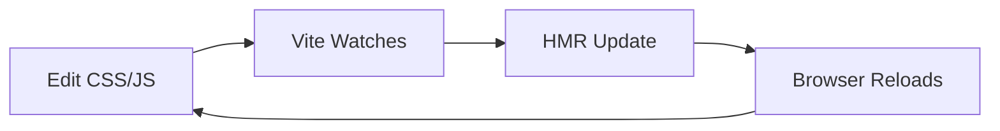
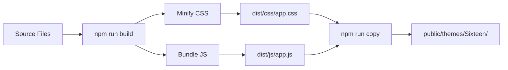

# Build Workflow Guide

> *"Costruisci una volta, distribuisci ovunque."*

## 🚀 Quick Start

```bash
# Install dependencies (first time only)
npm install

# Development with hot reload
npm run dev

# Production build
npm run build

# Copy assets to public directory
npm run copy
```

---

## 📦 package.json Scripts

### Location
`laravel/Themes/Sixteen/package.json`

### Available Scripts

```json
{
    "scripts": {
        "dev": "vite",
        "build": "vite build",
        "copy": "npm run copy:css && npm run copy:js",
        "copy:css": "cp -r dist/css ../public/themes/Sixteen/css/",
        "copy:js": "cp -r dist/js ../public/themes/Sixteen/js/",
        "watch": "vite build --watch"
    }
}
```

### What Each Command Does

#### `npm run dev`
**Purpose**: Development with hot reload

**What it does**:
- Starts Vite dev server
- Watches for file changes
- Hot Module Replacement (HMR)
- Source maps for debugging
- Runs on `http://localhost:5173`

**When to use**:
- ✅ Developing new features
- ✅ Testing CSS changes
- ✅ Debugging JavaScript

**Example**:
```bash
npm run dev
# Output: VITE v5.0.0  ready in 500 ms
# ➜  Local:   http://localhost:5173/
# ➜  Network: use --host to expose
```

#### `npm run build`
**Purpose**: Production build

**What it does**:
- Minifies CSS and JS
- Optimizes assets
- Generates manifest.json
- Creates production-ready files
- Output to `dist/` directory

**When to use**:
- ✅ Before committing changes
- ✅ Deploying to production
- ✅ Testing production build

**Example**:
```bash
npm run build
# Output:
# ✓ built in 2.5s
# dist/css/app.css    45.2 KB (gzip: 12.1 KB)
# dist/js/app.js      32.8 KB (gzip: 10.4 KB)
```

#### `npm run copy`
**Purpose**: Copy built assets to public directory

**What it does**:
- Copies `dist/css/` → `public/themes/Sixteen/css/`
- Copies `dist/js/` → `public/themes/Sixteen/js/`
- Preserves directory structure
- Overwrites old files

**When to use**:
- ✅ After `npm run build`
- ✅ Before testing in browser
- ✅ Deploying to server

**Example**:
```bash
npm run copy
# Output:
# Copied css/app.css to public/themes/Sixteen/css/app.css
# Copied js/app.js to public/themes/Sixteen/js/app.js
```

---

## 📁 File Structure

### Complete Directory Tree

```
Themes/Sixteen/
├── resources/                 # Source files (EDIT THESE)
│   ├── css/
│   │   ├── app.css           # Main CSS entry
│   │   ├── header.css        # Header styles
│   │   ├── footer.css        # Footer styles
│   │   └── components/
│   │       ├── cards.css
│   │       └── forms.css
│   ├── js/
│   │   ├── app.js            # Main JS entry
│   │   ├── header.js         # Header interactions
│   │   └── components/
│   │       ├── modal.js
│   │       └── dropdown.js
│   └── views/
│       ├── layouts/
│       └── components/
├── dist/                      # Build output (AUTO-GENERATED)
│   ├── css/
│   │   └── app.css           # Minified CSS
│   └── js/
│       └── app.js            # Bundled JS
├── public/                    # Web-accessible (COPIED)
│   └── themes/
│       └── Sixteen/
│           ├── css/
│           └── js/
├── package.json               # Dependencies & scripts
├── vite.config.js             # Vite configuration
└── tailwind.config.js         # Tailwind configuration
```

### Entry Points

**CSS Entry**: `resources/css/app.css`

```css
/* Import Tailwind */
@import 'tailwindcss';

/* Import component styles */
@import './header.css';
@import './footer.css';
@import './components/cards.css';
@import './components/forms.css';

/* Custom styles */
@layer components {
    .btn-primary {
        @apply bg-blue-600 text-white px-4 py-2 rounded hover:bg-blue-700;
    }
}
```

**JS Entry**: `resources/js/app.js`

```javascript
// Import dependencies
import './bootstrap';
import Alpine from 'alpinejs';

// Import components
import './header.js';
import './modal.js';

// Initialize Alpine
window.Alpine = Alpine;
Alpine.start();
```

---

## 🔧 Vite Configuration

### Location
`laravel/Themes/Sixteen/vite.config.js`

### Configuration

```javascript
import { defineConfig } from 'vite';
import laravel from 'laravel-vite-plugin';
import path from 'path';

export default defineConfig({
    plugins: [
        laravel({
            input: [
                'resources/css/app.css',
                'resources/js/app.js',
            ],
            refresh: true,
        }),
    ],
    build: {
        outDir: 'dist',
        manifest: true,
        rollupOptions: {
            output: {
                entryFileNames: 'js/[name].js',
                chunkFileNames: 'js/[name].[hash].js',
                assetFileNames: (assetInfo) => {
                    if (assetInfo.name.endsWith('.css')) {
                        return 'css/[name][extname]';
                    }
                    return 'assets/[name][extname]';
                },
            },
        },
    },
    resolve: {
        alias: {
            '@': path.resolve(__dirname, './resources'),
        },
    },
});
```

### Key Options Explained

| Option | Purpose | Value |
|--------|---------|-------|
| `input` | Entry points | CSS + JS files |
| `outDir` | Build output | `dist/` |
| `manifest` | Generate manifest | `true` (for Laravel) |
| `refresh` | Hot reload | `true` (dev mode) |

---

## 🎨 Tailwind CSS Integration

### Location
`laravel/Themes/Sixteen/tailwind.config.js`

### Configuration

```javascript
/** @type {import('tailwindcss').Config} */
export default {
    content: [
        './resources/**/*.blade.php',
        './resources/**/*.js',
        './resources/**/*.vue',
    ],
    theme: {
        extend: {
            colors: {
                primary: '#0066cc', // Design Comuni blue
                secondary: '#5c6b7f',
            },
            fontFamily: {
                sans: ['Titillium Web', 'sans-serif'],
            },
        },
    },
    plugins: [],
};
```

### How It Works

1. **Scan**: Tailwind scans Blade files for class names
2. **Purge**: Removes unused CSS (production)
3. **Output**: Generates minimal CSS file

**Example**:
```blade
{{-- In your Blade template --}}
<button class="btn-primary">Click me</button>

{{-- In CSS --}}
@layer components {
    .btn-primary {
        @apply bg-primary text-white px-4 py-2 rounded;
    }
}
```

---

## 🐛 Common Issues & Solutions

### Issue 1: CSS Not Updating

**Symptoms**:
- Edit CSS file
- Refresh browser
- No changes visible

**Solutions**:
```bash
# 1. Clear cache
rm -rf dist/
rm -rf public/themes/Sixteen/css/*

# 2. Rebuild
npm run build

# 3. Copy
npm run copy

# 4. Hard refresh browser
Ctrl + Shift + R (Windows/Linux)
Cmd + Shift + R (Mac)
```

### Issue 2: Build Fails

**Symptoms**:
```bash
npm run build
# Error: Cannot find module 'vite'
```

**Solutions**:
```bash
# 1. Delete node_modules
rm -rf node_modules/

# 2. Delete package-lock.json
rm package-lock.json

# 3. Reinstall
npm install

# 4. Rebuild
npm run build
```

### Issue 3: JavaScript Errors in Browser

**Symptoms**:
```
Uncaught ReferenceError: Alpine is not defined
```

**Solutions**:
```javascript
// Check app.js has Alpine setup
import Alpine from 'alpinejs';
window.Alpine = Alpine;
Alpine.start();

// Rebuild
npm run build
npm run copy
```

### Issue 4: Manifest Not Found

**Symptoms**:
```
Vite manifest not found at: public/themes/Sixteen/manifest.json
```

**Solutions**:
```bash
# Rebuild with manifest generation
npm run build

# Verify manifest exists
ls -la public/themes/Sixteen/manifest.json
```

---

## 📊 Build Process Flow

### Development Flow



### Production Flow



---

## 🎯 Best Practices

### DO ✅

```bash
# Always build before commit
npm run build && npm run copy

# Use dev mode for development
npm run dev

# Test production build locally
npm run build && npm run copy

# Version control source files only
git add resources/
git add package.json
git add vite.config.js

# Ignore build output
echo "dist/" >> .gitignore
echo "public/themes/Sixteen/" >> .gitignore
```

### DON'T ❌

```bash
# Never edit files in dist/ or public/
# (they get overwritten on build)

# Don't commit build output
git add dist/  # ❌ WRONG
git add public/themes/  # ❌ WRONG

# Don't skip build step
# (changes won't appear in browser)
```

---

## 📈 Performance Optimization

### Build Size Analysis

```bash
# Install bundle analyzer
npm install --save-dev rollup-plugin-visualizer

# Add to vite.config.js
import { visualizer } from 'rollup-plugin-visualizer';

export default defineConfig({
    plugins: [
        visualizer({
            filename: 'dist/stats.html',
            open: true,
        }),
    ],
});

# Run build
npm run build
# Opens: dist/stats.html (interactive treemap)
```

### Optimization Tips

1. **Code Splitting**: Split large JS files
2. **Lazy Loading**: Load components on demand
3. **Tree Shaking**: Remove unused code
4. **Minification**: Already enabled in production
5. **Compression**: Gzip/Brotli on server

---

## 🔗 References

### Internal
- [Header Analysis](./header/analysis.md)
- [Folio + Volt Best Practices](./folio-volt-best-practices.md)

### External
- [Vite Docs](https://vitejs.dev/)
- [Laravel Vite Plugin](https://laravel.com/docs/11.x/vite)
- [Tailwind CSS Docs](https://tailwindcss.com/docs)

---

## 🧘 Developer Meditation

> *"Costruisci una volta, distribuisci ovunque. Il build è il ponte tra sviluppo e produzione."*

Before building:
1. Have I tested in dev mode?
2. Are all files saved?
3. Is the build output clean?
4. Have I copied to public?

---

**Version**: 1.0  
**Date**: 2026-03-30  
**Status**: ✅ Documentation Complete  
**OpenViking URI**: `viking://themes/sixteen/docs/build-workflow`
