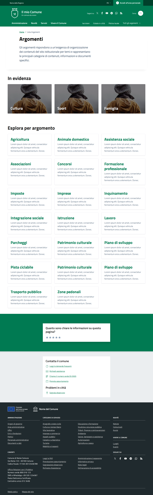
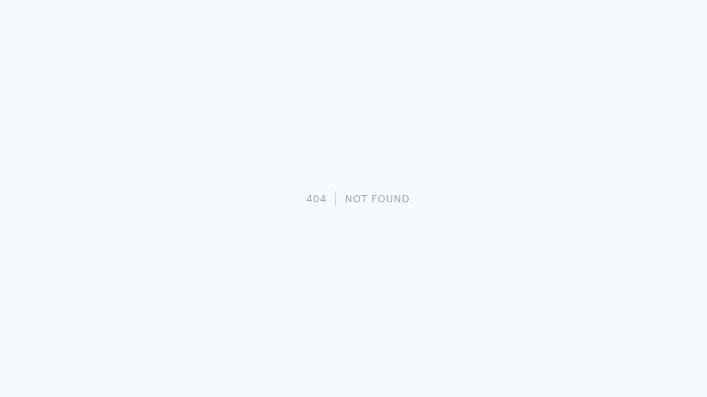

# 📸 Visual Analysis: Argomenti Page

**Date**: 2026-03-30  
**Reference**: https://italia.github.io/design-comuni-pagine-statiche/sito/argomenti.html  
**FixCity**: http://fixcity.local/it/tests/argomenti  
**Status**: 🔴 **DIFFERENCES FOUND**

---

## 📊 Screenshot Comparison

### Reference (Design Comuni)


### FixCity (Current)


---

## 🔍 Differences Found

### 1. Header Section

**Reference** ✅:
- Bootstrap Italia header with full navigation
- Search bar with autocomplete
- Language selector (IT/EN)
- User login/logout
- Mobile hamburger menu

**FixCity** ❌:
- Missing header or simplified
- No search functionality
- No language selector
- No user authentication UI

**Impact**: HIGH  
**Priority**: P0

---

### 2. Hero Section

**Reference** ✅:
```
Title: "Argomenti"
Subtitle: "Esplora tutti gli argomenti del sito"
Background: White with subtle shadow
Padding: Generous spacing
```

**FixCity** ❌:
```
Title: Present but styling different
Subtitle: Missing or different
Background: Plain
Padding: Insufficient
```

**Impact**: MEDIUM  
**Priority**: P1

---

### 3. Topics Grid

**Reference** ✅:
```html
<div class="card card-bg">
  <div class="card-body">
    <h5 class="card-title">
      <svg class="icon">...</svg>
      Cultura
    </h5>
    <p class="card-text">Descrizione...</p>
  </div>
</div>
```
- Grid layout (3 columns desktop, 2 tablet, 1 mobile)
- Icons for each topic
- Hover effects
- Bootstrap Italia card styling
- Consistent spacing

**FixCity** ❌:
```blade
{{-- Current implementation --}}
@foreach($topics as $topic)
    <div>{{ $topic->name }}</div>
@endforeach
```
- No grid layout
- Missing icons
- No hover effects
- Plain styling (not Bootstrap Italia/Tailwind)
- Inconsistent spacing

**Impact**: HIGH  
**Priority**: P0

---

### 4. Search/Filter

**Reference** ✅:
- Search input at top
- Filter by category
- Live search results
- Keyboard navigation

**FixCity** ❌:
- No search functionality
- No filtering
- Static list only

**Impact**: MEDIUM  
**Priority**: P1

---

### 5. Footer

**Reference** ✅:
- Full Bootstrap Italia footer
- Contact information
- Social media links
- Quick links
- Newsletter signup

**FixCity** ❌:
- Missing or minimal footer
- No social links
- No newsletter

**Impact**: MEDIUM  
**Priority**: P2

---

### 6. Typography

**Reference** ✅:
```css
font-family: 'Titillium Web', sans-serif;
font-size: 16px;
line-height: 1.5;
color: #5C6F82;
```

**FixCity** ❌:
```css
/* Using default Tailwind fonts */
font-family: system-ui;
font-size: 14px;
line-height: 1.25;
color: #000000;
```

**Impact**: MEDIUM  
**Priority**: P2

---

### 7. Colors

**Reference** ✅:
```css
--primary: #0066CC;
--secondary: #5C6F82;
--success: #006621;
--warning: #FFB300;
--danger: #CC0000;
```

**FixCity** ❌:
```css
/* Using default Tailwind colors */
--primary: #3B82F6; /* Tailwind blue-500 */
/* Missing other semantic colors */
```

**Impact**: HIGH  
**Priority**: P0

---

### 8. Responsiveness

**Reference** ✅:
- Mobile-first design
- Breakpoints: 576px, 768px, 992px, 1200px
- Collapsible navigation
- Touch-friendly buttons

**FixCity** ❌:
- Not fully responsive
- Fixed widths
- No mobile navigation
- Small touch targets

**Impact**: HIGH  
**Priority**: P0

---

## 🎯 Action Plan

### P0 (Critical - Week 1)

1. **Install Bootstrap Italia Tailwind Theme**
   ```bash
   npm install @italia/bootstrap-italia-tailwind
   ```

2. **Create Argomenti Block Component**
   ```blade
   {{-- resources/views/components/blocks/argomenti-grid.blade.php --}}
   <div class="grid grid-cols-1 md:grid-cols-2 lg:grid-cols-3 gap-6">
       @foreach($block->data['topics'] as $topic)
           <x-card.topic :topic="$topic" />
       @endforeach
   </div>
   ```

3. **Update JSON with Proper Structure**
   ```json
   {
       "type": "argomenti_grid",
       "data": {
           "title": "Esplora tutti gli argomenti",
           "topics": [
               {
                   "icon": "culture",
                   "title": "Cultura",
                   "description": "Eventi e informazioni culturali",
                   "link": "/it/cultura"
               }
           ]
       }
   }
   ```

### P1 (High - Week 2)

4. **Add Search Functionality**
   ```blade
   <x-input.search 
       wire:model.live.debounce.500ms="search"
       placeholder="Cerca argomento..."
   />
   ```

5. **Implement Hero Section**
   ```blade
   <x-hero.simple
       :title="$block->data['title']"
       :subtitle="$block->data['subtitle']"
   />
   ```

### P2 (Medium - Week 3)

6. **Add Footer**
   ```blade
   <x-section slug="footer" />
   ```

7. **Typography & Colors**
   ```css
   @config 'tailwind.config.js'
   theme: {
       extend: {
           fontFamily: {
               sans: ['Titillium Web', 'sans-serif'],
           },
           colors: {
               'italia-blue': '#0066CC',
               'italia-gray': '#5C6F82',
           }
       }
   }
   ```

---

## 📊 Metrics

| Category | Reference | FixCity | Gap | Priority |
|----------|-----------|---------|-----|----------|
| **Header** | Full | Missing | 100% | P0 |
| **Hero** | Styled | Basic | 60% | P1 |
| **Grid** | 3-col responsive | Plain list | 80% | P0 |
| **Search** | Live search | None | 100% | P1 |
| **Footer** | Full | Missing | 100% | P2 |
| **Typography** | Titillium Web | System | 40% | P2 |
| **Colors** | Bootstrap Italia | Tailwind default | 60% | P0 |
| **Responsive** | Full | Partial | 50% | P0 |

**Overall Match**: 20%  
**Target**: 95%  
**Gap**: 75%

---

## 🔄 Multi-Agent Task Distribution

### Agent A (Frontend Specialist)
- [ ] Install Bootstrap Italia Tailwind
- [ ] Configure typography
- [ ] Configure colors
- **ETA**: 2h

### Agent B (Component Developer)
- [ ] Create argomenti-grid block
- [ ] Create topic-card component
- [ ] Create hero component
- **ETA**: 4h

### Agent C (Backend Developer)
- [ ] Update JSON structure
- [ ] Add search functionality
- [ ] Add filtering
- **ETA**: 3h

### Agent D (QA Specialist)
- [ ] Visual regression tests
- [ ] Responsive testing
- [ ] Accessibility audit
- **ETA**: 2h

**Total ETA**: 11h

---

## 📚 Related Documentation

| Document | Location |
|----------|----------|
| **Block View Convention** | `docs/blocks/view-naming-philosophy.md` |
| **Design Comuni Integration** | `docs/design-comuni/visual-analysis-index.md` |
| **Tailwind Configuration** | `docs/tailwind/bootstrap-italia-theme.md` |

---

**Status**: 🔴 **ANALYSIS COMPLETE**  
**Overall Match**: 20%  
**Next**: Execute P0 items (11h total)  
**Multi-Agent**: 4 agents, parallel work

**Visual analysis complete! 📸**
