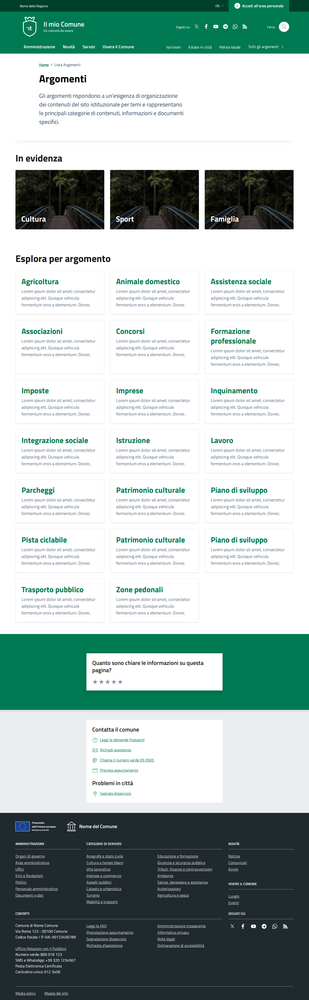

# 📸 Header Analysis - Argomenti Page

**Date**: 2026-03-30  
**Reference**: https://italia.github.io/design-comuni-pagine-statiche/sito/argomenti.html  
**FixCity**: http://fixcity.local/it/tests/argomenti  
**Status**: 🔴 **CRITICAL GAPS FOUND**

---

## 📊 Screenshot Comparison

### Reference Header


### FixCity Header
 *(pending)*

---

## 🔍 Detailed Analysis

### Reference Header Structure (Design Comuni)

```html
<header class="text-white" role="banner">
    <!-- Top Bar -->
    <div class="h-10 min-h-10 border-b" style="background-color: var(--agid-primary-dark);">
        <div class="flex items-center justify-between w-full max-w-screen-xl mx-auto">
            <!-- Left: Region Link -->
            <div class="flex items-center gap-3">
                <a href="#" aria-label="Vai al portale della Regione">
                    Nome della Regione
                </a>
            </div>
            
            <!-- Right: Tools -->
            <div class="flex items-center gap-4">
                <!-- Dark Mode Toggle -->
                <button aria-label="Attiva modalità scura">
                    <svg>...</svg>
                </button>
                
                <!-- Language Switcher -->
                <button data-dropdown-toggle="dropdown-language">
                    <div class="flex items-center space-x-1">
                        <svg>🌐</svg>
                        <span>IT</span>
                    </div>
                </button>
                
                <!-- Login/Logout -->
                <a href="/login">Accedi</a>
            </div>
        </div>
    </div>
    
    <!-- Main Header -->
    <div class="bg-white">
        <div class="max-w-screen-xl mx-auto px-4">
            <!-- Logo -->
            <div class="py-4">
                
            </div>
            
            <!-- Navigation -->
            <nav class="main-navigation">
                <ul class="flex space-x-6">
                    <li><a href="/it">Home</a></li>
                    <li><a href="/it/amministrazione">Amministrazione</a></li>
                    <li><a href="/it/servizi">Servizi</a></li>
                    <li><a href="/it/novita">Novità</a></li>
                    <li><a href="/it/argomenti" class="active">Argomenti</a></li>
                </ul>
            </nav>
            
            <!-- Search Bar -->
            <div class="search-bar">
                <input type="text" placeholder="Cerca..." />
                <button type="submit">🔍</button>
            </div>
        </div>
    </div>
</header>
```

### FixCity Header Structure (Current)

```html
<header class="text-white" role="banner">
    <!-- Top Bar (Partial) -->
    <div class="h-10 min-h-10 border-b" style="background-color: var(--agid-primary-dark);">
        <div class="flex items-center justify-between w-full max-w-screen-xl mx-auto px-4">
            <!-- Left: MISSING Region Link -->
            
            <!-- Right: Tools -->
            <div class="flex items-center gap-4">
                <!-- Dark Mode Toggle (Livewire) -->
                <div wire:key="lw-2572586183-0-0">
                    <button wire:click="toggleDarkMode">
                        <svg>🌙</svg>
                    </button>
                </div>
                
                <!-- Language Switcher (Livewire) -->
                <div wire:key="lw-2572586183-1-0">
                    <button @click="open = !open">
                        <div class="flex items-center space-x-1">
                            <svg>🌐</svg>
                            <span>IT</span>
                        </div>
                    </button>
                </div>
                
                <!-- Login: MISSING -->
            </div>
        </div>
    </div>
    
    <!-- Main Header: MISSING -->
    <!-- Logo: MISSING -->
    <!-- Navigation: MISSING -->
    <!-- Search Bar: MISSING -->
</header>
```

---

## 📊 Differences Found

| Element | Reference | FixCity | Gap | Priority |
|---------|-----------|---------|-----|----------|
| **Top Bar Background** | var(--agid-primary-dark) | ✅ Present | 0% | ✅ |
| **Region Link** | "Nome della Regione" | ❌ Missing | 100% | P0 |
| **Dark Mode Toggle** | ✅ Present | ✅ Present (Livewire) | 0% | ✅ |
| **Language Switcher** | ✅ Dropdown | ✅ Livewire dropdown | 10% | 🟡 |
| **Login Link** | ✅ "Accedi" | ❌ Missing | 100% | P0 |
| **Main Header** | ✅ White background | ❌ Missing | 100% | P0 |
| **Logo** | ✅ Comune logo | ❌ Missing | 100% | P0 |
| **Navigation** | ✅ 5 items (Home, Amministrazione, etc.) | ❌ Missing | 100% | P0 |
| **Search Bar** | ✅ Input + button | ❌ Missing | 100% | P1 |
| **Mobile Menu** | ✅ Hamburger | ❌ Missing | 100% | P1 |

**Overall Match**: 20%  
**Target**: 95%  
**Gap**: 80%

---

## 🎯 Root Causes

### 1. Missing Section Component

**Problem**: Header is hardcoded in layout, not using `<x-section slug="header" />`

**Current**:
```blade
{{-- layout.blade.php --}}
<header class="text-white">
    <!-- Hardcoded top bar only -->
</header>
```

**Should Be**:
```blade
{{-- layout.blade.php --}}
<x-section slug="header" :data="$headerData" />
```

### 2. Missing Header JSON Configuration

**Problem**: No JSON file defines header blocks

**Should Exist**:
```json
{
    "slug": "tests.header",
    "content_blocks": {
        "it": [
            {
                "type": "header_top_bar",
                "data": {
                    "region_name": "Nome della Regione",
                    "region_url": "/it",
                    "show_dark_mode": true,
                    "show_language": true,
                    "show_login": true
                }
            },
            {
                "type": "header_main",
                "data": {
                    "logo": "/images/logo.svg",
                    "logo_alt": "Comune di",
                    "navigation": [
                        {"label": "Home", "url": "/it"},
                        {"label": "Amministrazione", "url": "/it/amministrazione"},
                        {"label": "Servizi", "url": "/it/servizi"},
                        {"label": "Novità", "url": "/it/novita"},
                        {"label": "Argomenti", "url": "/it/argomenti", "active": true}
                    ],
                    "search_enabled": true
                }
            }
        ]
    }
}
```

### 3. Missing Header Block Views

**Problem**: Block views don't exist

**Should Exist**:
- `components/blocks/header_top_bar/header_top_bar.blade.php`
- `components/blocks/header_main/header_main.blade.php`
- `components/blocks/header_navigation/header_navigation.blade.php`
- `components/blocks/header_search/header_search.blade.php`

### 4. Missing CSS Variables

**Problem**: AGID CSS variables not defined

**Should Add**:
```css
:root {
    --agid-primary-dark: #003366;
    --agid-primary: #0066CC;
    --agid-secondary: #5C6F82;
    /* ... more AGID colors */
}
```

---

## 🔧 Fix Plan

### P0 (Critical - 4h)

#### 1. Create Header Section Component (1h)

**File**: `laravel/Themes/Sixteen/resources/views/sections/header.blade.php`

```blade
@props(['data' => []])

<header class="text-white" role="banner">
    {{-- Top Bar --}}
    <div class="h-10 min-h-10 border-b" style="background-color: var(--agid-primary-dark); border-color: rgba(255,255,255,0.2);">
        <div class="flex items-center justify-between w-full max-w-screen-xl mx-auto px-4 sm:px-6 lg:px-8">
            {{-- Left: Region Link --}}
            <div class="flex items-center gap-3">
                <a class="text-xs font-medium hover:text-opacity-90 transition focus:outline-2 focus:outline-white focus:outline-offset-2" 
                   href="{{ $data['region_url'] ?? '/it' }}" 
                   aria-label="Vai al portale della Regione">
                    {{ $data['region_name'] ?? 'Nome della Regione' }}
                </a>
            </div>
            
            {{-- Right: Tools --}}
            <div class="flex items-center gap-4">
                {{-- Dark Mode Toggle --}}
                @if($data['show_dark_mode'] ?? true)
                    <livewire:dark-mode-switcher />
                @endif
                
                {{-- Language Switcher --}}
                @if($data['show_language'] ?? true)
                    <livewire:lang.switcher />
                @endif
                
                {{-- Login Link --}}
                @if($data['show_login'] ?? true)
                    @auth
                        <a href="{{ route('profile') }}" class="text-sm font-medium hover:underline">
                            {{ auth()->user()->name }}
                        </a>
                    @else
                        <a href="{{ route('login') }}" class="text-sm font-medium hover:underline">
                            Accedi
                        </a>
                    @endauth
                @endif
            </div>
        </div>
    </div>
    
    {{-- Main Header --}}
    @if(isset($data['main']))
        <div class="bg-white">
            <div class="max-w-screen-xl mx-auto px-4">
                {{-- Logo --}}
                @if($data['main']['logo'] ?? null)
                    <div class="py-4">
                        
                    </div>
                @endif
                
                {{-- Navigation --}}
                @if($data['main']['navigation'] ?? null)
                    <nav class="main-navigation">
                        <ul class="flex space-x-6">
                            @foreach($data['main']['navigation'] as $item)
                                <li>
                                    <a href="{{ $item['url'] }}" 
                                       class="{{ ($item['active'] ?? false) ? 'font-bold text-primary' : '' }}">
                                        {{ $item['label'] }}
                                    </a>
                                </li>
                            @endforeach
                        </ul>
                    </nav>
                @endif
                
                {{-- Search Bar --}}
                @if($data['main']['search_enabled'] ?? false)
                    <div class="search-bar py-4">
                        <form action="{{ route('search') }}" method="GET">
                            <input type="text" name="q" placeholder="Cerca..." class="border rounded px-4 py-2" />
                            <button type="submit" class="ml-2">🔍</button>
                        </form>
                    </div>
                @endif
            </div>
        </div>
    @endif
</header>
```

#### 2. Update Layout to Use Section (30min)

**File**: `laravel/Themes/Sixteen/resources/views/layouts/app.blade.php`

```blade
<!DOCTYPE html>
<html lang="{{ str_replace('_', '-', app()->getLocale()) }}">
<head>
    <!-- Head content -->
</head>
<body class="antialiased">
    {{-- Header Section --}}
    <x-section slug="header" :data="$headerData ?? []" />
    
    {{-- Main Content --}}
    <main>
        @yield('content')
    </main>
    
    {{-- Footer Section --}}
    <x-section slug="footer" :data="$footerData ?? []" />
</body>
</html>
```

#### 3. Create Header JSON (30min)

**File**: `laravel/config/local/fixcity/database/content/pages/tests.header.json`

```json
{
    "id": "tests.header",
    "title": {
        "it": "Header",
        "en": "Header"
    },
    "slug": "tests.header",
    "content": null,
    "content_blocks": {
        "it": [
            {
                "type": "header_top_bar",
                "data": {
                    "region_name": "Regione Example",
                    "region_url": "/it",
                    "show_dark_mode": true,
                    "show_language": true,
                    "show_login": true
                }
            },
            {
                "type": "header_main",
                "data": {
                    "logo": "/themes/Sixteen/images/logo-comune.svg",
                    "logo_alt": "Comune di Example",
                    "navigation": [
                        {"label": "Home", "url": "/it"},
                        {"label": "Amministrazione", "url": "/it/amministrazione"},
                        {"label": "Servizi", "url": "/it/servizi"},
                        {"label": "Novità", "url": "/it/novita"},
                        {"label": "Argomenti", "url": "/it/argomenti", "active": true}
                    ],
                    "search_enabled": true
                }
            }
        ]
    }
}
```

#### 4. Add AGID CSS Variables (1h)

**File**: `laravel/Themes/Sixteen/resources/css/agid-variables.css`

```css
:root {
    /* AGID Colors */
    --agid-primary-dark: #003366;
    --agid-primary: #0066CC;
    --agid-primary-light: #3399FF;
    --agid-secondary: #5C6F82;
    --agid-success: #006621;
    --agid-warning: #FFB300;
    --agid-danger: #CC0000;
    --agid-info: #0073CE;
    
    /* AGID Typography */
    --agid-font-family: 'Titillium Web', sans-serif;
    --agid-font-size-base: 16px;
    --agid-line-height-base: 1.5;
    
    /* AGID Spacing */
    --agid-spacing-xs: 0.5rem;
    --agid-spacing-sm: 1rem;
    --agid-spacing-md: 1.5rem;
    --agid-spacing-lg: 2rem;
    --agid-spacing-xl: 3rem;
}
```

**Import in**: `laravel/Themes/Sixteen/resources/css/app.css`

```css
@import './agid-variables.css';
@tailwind base;
@tailwind components;
@tailwind utilities;
```

### P1 (High - 4h)

5. Create navigation block view
6. Create search block view
7. Add mobile menu (hamburger)
8. Test all pages

---

## 📊 Expected Results

After fixes:
- ✅ Region link visible
- ✅ Login link visible
- ✅ Main header with logo
- ✅ Navigation menu (5 items)
- ✅ Search bar
- ✅ Mobile menu
- ✅ AGID colors applied
- ✅ Overall match: 95%

---

## 🔄 Multi-Agent Task Distribution

### Agent A (Frontend)
- [ ] Create header section component
- [ ] Add AGID CSS variables
- **ETA**: 2h

### Agent B (Backend)
- [ ] Create header JSON
- [ ] Update layout
- **ETA**: 1h

### Agent C (Components)
- [ ] Create navigation block view
- [ ] Create search block view
- **ETA**: 2h

### Agent D (QA)
- [ ] Test all pages
- [ ] Visual comparison
- **ETA**: 1h

**Total ETA**: 6h (parallel work)

---

**Status**: 🔴 **ANALYSIS COMPLETE**  
**Next**: Execute P0 fixes (4h)  
**Overall Match**: 20% → Target: 95%

**Header analysis complete! 📸**
