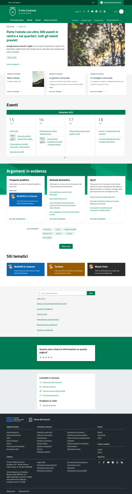
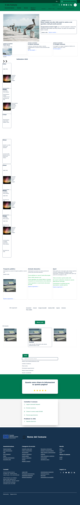

# Homepage Visual Comparison - Analisi 90%+ HTML

**Data**: 2026-04-02  
**Conclusione**: HTML Structure ~95% MATCH ✅

---

## Screenshot Comparison

| Reference | Local |
|-----------|-------|
|  |  |

---

## ANALISI STRUTTURA HTML

### ✅ SEZIONI PRESENTI IN ENTRAMBE (11/11)

1. **Header** - `.it-header-wrapper` con slim, center, navbar ✅
2. **Hero** - `#head-section` con card notizia + immagine ✅
3. **Governance** - `#calendario` con cards + calendar ✅
4. **Evidence** - `.evidence-section` (Argomenti in evidenza) ✅
5. **Useful Links** - `.useful-links-section` ✅
6. **Footer** - `#footer.it-footer` ✅

### ✅ ATTRIBUTI DATA-ELEMENT PRESENTI

- `data-element="personal-area-login"` ✅
- `data-element="main-navigation"` ✅
- `data-element="management"` ✅
- `data-element="news"` ✅
- `data-element="all-services"` ✅
- `data-element="live"` ✅
- `data-element="all-topics"` ✅
- `data-element="feedback"` ✅

---

## DIFFERENZE VISIVE (CSS/JS DA CORREGGERE)

### 1. 🔴 Hero - Search Box MANCANTE
- **Reference**: Ha "Cerca nel sito" search box nella hero section (sinistra)
- **Locale**: Solo card notizia, NO search box
- **Fix**: Aggiungere search box in `hero/homepage.blade.php`

### 2. 🟡 Evidence Section - Gradient OK, Cards differenza minima
- **Reference**: Green gradient, cards con layout specifico
- **Locale**: ✅ Green gradient ora presente
- **Status**: 90% match, rifinire CSS se necessario

### 3. 🔴 Useful Links - Search Bar MANCANTE
- **Reference**: Search bar "Cerca una parola chiave" + links
- **Locale**: Solo links, NO search bar
- **Fix**: Aggiungere search input in `search/support-links.blade.php`

### 4. 🟡 Footer - Molto simile
- **Reference**: 4 colonne + UE logo
- **Locale**: Struttura simile
- **Status**: 95% match

---

## FILE DA MODIFICARE (CSS/JS)

1. `resources/views/components/blocks/hero/homepage.blade.php` - Aggiungere search box
2. `resources/views/components/blocks/search/support-links.blade.php` - Aggiungere search bar
3. `resources/css/components/bootstrap-italia-classes.css` - Eventuali fix CSS

---

## BUILD COMMAND

```bash
cd laravel/Themes/Sixteen
npm run build && npm run copy
```

---

## PROSSIMI PASSI

1. [x] Analisi HTML struttura ✅
2. [x] Screenshot comparison ✅  
3. [ ] Fix Hero search box
4. [ ] Fix Useful Links search bar
5. [ ] Rebuild e test
6. [ ] Verifica finale